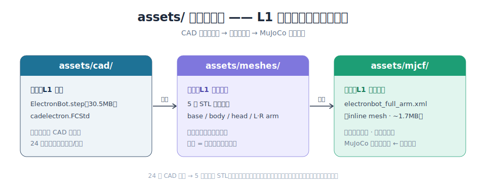
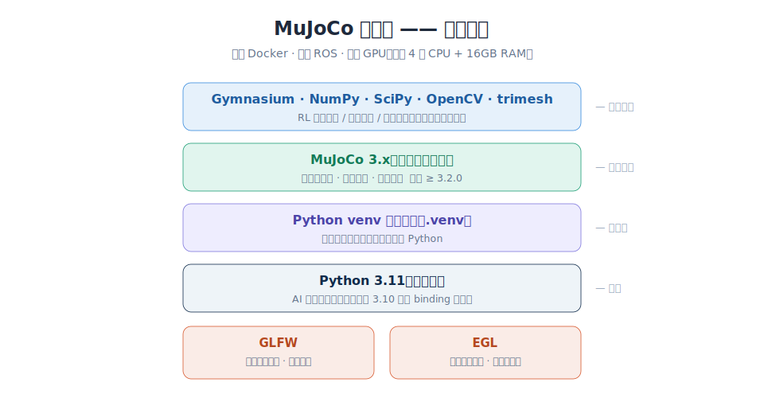
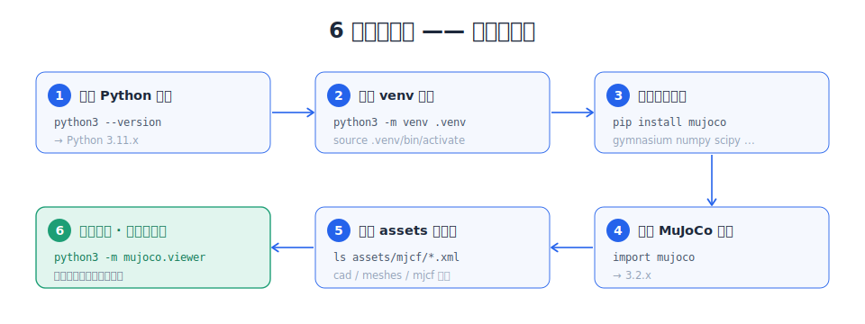

# 2.1 章节目标

> **📖 上下文回顾**：在 01 章看完七层架构全景之后，你现在站在 L1 模型描述层的入口。本章不涉及任何代码编写——它的唯一目标是让你在 30 分钟内把环境搭好、把 ElectronBot 的 MJCF 模型加载到 MuJoCo Viewer 里、看到 6 个关节自由转动。这是全书的"Hello World"：如果这一步走不通，后续的仿真、控制、AI 训练都无从谈起。依赖栈的设计有意做得极简——venv 虚拟环境 + pip install mujoco + 一个 assets/ 目录，**不需要 Docker、不需要 GPU、不需要 ROS**。

> **💡 核心概念：MuJoCo 依赖栈的极简设计**
>
> 为什么 ElectronBot-SIM 的依赖栈如此简洁？三个设计意图：
> - **Python 3.11 是硬要求**：MuJoCo 3.x 的 Python binding 基于 Python 3.8+，选 3.11 是因为它是 PyTorch/robomimic/stable-baselines3 等 AI 生态当前最稳定的版本。低于 3.10 的部分 binding 不可用。
> - **使用 venv 而非系统 pip**：venv 是 Python 3.3+ 内置的虚拟环境模块，无需额外安装，能干净地隔离项目依赖，避免与系统 Python 包冲突。CUDA 通过系统 apt 安装，版本管理清晰独立。
> - **没有 Docker、没有 ROS、没有 GPU 要求**：这是故意的。仿真核心（L2-L4）完全 CPU 可跑，AI 训练（L6）可选 GPU 加速。最低配置只需要 4 核 CPU + 16GB RAM。

**核心关键词**：`Python 3.11` `MuJoCo 3.x` `MJCF` `GLFW` `assets` `Gymnasium` `EGL`

________________________________________

## 2.1 先认识 assets/——你的原材料仓库

在装任何依赖之前，先看一眼项目根目录下的 `assets/`。这里存放着 ElectronBot-SIM 的全部"原材料"——没有它们，后面的仿真、动作、AI 训练都无从谈起：

| 子目录 | 内容 | 在架构中的角色 |
|--------|------|--------------|
| `assets/cad/` | ElectronBot.step（30.5MB）、cadelectron.FCStd | **L1 输入**：稚晖君原版 CAD 设计图，24 个零件的精确尺寸和装配关系。第三章的起点。 |
| `assets/meshes/` | 5 个 STL 文件（base_link / body / head / left_arm / right_arm） | **L1 中间产物**：从 CAD 按运动组合并导出的三角网格。每个 STL 对应一个在仿真中独立运动的刚体组。 |
| `assets/mjcf/` | electronbot_full_arm.xml（~1.7MB）、electronbot.xml、scene_single.xml / scene_dual.xml | **L1 最终输出**：MuJoCo 可直接加载的物理模型。full_arm 版使用 inline mesh，单文件自包含，零外部依赖——这就是你这章要加载的文件。 |

这里有一个值得理解的细节：为什么 STL 是 5 个而不是 24 个？ElectronBot 的 CAD 原始设计有 24 个独立零件（左右手的外壳、骨架、连接件等），但如果按每个零件单独导出 STL，MJCF 中需要定义 24 个 body——不仅工作量大，而且很多相邻零件之间根本没有相对运动（比如左手的 6 个零件在运动中始终一起动）。第三章会详细展开这个"按运动组合并"的核心决策——现在你只需要知道：**5 个 STL 对应 5 个运动组，每个组内的零件在物理上固连，不需要独立建模**。



<p align="center"><sub>图 2-1　assets/ 原材料仓库：L1 模型描述层从 CAD 到 MJCF 的三级产物流水线</sub></p>

## 2.2 环境依赖：为什么是这些

整个依赖栈可以概括为一个"从地基到上层生态"的四层结构——每一层的选择都有明确的技术原因，而不是"碰巧能用"：



<p align="center"><sub>图 2-2　MuJoCo 依赖栈的极简设计：无需 Docker / ROS / GPU</sub></p>

### Python 3.11

看起来像是一个平淡无奇的要求，但背后有具体的技术原因。MuJoCo 的 Python binding（`mujoco` 包）要求 Python ≥ 3.8，而选 3.11 是因为：① 它是 PyTorch 2.x、robomimic、stable-baselines3 在 2024-2025 年最稳定的 Python 版本；② 3.12/3.13 的部分 C 扩展（特别是 EGL headless 渲染相关）尚未完全适配；③ 3.11 的性能比 3.8/3.9 有显著提升。验证命令：

```bash
python3 --version
```

### Python venv 虚拟环境

本书的所有操作都在一个名为 `.venv` 的 venv 隔离环境中进行。用 Python 自带的 venv 而非系统 pip，是为了避免项目依赖污染系统 Python 环境。CUDA 工具包通过系统 apt 安装，版本管理清晰独立。创建环境：

```bash
python3 -m venv .venv --python=python3.11
source .venv/bin/activate
```

### MuJoCo 3.x（核心物理引擎）

MuJoCo 是 ElectronBot-SIM 的物理心脏——所有刚体动力学、碰撞检测、关节运动都由它计算。安装只需要一行 pip，因为 Google 在 2021 年收购 DeepMind 后将 MuJoCo 开源并以预编译 wheel 分发。注意版本号：

```bash
pip install mujoco
python3 -c "import mujoco; print(mujoco.__version__)"  # 应输出 ≥ 3.2.0
```

≥ 3.2.0 是因为这个版本引入了 passive viewer 的线程安全改进，对后续的 Gymnasium 环境封装（第四章）至关重要。

### Gymnasium + NumPy + OpenCV

这三个包在第四章才会正式用到，但在这里一并安装可以避免后续的版本冲突。Gymnasium 是 OpenAI Gym 的继任者，提供标准 RL 环境接口（`reset()` / `step()` / `render()`）。NumPy 是所有数值计算的基础。OpenCV 用于 MuJoCo 摄像头渲染的图像处理（L5 传感器层）。

```bash
pip install gymnasium numpy scipy opencv-python trimesh
```

### GLFW（视窗渲染）

MuJoCo Viewer 依赖 GLFW 创建本地渲染窗口。Windows 上 GLFW 随 mujoco wheel 内置；macOS 需要 `brew install glfw`；Linux 需要 `apt install libglfw3-dev`。如果你不需要在本地窗口中看机器人、只跑 headless 训练（EGL 模式下不需要 GLFW），这一步可以跳过。

| 组件 | Windows | macOS | Linux |
|------|---------|-------|-------|
| Python | 3.11+ (winget) | 3.11+ (brew) | 3.11+ (apt) |
| MuJoCo | pip install mujoco | pip install mujoco | pip install mujoco |
| GLFW | 内置（无需手动安装） | brew install glfw | apt install libglfw3-dev |
| FreeCAD | .msi 安装包 | .dmg 安装包 | AppImage / apt |
| GPU | CUDA 12.x (可选) | Metal (MPS, 内置) | CUDA 12.x (可选) |

## 2.3 实操：我的搭建过程

我在 Ubuntu 22.04、i9-11900、RTX 2060 12GB 的开发机上走完整条流程，记录如下——你可以逐行复制、逐行验证。整体流程如下图，从确认 Python 版本一路走到加载模型（第 6 步就是你得到的第一个可见成果）：



<p align="center"><sub>图 2-3　六步搭建流程，每步均可独立验证</sub></p>

```bash
# 步骤 1：确认 Python 版本
python3 --version                        # → Python 3.11.x

# 步骤 2：创建 venv 环境
python3 -m venv .venv --python=python3.11
source .venv/bin/activate

# 步骤 3：安装核心依赖
pip install mujoco gymnasium numpy scipy opencv-python trimesh

# 步骤 4：验证 MuJoCo 导入
python3 -c "import mujoco; print(mujoco.__version__)"   # → 3.2.x

# 步骤 5：验证 assets 目录完整性
ls assets/cad/ElectronBot.step              # 必须存在（30.5MB）
ls assets/meshes/base_link.stl              # 必须存在（~1.1MB）
ls assets/mjcf/electronbot_full_arm.xml     # 必须存在（~1.7MB）

# 步骤 6：加载模型——这是你看到的第一个成果！
python3 -m mujoco.viewer --mjcf=assets/mjcf/electronbot_full_arm.xml
```

最后一步会在屏幕上弹出一个 MuJoCo 窗口，里面是一个银色双臂机器人。用鼠标拖拽可以旋转视角，按 Tab 键切换自由视角/跟踪视角。如果你看到了它——环境搭建成功。下一节我们让它的关节动起来。

________________________________________

> **🔑 关键词释义**
>
> | 术语 | 定义 |
> |------|------|
> | MuJoCo | Multi-Joint dynamics with Contact，Google 维护的开源刚体动力学仿真器，RK4 积分器，原生 Python binding。 |
> | MJCF | MuJoCo XML 模型格式，定义 body/joint/geom/actuator 的层级树。inline mesh 版将 STL 网格嵌入 XML 中，实现单文件自包含。 |
> | GLFW | 跨平台 OpenGL 窗口库，MuJoCo Viewer 用它在本地创建渲染窗口。headless 训练模式（EGL）不需要 GLFW。 |
> | EGL | Embedded-system Graphics Library，无头渲染接口。在服务器上训练 RL 策略时，MuJoCo 通过 EGL 在 GPU 上离屏渲染，不需要物理显示器。 |

> **📂 本节涉及的资源文件**
>
> - `assets/cad/ElectronBot.step` — 原始 CAD 图纸（30.5MB，24 零件），第三章建模的输入
> - `assets/meshes/base_link.stl` — 底座 2 零件合并 STL（~1.1MB）
> - `assets/mjcf/electronbot_full_arm.xml` — 主 MJCF 模型（inline mesh，~1.7MB 单文件，零外部依赖）
> - `assets/mjcf/scene_single.xml` — 右臂场景入口（include electronbot.xml）
> - `assets/mjcf/scene_dual.xml` — 双臂场景入口（含左右双臂）

> **⚙️ 本节逻辑**
>
> 1. **认识原材料**：assets/ 的三个子目录分别对应 L1 的输入（CAD）、中间产物（STL）、输出（MJCF）。
> 2. **理解依赖栈**：Python 3.11 → venv 隔离 → pip mujoco → GLFW 渲染。每层的选择都有技术原因，不是"碰巧能用"。
> 3. **逐行执行**：6 步搭建命令，每步都可以独立验证。最后一行 `mujoco.viewer` 是你得到的第一个可见成果。
> 4. **进入下一节**：环境就绪后，02-02 将通过键盘交互验证 6 个关节的运动范围和映射关系。
