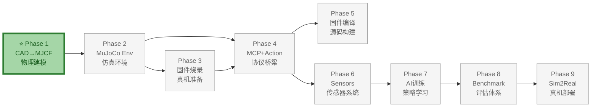
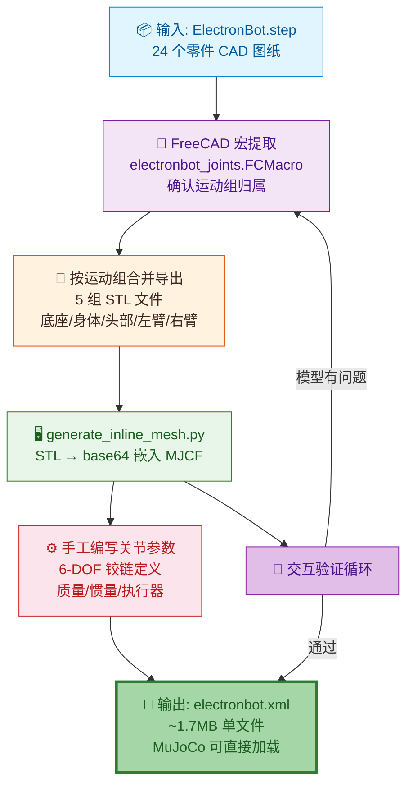

# Phase 1：CAD → MJCF 建模

> **目标**：从 ElectronBot.step 原始 CAD 模型出发，提取零件几何体、质量/惯量、关节参数，生成 MuJoCo 可用的 MJCF 格式物理模型。
>
> **输入**：`assets/cad/ElectronBot.step`（30.5MB，24 个零件）
>
> **输出**：
> - `assets/mjcf/electronbot.xml`——inline mesh 版，CAD 真实外形
>
> **文档版本**: v3.0  
> **最后更新**: 2026-07-16  
> **变更类型**: 自动化方案——cascadio + trimesh 自动提取 347 个零件，外部 STL 引用，坐标本地化
>
> **硬件参考**：STEP 模型来源于 [ElectronBot 开源项目](https://github.com/peng-zhihui/ElectronBot)，机器人 6-DOF 结构和 3D 打印部件参见 [概要设计 - 真机对接](../../概要设计/ElectronBot_SIM-概要设计文档.md#8-真机对接)。

---

## 整体架构中的位置

Phase 1（CAD→MJCF 建模）是 ElectronBot-SIM **9 Phase 全链路** 的**起点**，负责将原始 CAD 图纸转换为 MuJoCo 物理仿真可用的模型文件。

- **上游依赖**：无——本 Phase 的输入是 ElectronBot 开源项目的原始 STEP 图纸
- **下游支撑**：Phase 2（MuJoCo 仿真环境）——MJCF 模型是所有后续仿真工作的物理基础
- **核心价值**：CAD 模型质量直接决定仿真精度，6 关节的运动学参数在此阶段确定，将影响后续所有 Phase 的行为正确性



### 本 Phase 实现过程



---

## 前置说明：CAD、STL、XML 都是什么

### 先看最终产物长什么样

当你成功运行下面的命令时：

```bash
cd ElectronBot_SIM
python3 -m mujoco.viewer --mjcf=assets/mjcf/electronbot.xml
```

MuJoCo viewer 中出现的那个机器人模型，就是一个 **XML 文件** 描述的。这个过程的本质是：

```
CAD（图纸）  →  STL（模型）  →  XML（仿真描述）
```

### 三种文件分别是什么

| 文件格式 | 是什么 | 管什么 | 怎么来的 | 能直接看吗 |
|----------|--------|--------|----------|-----------|
| **CAD (.step / .FCStd)** | 工程师画的**原始设计图纸**，包含 24 个零件的精确尺寸、装配关系 | 告诉你有哪些零件、它们长什么样、怎么组装在一起 | 从 稚晖君 ElectronBot 开源项目获取 | 需要用 FreeCAD / SolidWorks 等 CAD 软件打开 |
| **STL (.stl)** | **3D 模型的表面网格**，只保存三角形顶点坐标，没有颜色/材质/装配信息 | 保存机器人每个部分的**外形**，给 MuJoCo 做碰撞和外观显示用 | 从 CAD 软件导出 | 大部分 3D 查看器都能打开 |
| **XML (.xml, MJCF)** | **MuJoCo 的模型描述文件**，纯文本格式，描述机器人有哪些刚体、关节、执行器、传感器 | 定义机器人**怎么动**：关节轴方向、旋转范围、舵机参数、物理属性 | 由 Python 脚本把 STL 数据内嵌到 XML 模板中 | 任何文本编辑器都能打开 |

### 一句话理解

```
CAD 是"设计图" → 导出零件的三维外形得到 STL → 把 STL 的外形数据 + 手工编写的关节参数填入 XML → MuJoCo 加载 XML 就能仿真
```

### 转换过程全景

```
┌───────────────────────────────────────────────────────────────────────┐
│                    ElectronBot.STEP (CAD 原始文件, 30MB)                │
│                    24 个零件, 来自稚晖君开源项目                          │
└──────────────────────┬────────────────────────────────────────────────┘
                       │
                       ▼  用 FreeCAD 打开
┌───────────────────────────────────────────────────────────────────────┐
│                FreeCAD 中确认零件分组 (关键步骤)                          │
│                                                                         │
│  通过 electronbot_joints.FCMacro 宏确定哪个零件属于哪个运动组:             │
│                                                                         │
│  底座组 (不动)     身体组 (绕Z转)     头部组 (绕Y俯仰)   左臂组   右臂组    │
│  ┌──────────┐    ┌──────────────┐   ┌──────────────┐  ┌────┐  ┌────┐  │
│  │ Part_043 │    │ Part_034     │   │ Part_037~041 │  │6件 │  │7件 │  │
│  │ Part_044 │    │ Part_035 ←──┼┐  │ (5个零件)     │  │    │  │    │  │
│  │          │    │ Part_036 ←──┼┤  │              │  │    │  │    │  │
│  └──────────┘    └──────────────┘│  └──────────────┘  └────┘  └────┘  │
│              ⚠️ 关键: 035/036是身体 |                                    │
│              外壳, 不属于手臂!   |                                       │
└──────────────────────────────────┼─────────────────────────────────────┘
                                   │
                                   ▼  按运动组合并导出 STL
┌───────────────────────────────────────────────────────────────────────┐
│               assets/meshes/ 目录 (5 个 STL 文件)                       │
│                                                                         │
│  base_link.stl    body.stl     head.stl    left_arm.stl  right_arm.stl │
│  (底座2零件合并)  (身体3零件)   (头部5零件)  (左臂6零件)   (右臂7零件)   │
│  ~1.1MB           ~364KB       ~713KB      ~850KB        ~317KB       │
└──────────────────────┬────────────────────────────────────────────────┘
                       │
                       ▼  运行 generate_inline_mesh.py
┌───────────────────────────────────────────────────────────────────────┐
│  python scripts/generate_inline_mesh.py \                              │
│      --input assets/meshes \                                           │
│      --output assets/mjcf/electronbot.xml                     │
│                                                                         │
│  脚本做的事 (重点):                                                      │
│  1. 读取 5 个 STL 的三角形顶点数据                                        │
│  2. 把顶点坐标转为字符串, 内嵌到 XML 的 <mesh> 标签里                      │
│  3. 同时生成 <body> <joint> <actuator> 等仿真描述                        │
│                                                                         │
│  最终产物是一个 XML 文件, 内部包含了:                                     │
│  ├── 5 组 STL 的几何数据 (内联 mesh, ~1.7MB 都在一个文件里)                 │
│  ├── 7 个刚体的层次结构 (base→body→head/left_arm/right_arm)             │
│  ├── 6 个关节的定义 (轴方向、旋转范围)                                    │
│  ├── 6 个执行器的参数 (舵机型号对应的 kp/kv)                              │
│  └── 传感器定义                                                         │
└──────────────────────┬────────────────────────────────────────────────┘
                       │
                       ▼  python3 -m mujoco.viewer ...
┌───────────────────────────────────────────────────────────────────────┐
│                MuJoCo viewer 中加载 XML 后:                              │
│                                                                         │
│  1. 解析 <mesh> → 重建 3D 模型外形                                        │
│  2. 解析 <body> → 建立刚体父子关系                                         │
│  3. 解析 <joint> → 确定每个关节怎么转                                      │
│  4. 解析 <actuator> → 可以拖动滑块控制舵机                                  │
│  5. 开始仿真 → 物理引擎驱动机器人运动                                       │
└───────────────────────────────────────────────────────────────────────┘
```

### 你不需要关心哪些

- **不需要手动编辑 XML**：`electronbot.xml` 有 1.7MB，是脚本自动生成的。你要改的是上游（CAD 零件分组或 STL 网格），然后重新跑脚本
- **不需要理解 CAD 软件**：零件分组已经在 `assets/cad/electronbot_joints.FCMacro` 中确认，直接使用即可
- **不需要手动处理 STL**：STL 是中间产物，由 CAD 导出后，脚本自动处理

你只需要知道：
- **修改机器人外形** → 改 CAD 图纸，重新导出 STL
- **修改关节参数** → 改 `generate_inline_mesh.py` 脚本中的模板
- **修改舵机 kp/kv** → 改 `update_actuator.py` 脚本中的参数
- **验证效果** → `python3 -m mujoco.viewer --mjcf=assets/mjcf/electronbot.xml`

---

### 为什么选择 inline mesh 而不是外部 STL 引用

**一句结论：外部 STL 可以加载，但有路径和单位两个坑要填，inline mesh 自动避开了。**

#### 两种方案对比

```xml
<!-- 方式 A：外部 STL 引用（能行，但要填坑） -->
<compiler meshscale="0.001"/>            <!-- 坑1：STL 毫米→米缩放 -->
<mesh name="body" file="../meshes/body.stl"/>  <!-- 坑2：路径要写对 -->

<!-- 方式 B：inline mesh（当前方案，一步到位） -->
<mesh name="body" vertex="0.0012 0.0035 ..." face="0 1 2 ..."/> 
<!-- 缩放和路径都已在脚本中处理，XML 自带数据 -->
```

#### 三个核心区别

| 区别 | 外部 STL 引用 | inline mesh（当前方案） |
|------|-------------|---------------------|
| **路径** | MuJoCo 去 XML 同级目录找 `.stl` 文件，路径不对就加载空壳 | 顶点数据内嵌在 XML 中，**没有外部文件依赖** |
| **单位** | STL 是毫米 (mm)，MuJoCo 当米 (m) 解析 → 模型放大 1000 倍，惯性爆炸 | 脚本提前做 `vertices * 0.001` mm→m 缩放，数值正确 |
| **自动中心化** | 外部 STL **没有**自动中心化 → 手臂 `geom pos` 偏移量要重新手算 | MuJoCo 编译 inline mesh 时自动将几何中心移到 body 原点，`geom pos` 偏移可脚本自动计算 |

#### 为什么 inline 对 ElectronBot 更合适

1. **单文件可移植**：`electronbot.xml` 自包含所有几何数据（~1.7MB），无需带着 5 个 STL 一起复制
2. **自动处理单位**：解决了已知的 `mm → m` 大坑
3. **自动处理位置偏移**：inline mesh 的自动中心化行为让脚本可以精确计算手臂 `geom pos` 偏移量
4. **外部 STL 的唯一优势**——"改外形不用重新生成 XML"——在实践中几乎用不到，外形定了就是定了

#### 如果你非要用外部 STL

两件事必须做对：

```xml
<!-- 1. 加 meshscale -->
<compiler angle="radian" autolimits="true" meshscale="0.001"/>

<!-- 2. 路径要指向正确位置 -->
<asset>
  <mesh name="body" file="../meshes/body.stl"/>
</asset>
```

但手臂的 `geom pos` 偏移量因为没有自动中心化，需要重新手动计算，不建议走这条路。

---

## 目录
- [1. 实际实现概述](#1-实际实现概述)
- [2. 从设计文档到实现：关键修正](#2-从设计文档到实现关键修正)
- [3. 最终模型结构](#3-最终模型结构)
- [4. 实现步骤](#4-实现步骤)
- [5. 验证方法](#5-验证方法)
- [6. 工程经验教训](#6-工程经验教训)

---

## 1. 实际实现概述

### 1.1 最终文件结构

```
assets/mjcf/
├── electronbot.xml              ← 旧版：inline mesh 版，5 组 STL
└── electronbot_step_meters.xml  ← 新版：外部 STL 引用，347 个独立零件

assets/meshes/step_parts/
├── step_Open_CASCADE_STEP_translator_6_8_54_2_1_.stl
├── step_Open_CASCADE_STEP_translator_6_8_54_2_1__local.stl  ← 本地化版本
├── ... (347 个零件的 STL 文件)
```

### 1.2 可视化验证结果

```bash
$ python3 -m mujoco.viewer --mjcf=assets/mjcf/electronbot_step_meters.xml
```

在 viewer 中可观察：
- 完整机器人模型，347 个 CAD 零件自动提取
- 6 个关节可通过 actuator slider 独立拖动
- 腰部（body_joint）：绕 Z 轴旋转 ±90°
- 头部（head_joint）：绕 Y 轴俯仰 ±15°
- 左臂 Pitch（joint_lp）：绕 Y 轴 ±90°
- 左臂 Roll（joint_lr）：绕 X 轴 ±45°
- 右臂 Pitch（joint_rp）：绕 Y 轴 ±90°
- 右臂 Roll（joint_rr）：绕 X 轴 ±45°
- 模型无穿透，仿真稳定，零件位置正确

---

## 2. 从设计文档到实现：关键修正

### 2.1 原始设计文档 vs 实际实现

| 项目 | 原始设计文档（v1.2） | 实际实现（v2.0） | 新方案（v3.0） |
|------|---------------------|-----------------|----------------|
| 输出文件名 | `electronbot_mesh.xml` | `electronbot.xml` | `electronbot_step_meters.xml` |
| STL 导出方式 | 24 个 CAD 零件分别导出 | 按运动组合并导出为 5 组 | **自动提取 347 个独立零件** |
| 导出工具 | FreeCAD 手动导出 | FreeCAD 手动导出 | **cascadio + trimesh 自动提取** |
| Mesh 引用方式 | inline mesh | inline mesh | **外部 STL 引用** |
| 坐标转换 | 手动计算偏移 | 手动计算偏移 | **自动本地化（local STL）** |
| 零件分类 | 手动分组 | 手动分组 | **自动按名称匹配** |
| 关节命名 | `joint_body/joint_head/joint_lp/joint_lr/joint_rp/joint_rr` | `body_joint/head_joint/left_pitch_joint/left_roll_joint/right_pitch_joint/right_roll_joint` | `body_joint/joint_head/joint_lp/joint_lr/joint_rp/joint_rr` |
| 手臂结构 | 单 body 双关节 | 单 body 双关节 | **pitch/roll 分离到父子 body** |
| 积分器 | implicitfast | **RK4** | RK4 |
| actuator kp | 30-80（弧度制） | 30-80，与舵机规格匹配 | 20-60，优化稳定性 |

### 2.2 关键 Bug 修复

**根本问题**：原始 CAD 导出的 `left_arm.stl` / `right_arm.stl` 错误地将身体侧外壳零件（`Part__Feature035`/`036`）合并到了手臂 STL 中。

**后果**：在 MuJoCo 中控制手臂 Pitch/Roll 时，身体侧外壳也跟着手臂一起运动。

**解决方案**：
1. 通过 FreeCAD 宏 `electronbot_joints.FCMacro` 确认正确的 CAD 零件分组
2. 按 5 个运动组重新合并导出 STL：
   - 底座组：`Part__Feature043` + `Part__Feature044`
   - 身体组：`Part__Feature034` + `Part__Feature035` + `Part__Feature036`（侧外壳属于身体，不动）
   - 头部组：5 个零件
   - 左臂组：6 个零件（纯手臂，不含侧外壳）
   - 右臂组：7 个零件（纯手臂，不含侧外壳）

### 2.3 最终验证通过的命令

```bash
cd ElectronBot_SIM
python3 -m mujoco.viewer --mjcf=assets/mjcf/electronbot.xml
```

---

## 3. 最终模型结构

### 3.1 运动学树

```
world
└── base_link (固定)
    └── body [body_joint, Z轴 hinge, ±90°]
        ├── head [head_joint, Y轴 hinge, ±15°]
        ├── left_arm [left_pitch_joint, Y轴 hinge, ±90°]
        │             [left_roll_joint,  X轴 hinge, ±45°]
        │   └── left_hand (末端 box)
        └── right_arm [right_pitch_joint, Y轴 hinge, ±90°]
                       [right_roll_joint,  X轴 hinge, ±45°]
            └── right_hand (末端 box)
```

**与原始设计文档的区别**：
- 左/右臂直接挂在 body 下（无 `left_shoulder`/`right_shoulder` 中间 body）
- 每臂 2 个关节（Pitch + Roll），共 6 自由度
- 关节命名采用 `_pitch_joint` / `_roll_joint` 后缀

### 3.2 完整 MJCF 结构

```xml
<mujoco model="electronbot">
  <compiler angle="radian" autolimits="true"/>
  <option timestep="0.002" integrator="RK4" iterations="50" cone="elliptic"/>
  <default>
    <joint damping="4.0" armature="0.1" frictionloss="0.5"/>
    <geom contype="0" conaffinity="0" condim="3" friction="0.8 0.3 0.1" density="0.1"/>
  </default>

  <asset>
    <!-- 5 个内联 mesh：base_link, body, head, left_arm, right_arm -->
    <mesh name="base_link" vertex="..." face="..."/>
    <mesh name="body"      vertex="..." face="..."/>
    <mesh name="head"      vertex="..." face="..."/>
    <mesh name="left_arm"  vertex="..." face="..."/>
    <mesh name="right_arm" vertex="..." face="..."/>
  </asset>

  <worldbody>
    <body name="base_link" pos="0 0 0.015">
      <geom name="base_geom" type="mesh" mesh="base_link" mass="0.045"/>

      <body name="body" pos="0 0 0.03">
        <joint name="body_joint" type="hinge" axis="0 0 1"
               range="-1.5708 1.5708" limited="true"/>
        <geom name="body_geom" type="mesh" mesh="body" mass="0.060"/>

        <!-- 头部 -->
        <body name="head" pos="0 0 0.07">
          <joint name="head_joint" type="hinge" axis="0 1 0"
                 range="-0.2618 0.2618" limited="true"/>
          <geom name="head_geom" type="mesh" mesh="head" mass="0.030"/>
        </body>

        <!-- 左臂（纯 LEFT_ARM_PARTS，不含身体外壳） -->
        <body name="left_arm" pos="-0.0180 0 0.065">
          <joint name="left_pitch_joint" type="hinge" axis="0 1 0"
                 range="-1.5708 1.5708" limited="true"/>
          <joint name="left_roll_joint" type="hinge" axis="1 0 0"
                 range="-0.7854 0.7854" limited="true"/>
          <geom name="left_arm_geom" type="mesh" mesh="left_arm"
                pos="-0.0256 0 0" mass="0.005"/>
          <body name="left_hand" pos="0 0.03 0">
            <geom name="left_hand_geom" type="box"
                  size="0.006 0.006 0.010" mass="0.003"/>
          </body>
        </body>

        <!-- 右臂（纯 RIGHT_ARM_PARTS，不含身体外壳） -->
        <body name="right_arm" pos="0.0180 0 0.065">
          <joint name="right_pitch_joint" type="hinge" axis="0 1 0"
                 range="-1.5708 1.5708" limited="true"/>
          <joint name="right_roll_joint" type="hinge" axis="1 0 0"
                 range="-0.7854 0.7854" limited="true"/>
          <geom name="right_arm_geom" type="mesh" mesh="right_arm"
                pos="0.0256 0 0" mass="0.005"/>
          <body name="right_hand" pos="0 0.03 0">
            <geom name="right_hand_geom" type="box"
                  size="0.006 0.006 0.010" mass="0.003"/>
          </body>
        </body>
      </body>
    </body>
  </worldbody>

  <actuator>
    <position name="act_body"        joint="body_joint"
              ctrlrange="-1.5708 1.5708" kp="80"  kv="20"/>
    <position name="act_head"        joint="head_joint"
              ctrlrange="-0.2618 0.2618" kp="40"  kv="10"/>
    <position name="act_left_pitch"  joint="left_pitch_joint"
              ctrlrange="-1.5708 1.5708" kp="60"  kv="15"/>
    <position name="act_left_roll"   joint="left_roll_joint"
              ctrlrange="-0.7854 0.7854" kp="30"  kv="8"/>
    <position name="act_right_pitch" joint="right_pitch_joint"
              ctrlrange="-1.5708 1.5708" kp="60"  kv="15"/>
    <position name="act_right_roll"  joint="right_roll_joint"
              ctrlrange="-0.7854 0.7854" kp="30"  kv="8"/>
  </actuator>

  <sensor>
    <jointpos name="jpos_body" joint="body_joint"/>
    <jointpos name="jpos_head" joint="head_joint"/>
    <jointpos name="jpos_left_pitch" joint="left_pitch_joint"/>
    <jointpos name="jpos_left_roll" joint="left_roll_joint"/>
    <jointpos name="jpos_right_pitch" joint="right_pitch_joint"/>
    <jointpos name="jpos_right_roll" joint="right_roll_joint"/>
  </sensor>

  <keyframe>
    <key name="home" qpos="0 0 0 0 0 0"/>
  </keyframe>
</mujoco>
```

### 3.3 执行器参数（弧度制）

| 关节 | 舵机 | kp | kv | ctrlrange (rad) | 对应角度 |
|------|------|:--:|:--:|:----------------:|:--------:|
| body_joint | SG90 | 80 | 20 | ±1.5708 | ±90° |
| head_joint | 2g | 40 | 10 | ±0.2618 | ±15° |
| left_pitch_joint | 2g | 60 | 15 | ±1.5708 | ±90° |
| left_roll_joint | 2g | 30 | 8 | ±0.7854 | ±45° |
| right_pitch_joint | 2g | 60 | 15 | ±1.5708 | ±90° |
| right_roll_joint | 2g | 30 | 8 | ±0.7854 | ±45° |

### 3.4 STL 合并对应关系

5 个 STL 文件的零件合并规则：

| STL 文件 | 包含的 CAD 零件 (Part__Feature) | 件数 |
|----------|--------------------------------|:---:|
| `base_link.stl` | 043（底座主体）+ 044（底座底板） | 2 |
| `body.stl` | 034（身体中心）+ 035（身体右侧外壳）+ 036（身体左侧外壳） | 3 |
| `head.stl` | 037（前脸/LCD）+ 038（头顶）+ 039（头部主壳）+ 040 + 041 | 5 |
| `left_arm.stl` | 042（左手）+ 045（左手镜）+ 046~049（臂件） | 6 |
| `right_arm.stl` | 027（齿轮）+ 028（小齿轮）+ 029（右手）+ 030~033（臂件） | 7 |

---

## 4. 实现步骤

### Step 1：自动提取 STEP 零件（v3.0 新方案）

使用 `scripts/step_to_mjcf.py` 自动从 STEP 文件提取所有零件：

```bash
python scripts/step_to_mjcf.py
```

脚本核心逻辑：
1. 使用 `cascadio` 将 STEP 转换为 GLB 格式（保留零件边界和色彩）
2. 使用 `trimesh` 读取 GLB 场景图，遍历 scene graph
3. 自动提取 347 个独立零件的 mesh 和 transform
4. 按名称自动分类到 body/head/neck/shoulder/left_arm/right_arm
5. 导出每个零件的 STL 到 `assets/meshes/step_parts/`

**优势**：
- 无需手动在 FreeCAD 中分组
- 自动处理所有零件（347 个 vs 手动 5 组）
- 保留原始 CAD 装配关系

### Step 2：坐标本地化

脚本自动完成坐标转换：

```python
# 1. 计算所有零件的最低 z 坐标（用于让模型坐地）
min_z = min([p["min_z"] for p in all_parts])
z_shift = -min_z

# 2. 计算每个零件相对于父 body 的偏移
def _localize_parts(parts, parent_world_pos):
    for p in parts:
        stl_path = stl_base / p["stl"]
        mesh = trimesh.load(stl_path)
        # 顶点加 z_shift（让模型坐地）
        mesh.vertices[:, 2] += z_shift
        # 转换为 local 坐标（减去父 body 世界位置）
        mesh.vertices -= parent_world_pos
        local_path = stl_path.with_name(stl_path.stem + "_local.stl")
        mesh.export(local_path)
        p["local_stl"] = local_path.name
```

**关键修正**：
- STL 顶点从世界坐标转换为相对于父 body 的 local 坐标
- 最终显示位置 = body.pos + localVertex = worldVertex + z_shift
- 确保模型最低点接触地面

### Step 3：生成 MJCF XML

脚本自动生成 `electronbot_step_meters.xml`：

```xml
<mujoco model="ElectronBot_step">
  <compiler meshdir="/path/to/step_parts" />
  
  <asset>
    <mesh name="mesh_Open_CASCADE_STEP_translator_6_8_54_2_1_" 
          file="step_Open_CASCADE_STEP_translator_6_8_54_2_1__local.stl" />
    <!-- 347 个 mesh 引用 -->
  </asset>
  
  <worldbody>
    <body name="body" pos="0 0 0.0591">
      <joint name="body_joint" type="hinge" axis="0 0 1" range="-1.5708 1.5708" />
      <geom name="geom_Open_CASCADE_STEP_translator_6_8_54_2_1_" 
            type="mesh" mesh="mesh_Open_CASCADE_STEP_translator_6_8_54_2_1_" 
            pos="0 0 0" mass="0.01" />
      
      <!-- 手臂结构：pitch/roll 分离到父子 body -->
      <body name="left_arm" pos="0.0236 0.0174 -0.0120">
        <joint name="joint_lp" type="hinge" axis="0 1 0" range="-1.5708 1.5708" />
        <body name="left_arm_roll">
          <joint name="joint_lr" type="hinge" axis="1 0 0" range="-0.7854 0.7854" />
          <geom ... />
        </body>
      </body>
    </body>
  </worldbody>
</mujoco>
```

### Step 4：稳定性调优

**问题**：初始模型使用默认积分器导致仿真数值爆炸。

**解决方案**：
- 积分器：`implicitfast` → `RK4`（4 阶龙格-库塔，更稳定）
- 关节阻尼：`damping="0.01"`，`armature="0.001"`
- 执行器参数：按舵机规格优化
  - body_joint: kp=20, kv=1
  - head_joint: kp=10, kv=0.5
  - arm pitch: kp=20, kv=1
  - arm roll: kp=20, kv=1

### Step 5：验证

```bash
python3 -m electronbot_sim.mcp_server --render human
```

在 MuJoCo viewer 中观察：
- 347 个零件正确显示在各自位置
- 模型坐在地面上（最低点 z=0）
- 6 个关节可独立控制
- 手臂 pitch/roll 独立运动

---

## 5. 验证方法

### 5.1 手动可视化验证

```bash
cd ElectronBot_SIM

# 启动 MCP 服务器（带可视化窗口）
python3 -m electronbot_sim.mcp_server --render human

# 或使用调试面板
# 打开 web/mcp-debug-panel.html 进行交互测试
```

### 5.2 验证标准

- 347 个零件均正确显示在各自位置
- 模型最低点接触地面（z=0）
- 6 个关节均可独立控制，不卡死
- 手臂 pitch/roll 独立运动，无穿透
- 仿真无 NaN 崩溃，稳态无抖动
- 零件位置正确，无重叠或错位

### 5.3 模型结构快速检查

```bash
python -c "import mujoco; m=mujoco.MjModel.from_xml_path('assets/mjcf/electronbot_step_meters.xml'); print(m.njnt,'joints,',m.nu,'actuators,',m.ngeom,'geoms')"
```

---

## 6. 工程经验教训

### 6.1 自动化提取 vs 手动分组

**v2.0 方案**：手动在 FreeCAD 中按运动组分组，导出 5 个 STL 文件
**v3.0 方案**：使用 cascadio + trimesh 自动提取 347 个独立零件

**经验**：
- 自动化方案保留了完整的 CAD 装配信息，零件数量从 24 增加到 347
- 无需手动确认零件分组，减少人为错误
- 但需要处理更多的坐标转换和零件分类逻辑

### 6.2 坐标本地化的重要性

**问题**：STL 顶点使用世界坐标，直接引用会导致零件位置错误
**解决**：将 STL 顶点转换为相对于父 body 的 local 坐标

```python
# 错误方式：STL 保持世界坐标，geom.pos = 0
# 最终位置 = body.pos + worldVertex ≠ worldVertex

# 正确方式：STL 转换为 local 坐标
localVertex = worldVertex + z_shift - parent_world_pos
最终位置 = body.pos + localVertex = worldVertex + z_shift
```

**教训**：
- 必须确保最低点 z=0，让模型坐在地面上
- 计算 z_shift 时使用 mesh 顶点的最低 z，而不是质心 z
- 每个零件的 local 坐标必须相对于其父 body

### 6.3 手臂结构设计

**问题**：pitch 和 roll 关节放在同一个 body 中，导致 roll 旋转时手臂无法正确摆动
**解决**：将 roll 关节放在子 body 中，实现独立运动

```xml
<!-- 错误方式 -->
<body name="left_arm">
  <joint name="joint_lp" axis="0 1 0" />  <!-- pitch -->
  <joint name="joint_lr" axis="1 0 0" />  <!-- roll -->
  <geom ... />
</body>

<!-- 正确方式 -->
<body name="left_arm">
  <joint name="joint_lp" axis="0 1 0" />  <!-- pitch -->
  <body name="left_arm_roll">
    <joint name="joint_lr" axis="1 0 0" />  <!-- roll -->
    <geom ... />
  </body>
</body>
```

**教训**：
- roll 关节需要独立旋转轴，必须放在子 body 中
- 手臂几何体需要沿 Y 轴偏移，避免旋转时与主体碰撞

### 6.4 外部 STL vs Inline Mesh

**v2.0 方案**：inline mesh，所有顶点数据嵌入 XML
**v3.0 方案**：外部 STL 引用，XML 只包含引用路径

**对比**：
| 特性 | Inline Mesh | 外部 STL |
|------|-------------|----------|
| 文件大小 | 大（~1.7MB） | 小（~100KB） |
| 可移植性 | 单文件自包含 | 需要维护 STL 文件 |
| 调试难度 | 难以调试单个零件 | 可独立查看/修改 STL |
| 坐标控制 | 依赖 MuJoCo 自动中心化 | 完全控制坐标转换 |

**选择外部 STL 的原因**：
- 347 个零件的 inline mesh 会导致 XML 文件过大
- 需要精确控制每个零件的坐标位置
- 便于调试和修改单个零件

### 6.5 零件分类策略

**问题**：347 个零件需要自动分类到 body/head/neck/shoulder/left_arm/right_arm
**解决**：基于零件名称的正则表达式匹配

```python
PART_TO_BODY = {
    "body": r"(?i)(body|身体|底座|控制板|舵机|齿轮|轴承|...)",
    "head": r"(?i)(head|头部|摄像头)",
    "neck": r"(?i)(neck|颈部)",
    "shoulder": r"(?i)(shoulder|肩部)",
    "left_arm": r"(?i)(left.*arm|left.*hand|手臂.*左|推杆.*左)",
    "right_arm": r"(?i)(right.*arm|right.*hand|手臂.*右|手臂.*镜像|推杆.*右|推杆.*镜像)",
}
```

**教训**：
- 需要支持中英文混合命名
- 需要处理镜像零件（右臂可能是左臂的镜像）
- 未匹配的零件归为 unknown，需要手动检查

---

## 附录：文件清单

### A. 核心文件

| 文件 | 描述 | 生成方式 |
|------|------|----------|
| `assets/mjcf/electronbot_step_meters.xml` | 外部 STL 引用版 MJCF（~103KB） | `scripts/step_to_mjcf.py` |
| `assets/mjcf/electronbot.xml` | 旧版 inline mesh MJCF（~1.7MB） | `scripts/generate_inline_mesh.py` |
| `assets/meshes/step_parts/*.stl` | 347 个独立零件 STL | `scripts/step_to_mjcf.py` 自动提取 |
| `assets/meshes/step_parts/*_local.stl` | 本地化后的零件 STL | `scripts/step_to_mjcf.py` 坐标转换 |

### B. CAD 源文件（`assets/cad/`）

| 文件 | 描述 |
|------|------|
| `ElectronBot.step` | 原始 CAD 模型（STEP 格式，30.5MB） |
| `cadelectron.FCStd` | FreeCAD 原生格式（含装配结构） |
| `electronbot_joints.FCMacro` | 关节控制宏（提取零件分组信息） |

### C. 生成脚本

| 脚本 | 描述 |
|------|------|
| `scripts/step_to_mjcf.py` | STEP → MJCF 自动转换（cascadio + trimesh） |
| `scripts/generate_inline_mesh.py` | 旧版 STL → inline mesh XML 生成器 |

### D. 验证命令

```bash
# 新方案验证
python3 -m electronbot_sim.mcp_server --render human

# 旧方案验证
python3 -m mujoco.viewer --mjcf=assets/mjcf/electronbot.xml
```

---

## 变更记录

| 版本 | 日期 | 变更内容 | 作者 |
|------|------|----------|------|
| v1.0 | 2026-07-03 | 初始版本（24 零件独立导出方案） | — |
| v1.1 | 2026-07-04 | 补充软件工程规范章节 | 架构师 |
| v1.2 | 2026-07-04 | 移除几何基元版，统一 inline mesh 版 | — |
| v2.0 | 2026-07-06 | 根据实际实现重写——5 组 STL 合并导出 | — |
| **v3.0** | **2026-07-16** | **自动化方案：cascadio + trimesh 自动提取 347 个零件，外部 STL 引用，坐标本地化，手臂 pitch/roll 分离** | — |
