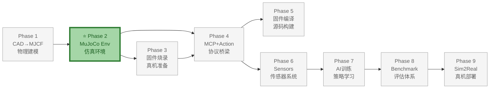
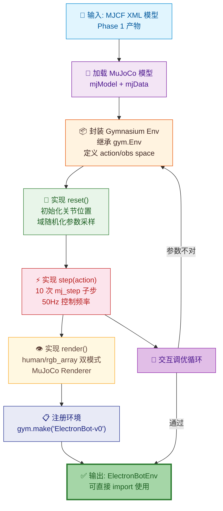

# Phase 2：MuJoCo 基础仿真环境

> **目标**：将 MJCF 模型封装为标准的 Gymnasium 强化学习环境，实现基础的物理仿真循环和键盘交互控制。
>
> **前置依赖**：Phase 1 完成（electronbot.xml 可用）
>
> **输出**：`src/electronbot_sim/env.py`——可直接 `import` 使用的 Gymnasium 环境
>
> **文档版本**: v1.4  
> **最后更新**: 2026-07-08  
> **变更类型**: 代码对齐——ElectronBotEnv 正式继承 gymnasium.Env
>
> **硬件参考**：机器人模型来自于 ElectronBot 真机 STEP 原始设计，6 关节运动学参数与真机舵机一一对应（参见 [原版 vs 小智版差异 - 舵机系统](../../概要设计/ElectronBot-原版vs小智版-差异分析.md#5-舵机系统差异)）。

---

## 整体架构中的位置

Phase 2（MuJoCo 基础仿真环境）是 ElectronBot-SIM **9 Phase 全链路** 中的仿真基础设施层，将 Phase 1 的物理模型封装为标准化 RL 环境。

- **上游依赖**：Phase 1（CAD→MJCF）——需要完整的 `.xml` 物理模型
- **下游支撑**：Phase 4（MCP+Action）——MCP Bridge 直接驱动本 Phase 的 `ElectronBotEnv`；Phase 6（Sensors）——传感器系统寄生在仿真环境之上
- **核心价值**：所有后续 AI 训练、Benchmark 评估都在此环境上运行；环境质量 = 训练效果上限



### 本 Phase 实现过程



---

## 0. 技术背景：Gymnasium

Gymnasium 是 OpenAI Gym 的社区维护继任者，是强化学习领域事实上的**标准环境接口规范**。它定义了一套统一的 API（`reset → step → render → close`），使物理仿真、游戏、机器人控制等不同后端都可以通过相同的方式与 RL 算法交互。

### 0.1 为何选择 Gymnasium

在本项目中，Gymnasium 充当 **MuJoCo 物理引擎** 与 **RL 训练框架** 之间的桥梁：

```
RL 训练框架                          MuJoCo 物理引擎
(Stable-Baselines3 / CleanRL)        (刚体动力学仿真)
        │                                    │
        └────────── Gymnasium ───────────────┘
                   (统一接口层)
              ElectronBotEnv(gym.Env)
              ├── action_space: Box(6,)
              ├── observation_space: Dict{...}
              ├── reset() → obs, info
              ├── step(action) → obs, reward, done, info
              └── render() → frame | None
```

不直接使用 MuJoCo 原生 API 的原因：

| 考量 | 说明 |
|------|------|
| **生态兼容性** | Stable-Baselines3、CleanRL、Ray RLLib 等主流框架均以 Gymnasium 接口为输入，遵循该规范即可零成本接入 |
| **可复现性** | `seed` 参数统一控制随机性，`info` 字典承载调试元数据 |
| **向量化加速** | `gym.vector` / `EnvPool` 等工具可透明地将单环境包装为并行环境，无需修改环境代码 |
| **社区惯用范式** | 研究者熟悉 `env.step()` 交互循环，降低协作与复现门槛 |

### 0.2 核心概念

#### 0.2.1 动作空间（Action Space）

定义策略可以输出的动作格式。`gym.spaces.Box` 表示连续值向量，`gym.spaces.Discrete` 表示离散选项。本环境使用 `Box(6,)`，值为 6 个关节的角度增量（度）。

#### 0.2.2 观测空间（Observation Space）

定义环境返回给策略的状态格式。支持嵌套结构，本环境使用 `gym.spaces.Dict`，按语义分组的字典观测比扁平向量更易于调试和理解。

#### 0.2.3 step() 的五元组返回值

每次 `step(action)` 返回 `(obs, reward, terminated, truncated, info)`：

| 返回值 | 类型 | 语义 |
|--------|------|------|
| `obs` | 与 `observation_space` 匹配 | 当前状态观测 |
| `reward` | `float` | 即时奖励信号 |
| `terminated` | `bool` | 任务成功/失败（如机器人摔倒），episode 应终止 |
| `truncated` | `bool` | 超时截断（达到 `max_episode_steps`），episode 应终止但不算失败 |
| `info` | `dict` | 调试信息（关节限位触及、控制能耗、fps 等） |

> **terminated vs truncated 分离**（Gymnasium ≥ 0.26 引入）是区分"环境自身终止"和"外部超时截断"的关键设计，RL 算法据此决定是否将终止状态作为负样本学习。

#### 0.2.4 环境注册

Gymnasium 支持通过字符串 ID 注册环境，使 `gym.make("ElectronBot-v0")` 即可创建实例：

```python
from gymnasium.envs.registration import register

register(
    id="ElectronBot-v0",
    entry_point="electronbot_sim.env:ElectronBotEnv",
    max_episode_steps=1000,
)
```

### 0.3 与 MuJoCo 的关系

| 层面 | MuJoCo | Gymnasium（本环境） |
|------|--------|-------------------|
| 物理状态 | `mjData.qpos` / `qvel` | `obs["joint_pos"]` / `obs["joint_vel"]`（已转为度） |
| 控制输入 | `mjData.ctrl`（原始力矩/位置目标） | `action`（6 维角度增量，度） |
| 仿真推进 | `mj_step()` | `step()`（内部调用 10 次 `mj_step1/mj_step2`，封装为 50Hz） |
| 模型定义 | MJCF XML | `action_space` / `observation_space`（类型安全的接口契约） |

---

## 1. 预期效果

### 1.1 阶段完成后的状态

```python
# 用户代码——3 行创建一个可交互的 ElectronBot 仿真
from electronbot_sim.env import ElectronBotEnv

env = ElectronBotEnv(render_mode="human")
obs, info = env.reset()

# 键盘控制 6 个关节
while True:
    action = get_keyboard_action()  # W/S/A/D/Q/E 等按键
    obs, reward, terminated, truncated, info = env.step(action)
    env.render()
```

```
$ python -m electronbot_sim.interactive
🎮  ElectronBot 键盘控制模式

  [1/2] 头部俯仰 (head)       [3/4] 身体旋转 (body)
  [Q/A] 左臂 Pitch (lp)       [W/S] 左臂 Roll (lr)
  [E/D] 右臂 Pitch (rp)       [R/F] 右臂 Roll (rr)
  [Space] 复位 home           [Esc] 退出

  当前状态:
    head=-2.3°  body=+15.1°  lp=+45.2°  lr=-30.0°  rp=-22.1°  rr=+38.5°
```

### 1.2 功能清单

| 功能 | 描述 |
|------|------|
| `env.reset()` | 重置机器人到 home 姿态，随机化桌面物体位置 |
| `env.step(action)` | 执行一个控制步（50Hz），推进仿真，返回观测 |
| `env.render()` | OpenGL 窗口渲染 |
| 键盘交互 | 实时控制 6 个关节并显示当前角度 |
| 碰撞检测 | 关节运动触及限位时有视觉提示 |
| 物理参数可调 | 舵机力矩、摩擦系数均可外部设置 |

---

## 2. 架构设计

### 2.1 类结构

```
ElectronBotEnv (Gymnasium Env)
├── 继承：gymnasium.Env
├── 内部持有：mujoco.MjModel / mujoco.MjData
├── 内部持有：Renderer (OpenGL)
└── 提供标准 gym 接口

├── action_space:  Box(6,)   ← 6 个机械关节的位置增量 (Δ角度, 度)
├── observation_space:  Dict({
│       "joint_pos": Box(6,),      ← 6 个关节当前角度
│       "joint_vel": Box(6,),      ← 6 个关节当前角速度 (°/s)
│       "ee_left_pos": Box(3,),    ← 左手位置 (xyz, m)
│       "ee_right_pos": Box(3,),   ← 右手位置 (xyz, m)
│       "head_angle": Box(1,),     ← 头部角度
│   })
└── metadata: {"render_modes": ["human", "rgb_array"]}
```

### 2.2 控制频率

```
真机: 50Hz PWM (20ms 周期) + 10ms 插值步进
仿真: 50Hz (dt = 0.02s) × 仿真子步数

mj_step() 内部:
  nsubsteps = 10  → 每个仿真子步 0.002s
  总步长 = 0.02s
```

### 2.3 动作空间设计

采用**增量式位置控制**（Δ角度），因为：
- RL 训练时增量控制比绝对位置控制更容易学习
- 与 MCP 绝对位置控制的转换很简单：`new_abs = clamp(current_abs + delta, min, max)`

```python
import gymnasium as gym
import numpy as np

class ElectronBotEnv(gym.Env):
    def __init__(self, render_mode=None, **kwargs):
        super().__init__()
        
        # ─── 动作空间：6 个关节的角度增量 (°/步) ───
        self.action_space = gym.spaces.Box(
            low=np.array([-5.0] * 6),   # 每步最多转 5°
            high=np.array([5.0] * 6),
            dtype=np.float32
        )
        
        # ─── 观测空间 ───
        self.observation_space = gym.spaces.Dict({
            "joint_pos": gym.spaces.Box(
                low=np.array([-90, -45, -90, -45, -90, -30]),
                high=np.array([90, 45, 90, 45, 90, 30]),
                dtype=np.float32
            ),
            "joint_vel": gym.spaces.Box(
                low=-360.0, high=360.0, shape=(6,), dtype=np.float32
            ),
            "ee_left_pos": gym.spaces.Box(
                low=-1.0, high=1.0, shape=(3,), dtype=np.float32
            ),
            "ee_right_pos": gym.spaces.Box(
                low=-1.0, high=1.0, shape=(3,), dtype=np.float32
            ),
            "head_angle": gym.spaces.Box(
                low=-30.0, high=30.0, shape=(1,), dtype=np.float32
            ),
        })
        
        # ─── 域随机化参数（可外部覆写的入口） ───
        self.friction_range = kwargs.get("friction_range", (0.8, 1.2))
        self.gain_range = kwargs.get("gain_range", (0.9, 1.1))
        self.servo_deadband = kwargs.get("servo_deadband", 0.0)       # 归一化值 (0~1), 对应约 0-5° deadband
        self.battery_voltage = kwargs.get("battery_voltage", 4.2)     # V, 空载 4.2, 满载可降至 3.5
        self.actuator_gain_scale = 1.0  # 由 battery_voltage 计算: (battery_voltage/4.2)

        # ─── 观测模式 ───
        # obs_mode="full": 仿真专属研究用，含 joint_vel / ee_positions
        # obs_mode="realistic": Sim2Real 用，仅含真机可获取的数据
        self.obs_mode = kwargs.get("obs_mode", "realistic")
        
        # ─── MuJoCo 加载 ───
        self.model = mujoco.MjModel.from_xml_path(
            str(Path(__file__).parent.parent.parent / "assets/mjcf/scene_tabletop.xml")
        )
        self.data = mujoco.MjData(self.model)
        
        # ─── 渲染器 ───
        self.render_mode = render_mode
        self.renderer = None
        if render_mode == "human":
            self.renderer = mujoco.Renderer(self.model, 480, 480)
```

### 2.4 仿真主循环

```python
def step(self, action):
    """执行一个控制步"""
    # 1. 增量→绝对角度
    current_angles = self._get_joint_angles()
    target_angles = np.clip(
        current_angles + action,  # delta
        self.joint_min, self.joint_max
    )
    
    # 2. 设置执行器目标
    self._set_actuator_targets(target_angles)
    
    # 3. 推进物理仿真 (50Hz, 10 子步)
    self.data.ctrl[:] = target_angles
    for _ in range(int(0.02 / self.model.opt.timestep)):
        mujoco.mj_step1(self.model, self.data)
        # ... 可插入自定义逻辑（碰撞检测、力传感器读数等）
        mujoco.mj_step2(self.model, self.data)
    
    # 4. 构建观测
    obs = self._build_observation()
    
    # 5. 渲染（可选）
    if self.render_mode == "human" and self.renderer:
        self.renderer.update_scene(self.data, camera="head_cam")
        self.renderer.render()
    
    return obs, 0.0, False, False, {}
```

### 2.5 ElectronBotEnv 核心功能详解

除了 Gymnasium 标准接口（`reset` / `step` / `render` / `close`）外，`ElectronBotEnv` 还实现了以下专为 ElectronBot 机器人设计的核心功能。

#### 2.5.1 舵机↔机械关节双向映射

这是 ElectronBotEnv 区别于通用 MuJoCo 环境的最关键设计。真机的舵机角度与仿真中的机械关节角度之间存在**非线性映射关系**，由三个参数决定：

```
joint_angle = (servo_angle - SERVO_CENTER[i]) × SERVO_RATIO[i] × SERVO_DIRECTION[i]
servo_angle = joint_angle / (SERVO_RATIO[i] × SERVO_DIRECTION[i]) + SERVO_CENTER[i]
```

| 参数 | 含义 | 示例（头部） |
|------|------|------------|
| `SERVO_CENTER` | 舵机中心角度（度） | `HEAD=90°` |
| `SERVO_RATIO` | 舵机范围 / 机械范围比值 | `HEAD=60°/30°=2.0` |
| `SERVO_DIRECTION` | 方向符号（+1 同向 / -1 反向） | `RP/RR=-1`（右臂反向） |

**全项目单一数据源**：以下 6 组常量定义在 `env.py` 中，`McpSimBridge`、`ElectronBotActions` 等模块必须从此处导入，禁止多处置复定义：

```python
# 关节顺序: [RP, RR, LP, LR, BODY, HEAD]
SERVO_CENTER    = np.array([180.0, 140.0, 0.0,  40.0, 90.0, 90.0])
SERVO_RATIO     = np.array([1.0,   1.125, 1.0,  1.125,1.5,  2.0])
SERVO_DIRECTION = np.array([-1.0,  -1.0,  1.0,  1.0,  1.0,  1.0])
```

**派生数据**（由 SERVO_* 常量 + 固件安全范围自动推算）：

| 常量 | 值 | 说明 |
|------|-----|------|
| `SERVO_LIMITS` | `{(0,180),(100,180),(0,180),(0,80),(30,150),(75,105)}` | 对齐固件 `ClampServoTarget()` |
| `SERVO_HOME` | `[180, 180, 0, 0, 90, 90]` | 对齐固件 `servo_initial` |
| `JOINT_MIN` | `[-90, -45, -90, -45, -90, -30]` | 机械关节下界（度） |
| `JOINT_MAX` | `[90, 45, 90, 45, 90, 30]` | 机械关节上界（度） |
| `HOME_QPOS` | `[0, -45, 0, -45, 0, 0]` | home 姿态机械关节角度（度） |
| `SERVO_NAME_TO_INDEX` | `{"rp":0, "rr":1, "lp":2, "lr":3, "b":4, "h":5, ...}` | 舵机名称→索引映射 |

**转换函数**（供外部模块复用）：

| 函数 | 功能 |
|------|------|
| `servo_to_joint(idx, angle)` | 单舵机角度 → 单关节角度 |
| `joint_to_servo(idx, angle)` | 单关节角度 → 单舵机角度 |
| `servo_array_to_joint_array(arr)` | 6 维舵机 → 6 维关节（批量） |
| `joint_array_to_servo_array(arr)` | 6 维关节 → 6 维舵机（批量） |
| `clamp_servo_target(idx, angle)` | 舵机安全角度裁剪（对齐固件，返回 int） |

#### 2.5.2 角度单位三层约定

全项目强制执行三级角度单位隔离，避免 `57.3×`（180/π）量级偏差：

```
┌─────────────────────────────────────────────┐
│  Python 层 (mcp_bridge / actions / sensors)  │
│  运算单位: 度 °                              │
│  示例: joint_pos = [-45.0, 0.0, ...]        │
├─────────────────────────────────────────────┤
│  转换边界 (env.py 统一管控)                   │
│  读 qpos → np.degrees()                     │
│  写 ctrl → np.radians()                     │
├─────────────────────────────────────────────┤
│  MuJoCo 层 (data.qpos / data.ctrl / qvel)   │
│  存储单位: 弧度 rad                           │
│  注意: 即使 MJCF 设了 angle="degree", 运行   │
│        时 data.* 仍为弧度                    │
└─────────────────────────────────────────────┘
```

**严禁**任何外部模块直接写度数到 `data.ctrl`——必须通过 `apply_joint_targets_deg()` 入口。

#### 2.5.3 Bridge / Actions 专用接口

为 `McpSimBridge` 和 `ElectronBotActions` 提供独立于 Gymnasium 标准 API 的底层控制接口：

| 方法 | 签名 | 用途 |
|------|------|------|
| `apply_joint_targets_deg` | `(joint_angles_deg: ndarray)` | **唯一合法的写 ctrl 入口**——接收 6 维机械关节角度（度），内部裁剪到限位、转弧度后写入 `data.ctrl` |
| `step_simulation` | `(substeps: int = None) → bool` | **推进物理仿真的唯一入口**——不构建观测、不计算奖励、不递增 step_count，仅供 Bridge 多步插值时调用。返回 True 表示仿真状态合法 |
| `is_state_valid` | `() → bool` | 公开的 NaN/爆炸状态检测 |
| `get_commanded_joint_pos` | `() → ndarray` | 获取最后指令的关节角度（度），供 realistic 观测模式使用 |
| `set_moving_state` | `(is_moving: bool)` | 运动状态标志，供 Actions 在插值开始/结束时调用 |
| `get_battery_info` | `() → dict` | 返回 `{"voltage", "percent", "is_charging"}`，供 `battery.get_level` MCP 工具使用 |
| `get_servo_angles` | `() → ndarray` | 由机械关节角度反推舵机角度（度），供 `get_trims` / `get_status` 等 MCP 工具使用 |

#### 2.5.4 realistic 观测模式的实际内容

文档 §6.2.2 中描述的 `realistic` 模式仅保留 `joint_pos` 和 `head_angle`，实际代码中的 `realistic` 模式更进一步——**完全不依赖 MuJoCo 传感器读数**，仅包含真机固件可直接获取的信息：

| 字段 | 类型 | 来源 | 说明 |
|------|------|------|------|
| `commanded_joint_pos` | `Box(6,)` | `self._last_commanded` | 最后指令的关节目标角度（固件可记录），而非 MuJoCo 实际 qpos |
| `is_moving` | `Box(1,)` | `self._is_moving` | 布尔标志（0/1），表示是否有非零动作在执行中 |
| `battery_voltage` | `Box(1,)` | `dr_params.battery_voltage` | 电池电压（V），范围 3.5-4.2 |
| `battery_percent` | `Box(1,)` | 由电压线性换算 | 电量百分比 `(V-3.0)/1.2×100`，范围 0-100 |

这样设计的目的是**消除 Sim2Real Gap**——策略在仿真中仅依赖 `commanded_joint_pos`（指令目标）而非 `joint_pos`（实际位置），因为真机没有编码器反馈实际位置。将电池状态纳入观测也让策略能够感知执行器增益随电压的变化。

#### 2.5.5 便捷访问属性

| 属性/方法 | 类型 | 说明 |
|-----------|------|------|
| `joint_min` | `property → ndarray` | 关节下界（度） |
| `joint_max` | `property → ndarray` | 关节上界（度） |
| `np_random` | `property → Generator` | 环境独立随机数生成器 |
| `get_joint_positions()` | `() → ndarray` | `_get_joint_angles_deg()` 别名 |
| `get_ee_position(name)` | `(str) → ndarray` | 末端执行器世界坐标（m） |

#### 2.5.6 仿真子步数动态计算

与设计文档中固定 `nsubsteps=10` 不同，实际实现采用**动态子步数**：

```python
substeps = max(1, int(self.dt / self.model.opt.timestep))
```

这确保在 MJCF 模型改变 `timestep` 参数时，`step()` 仍然推进精确 `0.02s` 的仿真时间，避免帧率漂移。

#### 2.5.7 human 渲染模式延迟初始化

`human` 模式使用 `mujoco.viewer.launch_passive`（非阻塞 viewer），且在首次 `render()` 时延迟初始化。这避免了在无头 CI 环境中 `__init__` 时就因 GLFW 不可用而崩溃。失败时自动回退到 `rgb_array` 模式。

---

## 3. 实现步骤

### Step 1：环境骨架

实现 `env.py` 的最小可用版本（reset + step + 基本观测），略去 reward 和任务逻辑。

### Step 2：物理参数校准

根据真机舵机规格，校准 MuJoCo 执行器参数：

```python
# 舵机 → MuJoCo actuator 参数映射
servo_specs = {
    # actuator_name: (gear_ratio, kp, force_range_Nm, damping)
    "act_body": (1.5,  60, 0.12, 0.005),  # SG90 1.2kg·cm ≈ 0.12Nm
    "act_head": (2.0,  40, 0.04, 0.002),  # 2g 舵机
    "act_rp":   (1.0,  50, 0.08, 0.003),  # 2g/4.3g 舵机 (取决于位置)
    "act_rr":   (1.125,30, 0.05, 0.002),
    "act_lp":   (1.0,  50, 0.08, 0.003),
    "act_lr":   (1.125,30, 0.05, 0.002),
}
```

### Step 3：键盘交互 + 动作演示脚本

```python
# src/electronbot_sim/interactive.py
# 使用 pygame 或 pynput 捕获键盘，实时控制
```

#### visual_demo.py——自动动作演示

与 `mujoco.viewer` 的区别：

| | `mujoco.viewer` | `visual_demo.py` |
|---|---|---|
| 交互方式 | 手动拖滑块 | 自动播放预设序列 |
| 用途 | 模型查验、关节限位测试 | 控制管线验证、对外展示 |
| 控制方式 | 直接操作 position actuator | 调用 `McpSimBridge.handle_request()` |
| 无头模式 | `MUJOCO_GL=egl` | `--headless`，帧存 `/tmp/` + 生成 GIF |

典型动作序列：`home → 挥手 → 点头 → 转身 → home`，循环播放。

### Step 4：域随机化接口

```python
def randomize_domain(self):
    """随机化物理参数——域随机化入口"""
    rng = np.random.default_rng()
    
    # 关节摩擦随机化
    for i in range(self.model.njnt):
        scale = rng.uniform(*self.friction_range)
        self.model.dof_damping[i] *= scale
        
    # 执行器增益随机化  
    for i in range(self.model.nu):
        scale = rng.uniform(*self.gain_range)
        self.model.actuator_gainprm[i, 0] *= scale
        
    # 物体质量随机化
    for i in range(self.model.nbody):
        self.model.body_mass[i] *= rng.uniform(0.85, 1.15)
    
    # ── 新增：伺服死区随机化 (真机 2-5° deadband) ──
    # 归一化到 MuJoCo 动作空间后，<deadband 的动作不产生实际效果
    self.servo_deadband = rng.uniform(0.011, 0.028)  # 约 2-5° / 180°
    
    # ── 新增：电池电压效应 (影响执行器增益) ──
    # 真实锂电池 103030 在 6 舵机满载时电压从 4.2V 降至 ~3.5V
    self.battery_voltage = rng.uniform(3.5, 4.2)
    self.actuator_gain_scale = self.battery_voltage / 4.2  # 0.83 ~ 1.0
    
    # 应用电池增益缩放
    for i in range(self.model.nu):
        self.model.actuator_gainprm[i, 0] *= self.actuator_gain_scale
```

### 🔴 qfrc_applied 残留清零

MuJoCo 的 `qfrc_applied` 是持久状态，干扰测试后若不主动清零会导致后续测试受影响。

```python
# robot.py: reset() 中必须加
def reset(self):
    self.data.qfrc_applied[:] = 0  # ← 关键
    mujoco.mj_resetData(self.model, self.data)
    # ...

# test_env.py: 扰动测试后立即清零
# test 7: 抗扰动
self.data.qfrc_applied[joint_id] = -0.5
mujoco.mj_step(self.model, self.data)
# ... 检查恢复 ...
self.data.qfrc_applied[:] = 0  # ← 清零防止影响后续测试
```

---

## 4. 验证方法

### 4.1 自动化测试

```python
# tests/test_env.py

def test_env_reset():
    env = ElectronBotEnv(render_mode=None)
    obs, info = env.reset()
    assert obs["joint_pos"].shape == (6,)
    # ⚠️ 所有角度值使用度（degrees），非弧度（radians）
    # home 姿态: [0, -45, 0, -45, 0, 0] 度
    assert np.allclose(obs["joint_pos"], [0, -45, 0, -45, 0, 0], atol=1.0)
    # 验证 home 姿态正确

def test_env_action_bounds():
    env = ElectronBotEnv(render_mode=None)
    obs, info = env.reset()
    
    # 发送超大动作 → 不应崩溃，应裁剪到限位
    obs, _, _, _, _ = env.step(np.array([999, 999, 999, 999, 999, 999]))
    for i in range(6):
        assert env.joint_min[i] <= obs["joint_pos"][i] <= env.joint_max[i]

def test_env_physics_stable():
    env = ElectronBotEnv(render_mode=None)
    obs, info = env.reset()
    
    # 连续运行 1000 步，不应崩溃
    for _ in range(1000):
        action = env.action_space.sample()
        obs, _, _, _, _ = env.step(action)
    
    # 验证无 NaN
    assert not np.any(np.isnan(obs["joint_pos"]))

def test_env_render_rgb():
    env = ElectronBotEnv(render_mode="rgb_array")
    obs, info = env.reset()
    frame = env.render()
    assert frame.shape == (480, 480, 3)
```

### 4.2 手动验证清单

```
□ python -m electronbot_sim.interactive → 窗口正常打开，显示机器人
□ 按 [1]/[2] → 头部点头，屏幕显示角度变化
□ 按 [3]/[4] → 身体左右旋转
□ 按 [Q]/[A] → 左臂上下摆动
□ 按 [Space] → 机器人回到 home 姿态
□ 拖拽到关节极限 → 不再继续运动，无穿模
□ 按鼠标旋转视角 → 从不同角度观察机器人
□ 关闭窗口 → 程序正常退出
```

### 4.3 性能验证

```python
import time

env = ElectronBotEnv(render_mode=None)
env.reset()

start = time.time()
for _ in range(1000):
    action = env.action_space.sample()
    env.step(action)
elapsed = time.time() - start

fps = 1000 / elapsed
print(f"仿真速度: {fps:.0f} Hz (无渲染)")

# 要求：无渲染模式下 ≥ 500 Hz (10x 加速)
assert fps >= 500
```

---

## 5. 交付物清单

| 文件 | 描述 |
|------|------|
| `src/electronbot_sim/__init__.py` | 包初始化 |
| `src/electronbot_sim/env.py` | ElectronBotEnv 环境主类 |
| `src/electronbot_sim/interactive.py` | 键盘交互控制脚本 |
| `src/electronbot_sim/visual_demo.py` | 自动动作演示（mujoco.viewer 的补充） |
| `src/electronbot_sim/domain_randomizer.py` | 域随机化工具 |
| `tests/test_env.py` | 环境单元测试 |

---

## 6. 接口设计

### 6.1 模块对外接口

`ElectronBotEnv` 严格遵循 Gymnasium 标准 API，确保可被主流 RL 训练框架（Stable-Baselines3、CleanRL、Ray RLLib 等）直接 `make` 与向量化包装。所有接口均保证可重入性，支持 `EnvPool` 异步加速。

| 接口方法 | 签名 | 返回值 | 语义说明 |
|---------|------|--------|---------|
| `__init__` | `(render_mode: str \| None = None, **kwargs)` | `ElectronBotEnv` | 创建环境实例；`render_mode` 取值 `human` / `rgb_array` / `None`；`kwargs` 透传域随机化与物理参数 |
| `reset` | `(*, seed: int \| None = None, options: dict \| None = None)` | `(obs: Dict, info: dict)` | 重置机器人至 home 姿态、随机化桌面物体、执行域随机化；`seed` 控制可复现性 |
| `step` | `(action: np.ndarray)` | `(obs, reward: float, terminated: bool, truncated: bool, info: dict)` | 执行一个 50Hz 控制步；`action` 为 6 维角度增量 |
| `render` | `()` | `np.ndarray \| None` | `rgb_array` 返回 `(480, 480, 3)` 图像；`human` 返回 `None` 并刷新窗口 |
| `close` | `()` | `None` | 释放 `Renderer`、关闭 GLFW 窗口、清理 MuJoCo 上下文 |
| `randomize_domain` | `()` | `dict` | 域随机化入口，返回本次随机化参数快照（用于日志与可复现） |
| `set_physics_params` | `(params: dict) -> None` | `None` | 运行时热更新物理参数（摩擦、增益、阻尼等），无需重建环境 |
| `get_state` | `()` | `dict` | 序列化当前 `qpos` / `qvel` / `time`，用于检查点保存 |
| `set_state` | `(state: dict) -> None` | `None` | 恢复检查点状态，用于回放与调试 |

**Gymnasium 注册**：

```python
# src/electronbot_sim/__init__.py
import gymnasium as gym
from gymnasium.envs.registration import register

register(
    id="ElectronBot-v0",
    entry_point="electronbot_sim.env:ElectronBotEnv",
    max_episode_steps=1000,
)
```

### 6.2 输入输出契约

#### 6.2.1 动作空间（Action Space）

| 属性 | 值 |
|------|-----|
| 类型 | `gym.spaces.Box` |
| 形状 | `(6,)` |
| 数据类型 | `np.float32` |
| 范围 | `[-5.0, 5.0]` 度/步 |
| 语义 | 6 个关节的角度增量（Δ角度），按 `[head, body, lp, lr, rp, rr]` 顺序排列 |
| 单位 | 度（degrees），非弧度 |

动作语义说明：采用增量式位置控制。环境内部将增量累加到当前角度并裁剪到关节限位，再写入 `data.ctrl` 作为 PD 执行器目标。增量上限 5°/步对应 50Hz 下 250°/s 最大角速度，覆盖真机 SG90 舵机的 300°/s 空载转速。

#### 6.2.2 观测空间（Observation Space）

观测空间为 `gym.spaces.Dict`，包含以下键：

| 键 | 类型 | 形状 | 范围 | 单位 | 说明 |
|----|------|------|------|------|------|
| `joint_pos` | `Box` | `(6,)` | `[-90,-45,-90,-45,-90,-30]` ~ `[90,45,90,45,90,30]` | 度 | 6 关节当前角度 |
| `joint_vel` | `Box` | `(6,)` | `[-360, 360]` | 度/秒 | 6 关节当前角速度 |
| `ee_left_pos` | `Box` | `(3,)` | `[-1, 1]` | 米 | 左手末端位置 (xyz) |
| `ee_right_pos` | `Box` | `(3,)` | `[-1, 1]` | 米 | 右手末端位置 (xyz) |
| `head_angle` | `Box` | `(1,)` | `[-30, 30]` | 度 | 头部俯仰角度 |

**观测模式**（`obs_mode` 参数）：

| 模式 | 包含字段 | 用途 |
|------|---------|------|
| `full` | 全部 5 个字段 | 仿真专属研究用，提供完整状态信息，便于算法离线分析 |
| `realistic` | `joint_pos`、`head_angle`（仅真机可获取的传感器数据） | Sim2Real 训练用，约束观测空间与真机一致，避免部署时观测失效 |

`obs_mode="realistic"` 下，`joint_vel` 与 `ee_*_pos` 字段从观测字典中移除，强制策略仅依赖真机可获取的信息进行决策，缩小 Sim2Real Gap。

#### 6.2.3 reset 返回的 info 字典

| 键 | 类型 | 说明 |
|----|------|------|
| `domain_randomization` | `dict` | 本次 reset 应用的域随机化参数快照 |
| `object_positions` | `np.ndarray` | 随机化后的桌面物体初始位置 |
| `seed` | `int` | 本次 reset 使用的随机种子 |

#### 6.2.4 step 返回的 info 字典

| 键 | 类型 | 说明 |
|----|------|------|
| `joint_limits_hit` | `np.ndarray[bool]` | 6 维布尔数组，标记各关节是否触及限位 |
| `ctrl_cost` | `float` | 本步控制能量消耗（力矩 × 角速度） |
| `fps` | `float` | 仅在性能日志开启时返回，当前实测仿真频率 |

---

## 7. 数据模型

### 7.1 核心数据结构

#### 7.1.1 域随机化参数结构

域随机化参数通过 `__init__` 的 `kwargs` 注入，并在每次 `reset` 时由 `randomize_domain()` 重新采样。参数结构定义如下：

```python
@dataclass
class DomainRandomizationParams:
    """域随机化参数容器"""
    friction_range: tuple[float, float] = (0.8, 1.2)   # 摩擦系数缩放范围
    gain_range: tuple[float, float] = (0.9, 1.1)       # 执行器增益缩放范围
    mass_range: tuple[float, float] = (0.85, 1.15)     # 物体质量缩放范围
    servo_deadband: float = 0.0                         # 归一化死区 (0~1)，对应约 0-5°
    battery_voltage: float = 4.2                        # 电池电压 (V)，空载 4.2 / 满载 3.5
    actuator_gain_scale: float = 1.0                    # 由 battery_voltage 派生: V/4.2
```

| 字段 | 类型 | 默认值 | 采样范围 | 物理含义 |
|------|------|--------|---------|---------|
| `friction_range` | `tuple[float, float]` | `(0.8, 1.2)` | ±20% | 关节 `dof_damping` 缩放因子上下界 |
| `gain_range` | `tuple[float, float]` | `(0.9, 1.1)` | ±10% | 执行器 `actuator_gainprm` 缩放因子上下界 |
| `mass_range` | `tuple[float, float]` | `(0.85, 1.15)` | ±15% | 刚体 `body_mass` 缩放因子上下界 |
| `servo_deadband` | `float` | `0.0` | `0.011 ~ 0.028`（约 2-5°） | 舵机死区，归一化值 |
| `battery_voltage` | `float` | `4.2` | `3.5 ~ 4.2` V | 锂电池电压，影响执行器实际输出力矩 |
| `actuator_gain_scale` | `float` | `1.0` | `0.83 ~ 1.0` | 由 `battery_voltage / 4.2` 派生 |

#### 7.1.2 仿真参数

| 参数 | 值 | 说明 |
|------|-----|------|
| 控制频率 | 50 Hz | 对齐真机 50Hz PWM |
| 控制步长 `dt` | 0.02 s | 单个 `step()` 推进的仿真时间 |
| 仿真子步数 `nsubsteps` | 10 | 每个 `step()` 内部调用 `mj_step` 的次数 |
| 子步步长 | 0.002 s | MuJoCo 底层积分步长，保证数值稳定性 |
| 最大 episode 步数 | 1000 | 对应 20 秒仿真时长 |
| 重力加速度 | 9.81 m/s² | MuJoCo 默认值 |

时间对齐校验：`0.002s × 10 = 0.02s = 1/50Hz`，与真机 20ms PWM 周期严格一致。

#### 7.1.3 舵机规格表

6 个执行器的 MuJoCo 参数映射，依据真机舵机规格标定：

| 执行器名 | 关节 | gear_ratio | kp | force_range (Nm) | damping | 真机舵机型号 |
|---------|------|-----------|-----|------------------|---------|-------------|
| `act_head` | 头部俯仰 | 2.0 | 40 | 0.04 | 0.002 | 2g 舵机 |
| `act_body` | 身体旋转 | 1.5 | 60 | 0.12 | 0.005 | SG90 (1.2 kg·cm ≈ 0.12 Nm) |
| `act_lp` | 左臂 Pitch | 1.0 | 50 | 0.08 | 0.003 | 2g/4.3g 舵机 |
| `act_lr` | 左臂 Roll | 1.125 | 30 | 0.05 | 0.002 | 2g 舵机 |
| `act_rp` | 右臂 Pitch | 1.0 | 50 | 0.08 | 0.003 | 2g/4.3g 舵机 |
| `act_rr` | 右臂 Roll | 1.125 | 30 | 0.05 | 0.002 | 2g 舵机 |

> **标定依据**：SG90 标称扭矩 1.2 kg·cm ≈ 0.118 Nm，取 0.12 Nm；2g 舵机标称扭矩约 0.4 kg·cm ≈ 0.039 Nm，取 0.04 Nm。`kp` 为 PD 控制器的位置增益，`gear_ratio` 用于将控制信号映射到关节力矩。

### 7.2 数据流

`step()` 内部的数据流如下：

```
策略输出 action (Δ角度, 6维, 度)
        │
        ▼
┌───────────────────────┐
│  1. 增量→绝对角度       │  current_angles + action → clip(joint_min, joint_max)
└──────────┬────────────┘
           ▼
┌───────────────────────┐
│  2. 设置执行器目标      │  data.ctrl[:] = target_angles
└──────────┬────────────┘
           ▼
┌───────────────────────┐
│  3. 推进物理仿真        │  for _ in range(10): mj_step1 → 自定义逻辑 → mj_step2
│     (10 子步 × 0.002s)  │  子步内可插入碰撞检测、力传感器读数
└──────────┬────────────┘
           ▼
┌───────────────────────┐
│  4. 构建观测            │  _build_observation() → Dict(joint_pos, joint_vel, ...)
└──────────┬────────────┘
           ▼
┌───────────────────────┐
│  5. 渲染（可选）        │  render_mode == "human" → Renderer.update_scene + render
└──────────┬────────────┘
           ▼
返回 (obs, reward=0.0, terminated=False, truncated=False, info)
```

`reset()` 数据流：

```
reset(seed, options)
        │
        ▼
┌─────────────────────────────┐
│  1. 清零 qfrc_applied         │  data.qfrc_applied[:] = 0  （关键，防残留）
├─────────────────────────────┤
│  2. mj_resetData             │  重置 MuJoCo 状态
├─────────────────────────────┤
│  3. 设置 home 姿态            │  qpos → [0, -45, 0, -45, 0, 0] 度
├─────────────────────────────┤
│  4. randomize_domain()       │  重新采样摩擦/增益/质量/死区/电压
├─────────────────────────────┤
│  5. 随机化桌面物体            │  options 可指定物体位置范围
├─────────────────────────────┤
│  6. mj_forward               │  前向计算一次，刷新派生量
├─────────────────────────────┤
│  7. 构建 obs + info           │  返回 (obs, info)
└─────────────────────────────┘
```

---

## 8. 错误处理与恢复

### 8.1 错误分类

| 错误码 | 错误类别 | 触发条件 | 影响 | 严重级别 |
|--------|---------|---------|------|---------|
| `E001` | NaN 检测 | `qpos` / `qvel` 出现 NaN | 仿真数值发散，后续步进无意义 | 严重 |
| `E002` | 仿真爆炸 | 关节角度飞出物理限位 ±20° 缓冲区 | 机器人姿态异常，可能穿透桌面 | 严重 |
| `E003` | qfrc_applied 残留 | `reset()` 前未清零外部施加力 | 扰动测试污染后续 episode | 中等 |
| `E004` | 渲染失败 | EGL 上下文不可用 | `render()` 抛异常，训练中断 | 中等 |
| `E005` | MJCF 加载失败 | `scene_tabletop.xml` 路径错误或 XML 语法错误 | 环境无法初始化 | 致命 |
| `E006` | 动作维度不匹配 | `action.shape != (6,)` | `step()` 索引越界 | 中等 |
| `E007` | 关节限位超限 | 增量累加后超出 `joint_min/max` | 被自动 clip，无副作用 | 信息 |
| `E008` | 性能退化 | 实测 FPS 低于阈值（无渲染 <500 / 有渲染 <30） | 训练吞吐量下降 | 警告 |

### 8.2 异常恢复流程

#### 8.2.1 NaN 检测与自动恢复

在每次 `step()` 结束后检测状态合法性，发现 NaN 立即触发软重置：

```python
def _check_state_validity(self) -> bool:
    """检测仿真状态是否合法，返回 False 表示需要重置"""
    if np.any(np.isnan(self.data.qpos)) or np.any(np.isnan(self.data.qvel)):
        logger.warning("E001 NaN 检测：qpos/qvel 含 NaN，触发自动 reset")
        return False
    return True

def step(self, action):
    # ... 正常步进逻辑 ...
    if not self._check_state_validity():
        obs, info = self.reset()
        info["auto_reset_reason"] = "E001_NaN"
        return obs, 0.0, True, False, info  # terminated=True 结束当前 episode
    return obs, reward, terminated, truncated, info
```

#### 8.2.2 仿真爆炸恢复

关节角度超出物理限位缓冲区时，记录日志并重置：

```python
def _check_joint_explosion(self) -> bool:
    """检测关节是否飞出安全范围"""
    angles_rad = self.data.qpos[:6]
    angles_deg = np.degrees(angles_rad)
    # 物理限位 ±20° 缓冲区
    safe_min = self.joint_min - 20
    safe_max = self.joint_max + 20
    if np.any(angles_deg < safe_min) or np.any(angles_deg > safe_max):
        logger.error(
            "E002 仿真爆炸：关节角度 %s 超出安全范围 [%s, %s]",
            angles_deg, safe_min, safe_max
        )
        return False
    return True
```

#### 8.2.3 qfrc_applied 残留清零

`qfrc_applied` 是 MuJoCo 的持久状态字段，外部扰动测试后若不主动清零，会持续施加力矩污染后续测试。强制在 `reset()` 入口清零：

```python
def reset(self, *, seed=None, options=None):
    # ─── 关键：清零外部施加力，防止残留 ───
    self.data.qfrc_applied[:] = 0
    mujoco.mj_resetData(self.model, self.data)
    # ... 后续重置逻辑 ...
```

> 单元测试中，抗扰动测试（`test_disturbance_recovery`）在施加 `qfrc_applied` 后必须立即清零，否则后续 `test_env_physics_stable` 会因残留力矩而误判失败。

#### 8.2.4 渲染后端回退

无头训练环境（Docker / CI）中 EGL 可能不可用，需自动回退到 OSMesa 软件渲染：

```python
def _init_renderer(self):
    """初始化渲染器，支持 EGL → OSMesa 自动回退"""
    try:
        os.environ.setdefault("MUJOCO_GL", "egl")
        self.renderer = mujoco.Renderer(self.model, 480, 480)
    except (RuntimeError, ImportError) as e:
        logger.warning("E004 EGL 渲染不可用 (%s)，回退到 OSMesa", e)
        os.environ["MUJOCO_GL"] = "osmesa"
        try:
            self.renderer = mujoco.Renderer(self.model, 480, 480)
        except RuntimeError as e2:
            logger.error("OSMesa 也不可用，禁用渲染: %s", e2)
            self.renderer = None
            self.render_mode = None
```

| 渲染后端 | 环境变量 `MUJOCO_GL` | 适用场景 | 性能 |
|---------|---------------------|---------|------|
| EGL | `egl` | 无头 GPU 服务器、Docker | 高（GPU 加速） |
| OSMesa | `osmesa` | 无头 CPU 服务器、CI | 低（软件渲染） |
| GLFW | `glfw` | 本地带屏开发机 | 高（原生 OpenGL） |

---

## 9. 配置管理

### 9.1 配置参数表

| 参数名 | 类型 | 默认值 | 取值范围 | 说明 |
|--------|------|--------|---------|------|
| `render_mode` | `str` | `None` | `None` / `human` / `rgb_array` | 渲染模式 |
| `obs_mode` | `str` | `realistic` | `full` / `realistic` | 观测模式 |
| `dt` | `float` | `0.02` | 固定 | 控制步长（秒），对应 50Hz |
| `nsubsteps` | `int` | `10` | 固定 | 仿真子步数 |
| `friction_range` | `tuple` | `(0.8, 1.2)` | `(0.5, 1.5)` | 摩擦系数缩放范围（±20%） |
| `gain_range` | `tuple` | `(0.9, 1.1)` | `(0.7, 1.3)` | 执行器增益缩放范围（±10%） |
| `mass_range` | `tuple` | `(0.85, 1.15)` | `(0.7, 1.3)` | 物体质量缩放范围（±15%） |
| `servo_deadband` | `float` | `0.0` | `0.011 ~ 0.028` | 舵机死区（2-5°） |
| `battery_voltage` | `float` | `4.2` | `3.5 ~ 4.2` | 电池电压（V） |
| `max_episode_steps` | `int` | `1000` | — | 单 episode 最大步数 |
| `enable_domain_rand` | `bool` | `True` | — | 是否启用域随机化 |
| `enable_perf_log` | `bool` | `False` | — | 是否开启性能日志 |

**域随机化范围速查表**：

| 随机化维度 | 缩放范围 | 物理量 | 真机依据 |
|-----------|---------|--------|---------|
| 摩擦系数 | ±20% | `dof_damping` | 舵机齿轮箱润滑差异 |
| 执行器增益 | ±10% | `actuator_gainprm` | 舵机个体差异 + 电池电压波动 |
| 物体质量 | ±15% | `body_mass` | 3D 打印件重量公差 |
| 舵机死区 | 2-5° | 归一化 0.011-0.028 | SG90 死区实测 |
| 电池电压 | 3.5-4.2 V | 增益缩放 0.83-1.0 | 锂电池放电曲线 |

### 9.2 环境变量

| 环境变量 | 取值 | 默认值 | 说明 |
|---------|------|--------|------|
| `MUJOCO_GL` | `egl` / `osmesa` / `glfw` | `glfw`（有屏）/ `egl`（无头） | MuJoCo 渲染后端选择 |
| `ELECTRONBOT_SIM_DT` | `float` | `0.02` | 覆盖控制步长（调试用） |
| `ELECTRONBOT_SIM_NSUBSTEPS` | `int` | `10` | 覆盖仿真子步数（调试用） |
| `ELECTRONBOT_SIM_LOG_LEVEL` | `DEBUG` / `INFO` / `WARNING` / `ERROR` | `INFO` | 日志级别 |
| `ELECTRONBOT_SIM_ASSETS_PATH` | `path` | 内置 `assets/mjcf/` | MJCF 模型根路径覆写 |
| `ELECTRONBOT_SIM_DISABLE_DR` | `1` / `0` | `0` | 禁用域随机化（基线对照实验用） |

---

## 10. 日志与可观测性

### 10.1 日志规范

采用 Python `logging` 标准库，日志命名空间 `electronbot_sim.env`。日志格式遵循统一规范：

```
%(asctime)s | %(levelname)-7s | %(name)s | %(message)s
```

**日志级别约定**：

| 级别 | 使用场景 |
|------|---------|
| `DEBUG` | 每步的 qpos/qvel/ctrl 详细数值，仅调试时开启 |
| `INFO` | 仿真步进 fps、域随机化参数快照、reset 事件 |
| `WARNING` | 关节限位超限（E007）、性能退化（E008）、渲染后端回退（E004） |
| `ERROR` | 仿真爆炸（E002）、NaN 检测（E001）、qfrc_applied 残留（E003） |

**关键日志事件**：

1. **仿真步进日志**：每 1000 步输出一次实测 fps，用于监控训练吞吐量

```python
if self.step_count % 1000 == 0:
    elapsed = time.time() - self._last_log_time
    fps = 1000 / elapsed
    logger.info("仿真步进 fps=%.0f Hz (步数=%d)", fps, self.step_count)
    self._last_log_time = time.time()
```

2. **域随机化日志**：每次 `reset` 记录本次随机化参数快照

```python
logger.info(
    "域随机化: friction=%.2f, gain=%.2f, voltage=%.2fV, deadband=%.4f",
    sampled_friction, sampled_gain, self.battery_voltage, self.servo_deadband
)
```

3. **错误事件日志**：所有 E001-E008 错误均记录结构化日志，含错误码与上下文

### 10.2 关键指标

| 指标名 | 类型 | 采集方式 | 阈值/目标 | 说明 |
|--------|------|---------|----------|------|
| `sim_fps_no_render` | `float` | 每 1000 步计时 | ≥ 500 Hz | 无渲染模式仿真频率（10x 实时加速） |
| `sim_fps_with_render` | `float` | 每 1000 步计时 | ≥ 30 Hz | 有渲染模式仿真频率（实时） |
| `reset_latency_ms` | `float` | reset 计时 | < 50 ms | 单次 reset 耗时 |
| `nan_reset_count` | `int` | 累计计数 | 趋势监控 | NaN 触发的自动 reset 次数 |
| `explosion_reset_count` | `int` | 累计计数 | 趋势监控 | 仿真爆炸触发的 reset 次数 |
| `joint_limit_hit_rate` | `float` | 滑动窗口统计 | — | 关节触及限位的步数占比 |
| `episode_length_mean` | `float` | 滑动窗口统计 | — | 平均 episode 长度（步数） |

**性能验收标准**：

| 场景 | 指标 | 目标 |
|------|------|------|
| 无头训练（`render_mode=None`） | `sim_fps_no_render` | ≥ 500 Hz |
| 可视化调试（`render_mode=human`） | `sim_fps_with_render` | ≥ 30 Hz |
| 向量化环境（8 并发） | 聚合 fps | ≥ 3000 Hz |

---

## 11. 风险评估

### 11.1 技术风险

| 风险 ID | 风险描述 | 影响 | 发生概率 | 严重度 | 缓解措施 |
|---------|---------|------|---------|--------|---------|
| R-T01 | 物理精度与真机偏差：MuJoCo 刚体模型无法模拟真机柔性（舵机齿轮间隙、连杆形变、皮带弹性） | Sim2Real 迁移效果下降 | 高 | 高 | 域随机化覆盖柔性差异；预留 Phase 8 真机标定校准接口；对比真机轨迹数据反向校准 actuator 参数 |
| R-T02 | 域随机化参数范围不合理：范围过窄导致过拟合仿真、过宽导致训练不收敛 | RL 策略无法收敛或泛化失败 | 中 | 高 | 采用渐进式随机化（先窄后宽）；设置对照组消融实验；监控训练曲线方差，发现发散立即收窄范围 |
| R-T03 | 50Hz 控制频率与真机 50Hz PWM 对齐精度：仿真离散时间步与真机 PWM 周期存在微秒级抖动 | 时间敏感任务（EB-Follow）Sim2Real 退化 | 中 | 中 | 仿真子步 0.002s 保证数值稳定性；真机端预留时间戳对齐逻辑；在 Follow 任务中评估 ±1ms 抖动敏感性 |
| R-T04 | 舵机参数标定不准：SG90 力矩曲线非线性，单一 `kp` 无法覆盖全速域 | 高速运动时力矩预测偏差 | 中 | 中 | 分段线性化 actuator 模型；通过真机阶跃响应实验反推实际力矩-速度曲线 |
| R-T05 | MJCF 模型碰撞几何简化过度：桌面物体接触面用 box 近似球体 | 抓取任务（PickPlace）接触力预测失真 | 中 | 中 | 关键物体保留 mesh 碰撞；对比凸分解与 box 近似的接触力差异 |

### 11.2 依赖风险

| 依赖项 | 版本要求 | 风险 | 缓解措施 |
|--------|---------|------|---------|
| `mujoco` | ≥ 3.0 | API 变更（如 `Renderer` 接口调整） | 锁定 `mujoco==3.1.x`；CI 矩阵测试多版本 |
| `gymnasium` | ≥ 0.29 | `Env` 基类 API 演进 | 严格遵循 Gymnasium 官方迁移指南；避免使用 deprecated API |
| `numpy` | ≥ 1.24 | dtype 隐式转换导致 `float64` 污染 `float32` 观测 | 所有观测显式 `.astype(np.float32)` |
| EGL 驱动 | GPU 厂商提供 | 无头 GPU 服务器 EGL 不可用 | OSMesa 回退方案（见 8.2.4）；CI 优先用 OSMesa |
| Phase 1 MJCF | `electronbot.xml` 可用 | 模型文件缺失或 actuator 命名变更 | 环境初始化时校验 actuator 名称；MJCF 变更触发回归测试 |

---

## 12. 变更记录

| 版本 | 日期 | 变更内容 | 作者 |
|------|------|---------|------|
| v1.0 | 2026-07-03 | 初始版本：完成 1-5 章（预期效果、架构设计、实现步骤、验证方法、交付物清单） | 架构组 |
| v1.1 | 2026-07-04 | 补充软件工程规范章节：新增接口设计（6）、数据模型（7）、错误处理与恢复（8）、配置管理（9）、日志与可观测性（10）、风险评估（11）、变更记录（12）；追加文档元数据 | 架构组 |
| v1.2 | 2026-07-08 | 新增第 0 章技术背景：Gymnasium 介绍，含选型理由、核心概念（动作/观测空间、step 五元组、terminated vs truncated）、环境注册机制、与 MuJoCo 的关系对照 | 架构组 |
| v1.3 | 2026-07-08 | 新增 §2.5 ElectronBotEnv 核心功能详解：舵机↔关节双向映射系统（全项目单一数据源）、角度单位三层约定、Bridge/Actions 专用接口（7 个底层控制方法）、realistic 观测模式实际内容（4 字段 vs 文档旧描述）、便捷访问属性、动态子步数、human 延迟初始化 | 架构组 |
| v1.4 | 2026-07-08 | 代码对齐文档：`env.py` 中 `ElectronBotEnv` 由鸭子类型改为正式 `class ElectronBotEnv(gym.Env)` 继承，`__init__` 调用 `super().__init__()`，`reset()` 通过 `super().reset(seed=seed)` 初始化 np_random。支持 `isinstance` 检查、`gym.vector` 向量化、SB3 训练管线 | 架构组 |
