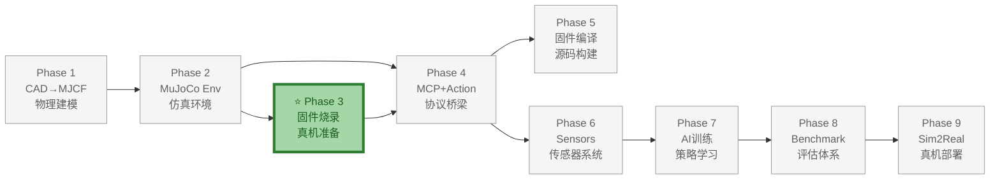
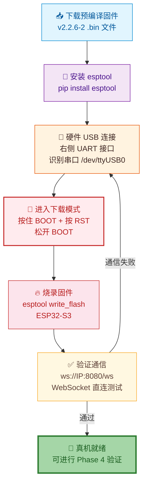
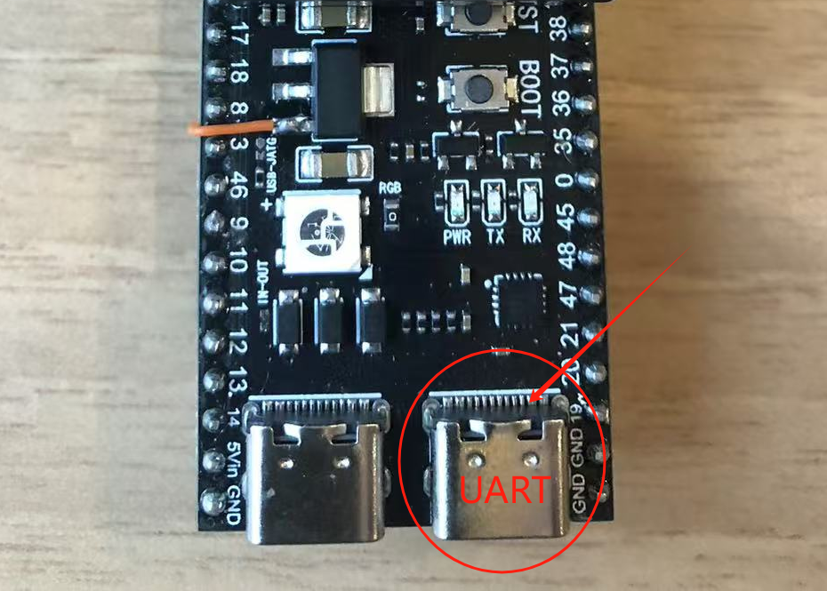
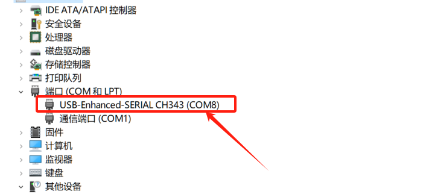
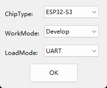
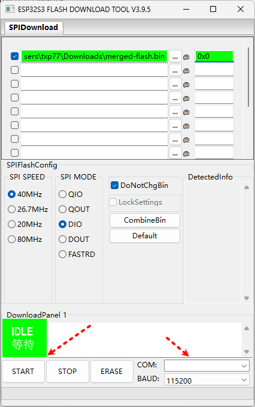

# Phase 3：预编译固件烧录

> **目标**：下载 v2.2.6-2 预编译固件，烧录到 ElectronBot ESP32-S3 真机，验证 WebSocket 直连可用。为 Phase 4 MCP-Action 的真机验证做准备。
>
> **前置依赖**：Phase 2 完成（仿真环境可用）；ESP32-S3 真机硬件
>
> **真机固件版本**：**v2.2.6-2**（2026-06-16，内置 `ws://<IP>:8080/ws`）
>
> **预计耗时**：1-2 小时
>
> **输出**：
> - 真机 ESP32-S3 已烧录 v2.2.6-2 固件
> - WebSocket 直连控制可正常通信

**文档版本**: v1.2  
**最后更新**: 2026-07-08  
**变更类型**: 增加硬件连接、USB 接口选择、COM 端口识别、BOOT/RST 按钮说明及配图

---

## 整体架构中的位置

Phase 3（预编译固件烧录）是 ElectronBot-SIM **9 Phase 全链路** 中真机硬件侧的**起点**，用预编译固件快速让真机跑起来，为 Phase 4 的 MCP 真机验证建立通信基础。

- **上游依赖**：Phase 2（MuJoCo Env）——需要了解舵机参数进行初步校准
- **下游支撑**：Phase 4（MCP+Action）——真机 WebSocket 直连验证 MCP 工具行为是否与仿真一致
- **核心价值**：这是 Sim2Real 验证链的第一环——真机必须先能通信，后续所有真机验证才可能进行



### 本 Phase 实现过程



---

## 0. 背景

### 0.1 为什么先做这个

在 Phase 3 MCP Bridge 完成后，需要立即在真机上验证 MCP 通信是否正常。本 Phase 用预编译固件快速让真机跑起来，**不需要搭建编译环境**。

### 0.2 v2.2.6-2 vs 旧版本的突破

| 版本 | 发布日期 | WebSocket 直连 |
|------|----------|:---:|
| v2.2.6-2 | 2026-06-16 | ✅ `ws://IP:8080/ws` |
| v2.2.6 | 2026-06-10 | ❌ 需云端透传 |
| v2.0.4 | 2025-11-03 | ❌ |

v2.2.6-2 内置 WebSocket Server，Python 端可直接 WebSocket 控制真机，延迟 <10ms。

### 0.3 三步通信路径

| 路径 | 方式 | 延迟 | 场景 |
|------|------|:---:|------|
| **WebSocket 直连** | `ws://IP:8080/ws` | <10ms | 调试、策略部署 |
| 云端 API 透传 | HTTPS→MQTT/WS→ESP32 | 200-500ms | 远程控制 |
| ONNX 本地推理 | 策略→ONNX→MCP→WS | <10ms | RL/IL 部署 |

---

## 1. 下载固件

```bash
wget https://electronbot.tech/assets/files/electronbot2.2.6-2-8777ea4d7e4cb1fe838db75ac1b55ecc.bin \
  -O electronbot-v2.2.6-2.bin
```

> 官方下载页：https://electronbot.tech/docs/downloads（也可在线一键烧录）

---

## 2. 安装 esptool

```bash
pip install esptool
```

---

## 3. 硬件连接与进入下载模式

### 3.1 选择 USB 接口

ElectronBot 主板（ESP32-S3-WROOM）正面朝下时有两个 USB-C 接口：

- **左侧 USB**：USB-JTAG / 调试接口
- **右侧 USB**：UART 串口（**烧录、串口监控请用这个**）

> 如果插到左侧 USB 口，esptool 可能识别不到设备或烧录失败。请认准主板丝印或下图红圈标识的 UART 口。



### 3.2 连接数据线并识别串口

1. 使用支持**数据传输**的 USB-C 线（不要使用纯充电线），连接主板 **右侧 UART 接口** 到电脑。
2. 在系统里确认串口已识别：

```bash
# Linux
ls /dev/ttyUSB*   # CH340/CH343 驱动，通常是 /dev/ttyUSB0
ls /dev/ttyACM*   # CP210 驱动，或 /dev/ttyACM0

# macOS
ls /dev/cu.usbserial*

# Windows
# 设备管理器 → 端口（COM 和 LPT）查看
```

Windows 设备管理器示例：



常见串口桥芯片为 **CH340 / CH343 / CP210**。若未识别，请先安装对应驱动（驱动下载见 [沁恒官网](https://www.wch.cn/products/CH340.html) / [CP210x](https://www.silabs.com/developers/usb-to-uart-bridge-vcp-drivers)）。

### 3.3 进入下载模式

按住主板上的 **BOOT** 按钮，再按一下 **RST**（或重新上电），然后松开 BOOT，即进入 ESP32-S3 下载模式。


> 进入下载模式后，串口号不会变化；esptool 会在复位时通过该串口与芯片建立下载协议。若后续 `esptool.py` 报 `Failed to connect to ESP32-S3`，请重试本步骤。

---

## 4. 烧录

```bash
esptool.py --chip esp32s3 --port /dev/ttyUSB0 --baud 921600 \
  --before default_reset --after hard_reset \
  write_flash -z --flash_mode dio --flash_size 16MB \
  0x0 electronbot-v2.2.6-2.bin
```

> 若 921600 失败，降至 115200 重试。

> **Windows 用户可选**：若更习惯图形化工具，可使用 [Flash Download Tool](https://www.espressif.com.cn/zh-hans/support/download/other-tools)。启动时选择 **ChipType=ESP32-S3**、**WorkMode=Develop**、**LoadMode=UART**；加载 `electronbot-v2.2.6-2.bin` 到地址 `0x0`，选择对应 COM 口后点击 **START**。
>
> 
>
> 

---

## 5. 配网

烧录完成后重启主板：

- **方式 A（推荐）**：手机连接 ElectronBot Wi-Fi 热点 → 浏览器配网
- **方式 B**：串口监控 `minicom -D /dev/ttyUSB0 -b 115200`，等待 "Wi-Fi connected, IP: 192.168.x.x"

---

## 6. 验证 WebSocket 直连

`websocat` 是一个命令行 WebSocket 客户端，连接 ESP32-S3 内置的 WebSocket Server（`ws://IP:8080/ws`），可以直接发送/接收 JSON 消息，无需浏览器。

```bash
# 一键安装所有工具（推荐）
bash tools/install_websocat_tools.sh

# 或手动安装 websocat（Linux）
wget https://github.com/vi/websocat/releases/latest/download/websocat.x86_64-unknown-linux-musl -O websocat
chmod +x websocat
sudo mv websocat /usr/local/bin/

# macOS
brew install websocat

# 连接真机 WebSocket
websocat ws://192.168.1.100:8080/ws
```

> **注意**：`ws://` 是 WebSocket 协议，不是 HTTP。连接后进入交互模式，直接粘贴 JSON 即可发送。`Ctrl+C` 退出。

测试命令：

```json
{"type":"mcp","payload":{"jsonrpc":"2.0","method":"tools/call","params":{"name":"self.electron.get_status","arguments":{}},"id":1}}
```

预期响应：

```json
{"type":"mcp","payload":{"jsonrpc":"2.0","id":1,"result":{"content":[{"type":"text","text":"idle"}],"isError":false}}}
```

测试动作：

```json
{"type":"mcp","payload":{"jsonrpc":"2.0","method":"tools/call","params":{"name":"self.electron.hand_action","arguments":{"action":3,"hand":3,"steps":2,"speed":600}},"id":2}}
```

机器人应双手挥手。

---

## 7. 完成标准

- [ ] 固件 v2.2.6-2 烧录成功
- [ ] Wi-Fi 配网成功，获知真机 IP
- [ ] `websocat ws://IP:8080/ws` 连接成功
- [ ] `get_status` 返回正常
- [ ] `hand_action` 挥手动作正常执行

---

## 8. 常见问题

| 现象 | 原因 | 解决 |
|------|------|------|
| `Failed to connect to ESP32-S3` | 未进入下载模式 | 按住 BOOT → 按 RST → 松开 BOOT |
| `Invalid head of packet` | 波特率过高 | 降至 115200 |
| `Connection refused` (WebSocket) | 固件非 v2.2.6-2 | 确认烧录了 v2.2.6-2 |
| `No route to host` | Wi-Fi 未连接 | 串口监控确认 Wi-Fi 连接成功 |
| 连接后立即断开 | 消息格式错误 | 必须 `{"type":"mcp","payload":{...}}` |

---

## 9. 变更记录

| 版本 | 日期 | 变更内容 | 作者 |
|------|------|---------|------|
| v1.2 | 2026-07-08 | 增加硬件连接、USB 接口选择、COM 端口识别、BOOT/RST 按钮说明及配图 | AI 助手 |
| v1.0 | 2026-07-08 | 从原 Phase 4 拆分——预编译固件烧录 | AI 助手 |
