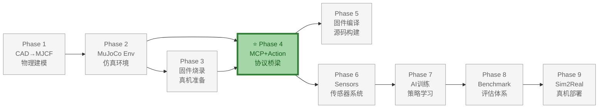
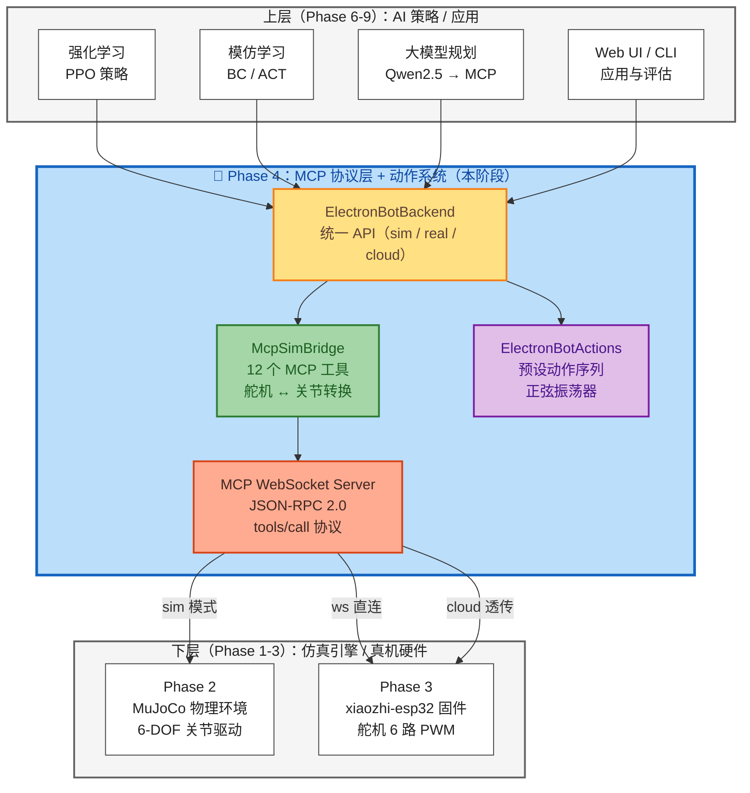
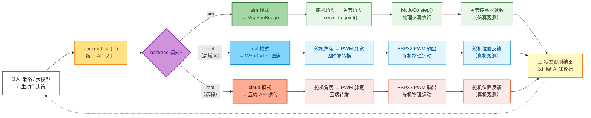
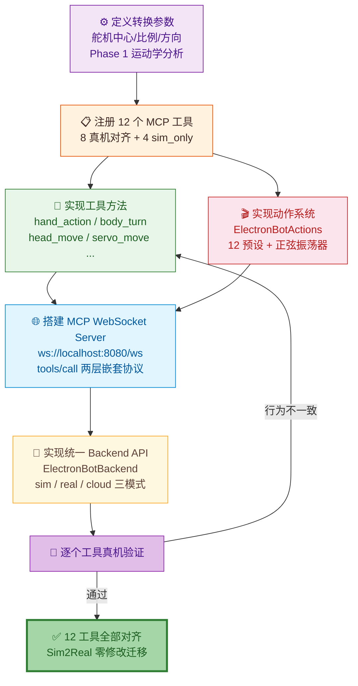

# Phase 4：MCP 协议层 + 动作系统

> **目标**：实现仿真端的 MCP JSON-RPC 服务器 + 完整动作系统。仿真实现全部 12 个 MCP 工具（8 真机对齐 + 4 sim_only），完整复现真机固件预设动作与舵机序列振荡器。
>
> **前置依赖**：Phase 2 完成（env.py 可用）；Phase 3 完成（真机 WebSocket 已验证，可随时对比验证）
>
> **真机对齐版本**：xiaozhi-esp32 **release v2.2.6-2**（支持 `ws://<IP>:8080/ws` 直连）
>
> **真机参考**：参见 [硬件连接与烧录](../03-Firmware-Flashing/03-Firmware-Flashing-详细设计说明书.md#3-硬件连接与进入下载模式) | [原版 vs 小智版差异](../../概要设计/ElectronBot-原版vs小智版-差异分析.md)
>
> **⚠️ 关键流程**: 每实现一个 MCP 工具 → 立即通过 WebSocket 在真机上验证 → 对比仿真行为 → 修正转换参数。**不要攒到最后一起验证。**
>
> **输出**：
> - `src/electronbot_sim/mcp_bridge.py` —— MCP Bridge 核心
> - `src/electronbot_sim/mcp_server.py` —— WebSocket 调试服务器
> - `src/electronbot_sim/backend.py` —— 统一 Backend API（sim/cloud/ws 三模式）
> - `src/electronbot_sim/actions/` —— 动作系统模块

**文档版本**: v2.3  
**最后更新**: 2026-07-10  
**变更类型**: 修正 `build_electronbot_xml.py` 模型组装逻辑，使 base/body/head/arms 相邻 mesh 边界框相接；v2.2 内容保持不变

> **文档版本**: v2.2  
> **最后更新**: 2026-07-09  
> **变更类型**: Web 调试面板集成 + 仿真端验证通过（#1~#11 ✅）；修复 3 个关键 Bug（关节命名/舵机截断/HTML 引号冲突）
> **变更类型**: 重编号 Phase 3→4，新增真机验证前提
>
> **文档版本**: v2.0  
> **最后更新**: 2026-07-08  
> **变更类型**: Phase 3+4 合并，更新至 v2.2.6-2

---

## 0. 开发目的与整体定位

### 0.0 全链路 Phase 管线



### 0.1 为什么需要 Phase 4

Phase 4（MCP 协议层 + 动作系统）是 ElectronBot-SIM 整个 **9 Phase 全链路** 中最关键的桥接环节。理由如下：

| 问题 | 如果没有 Phase 4 |
|------|-----------------|
| AI 策略如何控制机器人？ | 必须针对仿真和真机各写一套代码 |
| 仿真和真机如何对齐？ | 各自独立开发，行为不一致，Sim2Real 迁移失败 |
| 上层（Phase 6-9）调用什么接口？ | 没有统一抽象，每层都要处理 sim/real 差异 |

**Phase 4 的核心使命**：在 MuJoCo 物理引擎（下层）和 AI 训练/推理（上层）之间，建立一个 **协议统一、行为对齐** 的中间层。让上层所有代码只看到 `backend.call(tool_name, args)` 一种调用方式，完全不感知底层是仿真还是真机。

### 0.2 整体架构中的位置



### 0.3 Sim2Real 协议对齐流程

下面的流程图说明：**一次 MCP 调用如何从 AI 策略到达机器人执行，以及仿真和真机如何保持一致**。



> **关键设计原则**：无论走 sim/real/cloud 哪条路径，AI 策略层（节点 A）的代码完全不变，`backend.call()` 的入参和返回值语义完全一致。这就是 Phase 4 存在的根本目的——**Sim2Real 零修改迁移**。

### 0.4 本 Phase 实现过程



---

## 1. 预期效果

### 1.1 协议对齐说明

> ⚠️ **关键设计决策**: 真实 xiaozhi-esp32 固件的 MCP 协议使用 **`tools/call` 两层嵌套**结构。
> 仿真端需同时支持此标准格式和简化调试格式。

**真实固件 MCP 协议结构** (参照 `docs/mcp-protocol_zh.md`):
```json
// 外层封装
{"type":"mcp", "payload": {
  // 内层 JSON-RPC
  "jsonrpc":"2.0",
  "method":"tools/call",                    // ← 固定值，不是工具名
  "params":{
    "name":"self.electron.hand_action",     // ← 工具名在这里
    "arguments":{"action":3, "hand":3}      // ← 参数在这里
  },
  "id":3
}}

// 标准成功响应
{"type":"mcp", "payload": {
  "jsonrpc":"2.0", "id":3,
  "result":{
    "content":[{"type":"text", "text":"true"}],
    "isError":false
  }
}}
```

### 1.2 阶段完成后的状态

```
终端 A（仿真 WebSocket 服务器——调试用）：
$ python -m electronbot_sim.mcp_server
🔌 ElectronBot 仿真 MCP 服务器已启动 (调试模式)
   ws://localhost:8080/ws
   ───

终端 B（客户端——标准 MCP 格式，与真机云端通信一致）：
$ websocat ws://localhost:8080/ws

# 标准 tools/call 格式
{"type":"mcp","payload":{"jsonrpc":"2.0","method":"tools/call","params":{"name":"self.electron.hand_action","arguments":{"action":3,"hand":3,"steps":3,"speed":600}},"id":1}}
← {"type":"mcp","payload":{"jsonrpc":"2.0","id":1,"result":{"content":[{"type":"text","text":"{'status': 'ok'}"}],"isError":false}}}

# 仿真也支持简化扁平格式（仅仿真内部调试用）
{"jsonrpc":"2.0","method":"self.electron.get_status","params":{}}
← {"jsonrpc":"2.0","id":null,"result":{"content":[{"type":"text","text":"idle"}],"isError":false}}
```

### 1.2 统一 API

```python
# 仿真模式
from electronbot_sim import ElectronBotBackend
backend = ElectronBotBackend("sim")  # 连接仿真 MCP Bridge
backend.call("self.electron.home", {})

# 真机模式——一行改动
backend = ElectronBotBackend("real", host="192.168.1.100")  # 连接真机 WebSocket
backend.call("self.electron.home", {})  # 完全相同的调用
```

---

## 2. 架构设计

### 2.1 MCP Bridge 类

**文件**: `src/electronbot_sim/mcp_bridge.py`

**职责**: 仿真端 MCP 工具注册与舵机↔关节转换，与真机 xiaozhi-esp32 McpServer 实现同构。

**对外开放接口**:

```
McpSimBridge(env: ElectronBotEnv)          # 构造，注入 MuJoCo 环境
    └── handle_request(request: dict) → dict   # JSON-RPC 入口，兼容 tools/call 和扁平格式
```

**内部关键属性**:

| 属性 | 类型 | 说明 |
|------|------|------|
| `_servo_centers` | `np.ndarray[6]` | 舵机中心角度 `[180, 140, 0, 40, 90, 90]` |
| `_servo_ratios` | `np.ndarray[6]` | 舵机→关节映射比 `[1.0, 1.125, 1.0, 1.125, 1.5, 2.0]` |
| `_servo_directions` | `np.ndarray[6]` | 方向 (±1) `[-1, -1, 1, 1, 1, 1]` |
| `_tool_registry` | `dict[str, callable]` | 12 个工具的注册映射表（详见 [5.2.1](#521-12-个-mcp-工具签名表)） |
| `_trims` | `np.ndarray[6]` | 各舵机微调值 |

**核心内部方法**:

| 方法 | 说明 |
|------|------|
| `_servo_to_joint(idx, servo_angle)` | 舵机角度 → MuJoCo 关节角度（公式: `(servo-center)*ratio*direction`） |
| `_joint_to_servo(idx, joint_angle)` | MuJoCo 关节角度 → 舵机角度 |
| `_servo_index_from_name(servo_type)` | servo_type 字符串 → 索引（支持 `rp`/`rr`/`lp`/`lr`/`b`/`h` 及完整名） |

**请求处理逻辑** (`handle_request`):

1. 识别 `method == "tools/call"` → 标准 MCP 两层嵌套格式，从 `params.name` 取工具名、`params.arguments` 取参数
2. 否则 → 扁平调试格式，将 `method` 作为工具名、`params` 作为参数
3. 查 `_tool_registry` → 调用对应 handler → 封装 JSON-RPC 响应
4. 错误时返回标准错误码（-32601 未知方法、-32602 参数错误、-32603 内部错误）

**动作执行约定**:
- 所有舵机运动使用**线性插值**（对齐固件 `movements.cc:87`，非 EaseOutCubic）
- 插值步数: `steps = speed // 10`
- 查询类工具（`get_status`/`get_trims`/`battery.get_level`/`get_ip`）不驱动仿真步进

### 2.2 WebSocket 服务器 (仿真调试用)

**文件**: `src/electronbot_sim/mcp_server.py`

**职责**: 仿真环境下的本地 WebSocket 调试服务器，非真机通信接口。

> ⚠️ 真机 ESP32 (release v2.2.6) 没有 WebSocket Server。此服务器仅用于仿真调试。真机通信请使用 `ElectronBotBackend("cloud", ...)`。

**对外接口**:

```
McpWebSocketServer(host="localhost", port=8080)  # 构造，创建 ElectronBotEnv + McpSimBridge
    └── async start()                             # 启动 WebSocket 监听 ws://{host}:{port}/ws
```

**消息处理逻辑** (`handler`):
1. 收到消息 → 解析 JSON
2. `type == "mcp"` → 取 `payload` 字段作为 JSON-RPC 请求 → 调用 `McpSimBridge.handle_request` → 按 `{"type":"mcp","payload":<响应>}` 封装返回
3. 否则 → 直接作为 JSON-RPC 请求 → 调用 `McpSimBridge.handle_request` → 返回响应
4. JSON 解析失败 → 返回 `{"jsonrpc":"2.0","error":{"code":-32700,"message":"Parse error"}}`

**安全约束**: 默认仅监听 `localhost`，不提供认证，禁止暴露到公网。

### 2.3 统一 Backend API

**文件**: `src/electronbot_sim/backend.py`

**职责**: AI 策略层统一入口，屏蔽 sim/cloud 差异，Sim2Real 零修改迁移。

**对外接口**:

```
ElectronBotBackend(mode="sim"|"cloud", **kwargs)  # 构造
    ├── call(method: str, params: dict) → dict    # 同步调用 MCP 工具
    └── call_async(method: str, params: dict) → dict  # 异步调用（cloud 模式推荐）
```

**模式说明**:

| 模式 | 参数 | 底层调用路径 |
|------|------|-------------|
| `"sim"` | `render="human"\|"rgb_array"\|None` | 本地 MuJoCo → `McpSimBridge.handle_request` |
| `"cloud"` | `device_id`, `api_key`, `api_url` | `POST {api_url}/devices/{device_id}/tools/call` → ESP32 真机 |

**调用语义**:
- `call`：sim 模式即时返回；cloud 模式内部 `asyncio.run` 包装 HTTP 调用
- `call_async`：cloud 模式复用 `httpx.AsyncClient`，适用于高并发场景

---

## 3. 验证方法

### 3.1 自动化测试

**文件**: `tests/test_mcp_bridge.py`

**测试范围**: 使用标准 `tools/call` 格式逐个调用全部 12 个 MCP 工具，验证响应格式和数据正确性。

**测试用例清单**:

| 测试函数 | 验证目标 |
|---------|---------|
| `test_all_tools()` | 12 个工具全部可调用，响应格式为 MCP 标准 `result.content[0].text` + `isError:false` |
| `test_flat_format()` | 扁平调试格式兼容性：`method` 直接传工具名可正常执行 |
| `test_servo_to_joint_conversion()` | home 姿态下舵机 `[180,180,0,0,90,90]` → 关节 `[0,-45,0,-45,0,0]` 精度 < 1° |
| `test_servo_sequence()` | `servo_sequences` 的 JSON 序列解析、普通移动和正弦振荡模式均正常 |

**运行方式**: `pytest tests/test_mcp_bridge.py -v`

### 3.2 WebSocket 端到端测试

**文件**: `tests/test_websocket_e2e.py`

**测试范围**: 通过 WebSocket 连接仿真服务器，使用 `tools/call` 格式发送指令，验证消息封装/解封正确性。

**测试用例**:

| 测试步骤 | 验证目标 |
|---------|---------|
| 连接 `ws://localhost:8080/ws` | 连接成功 |
| 发送 `home` 命令（type=mcp 封装） | 返回 `isError:false` |
| 发送 `get_status` 命令 | 返回 `"idle"` 或 `"moving"` |
| 验证响应外层封装 | `resp["type"] == "mcp"`，内层为 JSON-RPC 响应 |

**运行方式**: 先启动 `python -m electronbot_sim.mcp_server`，再运行 `pytest tests/test_websocket_e2e.py -v`

### 3.3 手动验证

提供两种验证方式：**Web 调试面板**（推荐，无需安装客户端）和 **websocat 命令行**（轻量，适合脚本自动化）。

#### 3.3.1 方式一：Web 调试面板（推荐）

无需安装任何客户端，直接用浏览器打开。

**本地运行**（支持 `file://` 协议，无需 Web 服务器）：

```bash
# 终端 A：启动仿真服务器
python -m electronbot_sim.mcp_server
```

然后在浏览器中打开 `web/mcp-debug-panel.html`：

```
file:///mnt/data2/projects/xiaozhi/ElectronBot_SIM/web/mcp-debug-panel.html
```

**远程 / SSH 运行**（通过 HTTP 服务托管，从本地浏览器访问）：

```bash
# 终端 A：启动仿真服务器
python -m electronbot_sim.mcp_server

# 终端 B：启动 HTTP 静态文件服务（托管调试面板）
cd ~/数据盘/projects/xiaozhi/ElectronBot_SIM/web
python3 -m http.server 8081 --bind 0.0.0.0
```

然后在本地电脑浏览器访问 `http://<服务器IP>:8081/mcp-debug-panel.html`。

> **提示**：远程访问时，调试面板默认连接 `ws://localhost:8080/ws`，需将面板中连接地址改为 `ws://<服务器IP>:8080/ws`。

**面板功能**：
- **左侧**：按类别分组的工具按钮（预设动作 / 身体控制 / 舵机控制 / 序列动作 / 系统指令 / 查询工具）
- 每个按钮下方显示完整的 JSON-RPC 请求体（点击可展开/收起）
- 按钮上标记 `@SIM`（仅仿真）/ `REAL`（真机对齐）/ `QUERY`（查询类）
- **右侧**：实时请求/响应日志，绿边=响应、蓝边=请求、红边=错误

> **注意**：启动后 MuJoCo 窗口弹出，应直接看到完整机器人。若只看到天空/地面，参考 [known issues](#15-known-issues)。

#### 3.3.2 方式二：websocat 命令行

```bash
# 终端 B：安装 websocat（如未安装）
sudo apt install websocat    # Ubuntu/Debian
# 或
pip install websocat

# 连接
websocat ws://localhost:8080/ws
```

连接成功后进入交互模式，**每次按回车发送一行文本**：

| 输入内容 | 预期行为 |
|---------|---------|
| 空行（直接回车） | 返回 JSON 解析错误 `{"error":{"code":-32700,"message":"JSON 解析失败: ..."}}`**
| 非 JSON 字符串 | 同上 |
| 一行完整 JSON | 执行工具并返回 JSON-RPC 响应 |

> **🔑 关键提示**：`websocat` 是行协议模式，粘贴一行 JSON 后**按回车才会发送**。终端中的空行错误是正常的，只需粘贴有效 JSON 即可正常通信。退出按 `Ctrl+C`。

#### 3.3.3 常用测试命令

以下命令可直接粘贴到 `websocat` 终端中，按回车发送：

**⚠️ 提示：所有命令需要在一行内，粘贴后按回车。**

**查询工具列表**：
```json
{"jsonrpc":"2.0","method":"tools/list","id":0}
```

**查询状态（`get_status`）**：
```json
{"type":"mcp","payload":{"jsonrpc":"2.0","method":"tools/call","params":{"name":"self.electron.get_status","arguments":{}},"id":1}}
```

**复位（`home`）**：
```json
{"type":"mcp","payload":{"jsonrpc":"2.0","method":"tools/call","params":{"name":"self.electron.home","arguments":{}},"id":2}}
```

**双手挥手（`hand_action`，action=3）**：
```json
{"type":"mcp","payload":{"jsonrpc":"2.0","method":"tools/call","params":{"name":"self.electron.hand_action","arguments":{"action":3,"hand":3,"steps":2,"speed":600}},"id":3}}
```

**双手举手（`hand_action`，action=1）**：
```json
{"type":"mcp","payload":{"jsonrpc":"2.0","method":"tools/call","params":{"name":"self.electron.hand_action","arguments":{"action":1,"hand":3,"steps":2,"speed":800}},"id":4}}
```

**双手放手（`hand_action`，action=2）**：
```json
{"type":"mcp","payload":{"jsonrpc":"2.0","method":"tools/call","params":{"name":"self.electron.hand_action","arguments":{"action":2,"hand":3,"steps":2,"speed":800}},"id":5}}
```

**双手拍打（`hand_action`，action=4）**：
```json
{"type":"mcp","payload":{"jsonrpc":"2.0","method":"tools/call","params":{"name":"self.electron.hand_action","arguments":{"action":4,"hand":3,"steps":2,"speed":600}},"id":6}}
```

**点头（`head_move`，action=3）**：
```json
{"type":"mcp","payload":{"jsonrpc":"2.0","method":"tools/call","params":{"name":"self.electron.head_move","arguments":{"action":3,"angle":8,"speed":400}},"id":7}}
```

**抬头（`head_move`，action=1）**：
```json
{"type":"mcp","payload":{"jsonrpc":"2.0","method":"tools/call","params":{"name":"self.electron.head_move","arguments":{"action":1,"angle":10,"speed":300}},"id":8}}
```

**低头（`head_move`，action=2）**：
```json
{"type":"mcp","payload":{"jsonrpc":"2.0","method":"tools/call","params":{"name":"self.electron.head_move","arguments":{"action":2,"angle":10,"speed":300}},"id":9}}
```

**左转身体（`body_turn`，direction=1）**：
```json
{"type":"mcp","payload":{"jsonrpc":"2.0","method":"tools/call","params":{"name":"self.electron.body_turn","arguments":{"direction":1,"angle":45,"speed":1000}},"id":10}}
```

**右转身体（`body_turn`，direction=2）**：
```json
{"type":"mcp","payload":{"jsonrpc":"2.0","method":"tools/call","params":{"name":"self.electron.body_turn","arguments":{"direction":2,"angle":45,"speed":1000}},"id":11}}
```

**回正身体（`body_turn`，direction=3）**：
```json
{"type":"mcp","payload":{"jsonrpc":"2.0","method":"tools/call","params":{"name":"self.electron.body_turn","arguments":{"direction":3}},"id":12}}
```

**单舵机精确定位（`servo_move`，@sim_only）**：
```json
{"type":"mcp","payload":{"jsonrpc":"2.0","method":"tools/call","params":{"name":"self.electron.servo_move","arguments":{"servo_type":"rp","position":90,"speed":1000}},"id":13}}
```

**查询电池（`battery.get_level`）**：
```json
{"type":"mcp","payload":{"jsonrpc":"2.0","method":"tools/call","params":{"name":"self.battery.get_level","arguments":{}},"id":14}}
```

**紧急停止（`stop`）**：
```json
{"type":"mcp","payload":{"jsonrpc":"2.0","method":"tools/call","params":{"name":"self.electron.stop","arguments":{}},"id":15}}
```

#### 3.3.4 仿真调试专用：扁平格式

仿真端额外支持简化的扁平格式（无需 `type/mcp` 包裹层），仅内部调试用，真机不可用：

```json
{"jsonrpc":"2.0","method":"self.electron.home","params":{},"id":100}
{"jsonrpc":"2.0","method":"self.electron.get_status","params":{}}
{"jsonrpc":"2.0","method":"self.electron.get_ip","params":{}}
```

### 3.4 验证效果步骤与预期

> **前提**：已按 Phase 2 环境搭建完毕，MuJoCo 仿真窗口可正常渲染。启动 `python -m electronbot_sim.mcp_server` 后，可见 MuJoCo 渲染窗口和终端启动日志。

---

#### 3.4.1 环境就绪验证

**步骤 1 — 启动仿真服务器**

打开终端 A，执行：

```bash
cd /home/maple/数据盘/projects/xiaozhi/ElectronBot_SIM
python -m electronbot_sim.mcp_server
```

| 检查项 | 预期结果 |
|--------|---------|
| 终端输出 | `🔌 ElectronBot 仿真 MCP 服务器已启动 (调试模式)`<br>`   ws://localhost:8080/ws`<br>`   ⚠️ 此服务器仅用于仿真调试，不用于真机连接`<br>`   真机部署请使用: ElectronBotBackend('cloud', ...)`<br>`   ───` |
| 仿真窗口 | MuJoCo 窗口弹出，显示 ElectronBot 3D 模型，机器人处于默认（home）姿态：双臂上举、身体朝前、头部水平 |

**步骤 2 — WebSocket 客户端连接**

打开终端 B，使用 `websocat` 连接仿真服务器：

```bash
websocat ws://localhost:8080/ws
```

| 检查项 | 预期结果 |
|--------|---------|
| 连接状态 | 连接成功，无报错，光标等待输入 |
| 仿真窗口 | 机器人保持静止，窗口持续渲染 |

> 如未安装 `websocat`，可先执行 `sudo apt install websocat` 或 `pip install websocat`。

**步骤 3 — 查询机器人状态（`get_status`）**

在终端 B（`websocat` 交互界面）中输入以下 JSON 并回车：

```json
{"type":"mcp","payload":{"jsonrpc":"2.0","method":"tools/call","params":{"name":"self.electron.get_status","arguments":{}},"id":1}}
```

| 检查项 | 预期结果 |
|--------|---------|
| 终端 B 返回 | `{"type":"mcp","payload":{"jsonrpc":"2.0","id":1,"result":{"content":[{"type":"text","text":"idle"}],"isError":false}}}` |
| 仿真窗口 | 无变化 |

> **关键验证点**：`isError` 为 `false`，`text` 为 `"idle"`（刚启动时无动作执行）。

**步骤 4 — 查询电池电量（`battery.get_level`）**

在终端 B 中输入：

```json
{"type":"mcp","payload":{"jsonrpc":"2.0","method":"tools/call","params":{"name":"self.battery.get_level","arguments":{}},"id":2}}
```

| 检查项 | 预期结果 |
|--------|---------|
| 终端 B 返回 | `{"type":"mcp","payload":{"jsonrpc":"2.0","id":2,"result":{"content":[{"type":"text","text":"{'level': 100, 'charging': False}"}],"isError":false}}}` |
| 仿真窗口 | 无变化 |

> **关键验证点**：仿真环境下电池固定返回 `level: 100, charging: false`。

**步骤 5 — 查询 IP 地址（`get_ip`，@sim_only）**

在终端 B 中输入：

```json
{"type":"mcp","payload":{"jsonrpc":"2.0","method":"tools/call","params":{"name":"self.electron.get_ip","arguments":{}},"id":3}}
```

| 检查项 | 预期结果 |
|--------|---------|
| 终端 B 返回 | `{"type":"mcp","payload":{"jsonrpc":"2.0","id":3,"result":{"content":[{"type":"text","text":"{'ip': '127.0.0.1', 'connected': True}"}],"isError":false}}}` |
| 仿真窗口 | 无变化 |

**步骤 6 — 查询 Trim 微调值（`get_trims`）**

在终端 B 中输入：

```json
{"type":"mcp","payload":{"jsonrpc":"2.0","method":"tools/call","params":{"name":"self.electron.get_trims","arguments":{}},"id":4}}
```

| 检查项 | 预期结果 |
|--------|---------|
| 终端 B 返回 | `{"type":"mcp","payload":{"jsonrpc":"2.0","id":4,"result":{"content":[{"type":"text","text":"{'trims': [0, 0, 0, 0, 0, 0]}"}],"isError":false}}}` |
| 仿真窗口 | 无变化 |

> **关键验证点**：初始 trim 全为零，数组长度为 6（对应 6 个舵机）。

---

> **环境就绪检查点**：以上 6 个步骤全部通过（4 个查询类工具 `get_status` / `battery.get_level` / `get_ip` / `get_trims` 均返回 `isError:false`），且每次响应在秒级内返回，仿真窗口不闪动、不崩溃，即确认环境就绪。

---

#### 3.4.2 单舵机控制验证（`servo_move`，@sim_only）

| 步骤 | 操作 | 预期终端输出 | 预期仿真窗口 |
|:---:|------|------------|------------|
| 1 | 右臂俯仰下放：`{"type":"mcp","payload":{"jsonrpc":"2.0","method":"tools/call","params":{"name":"self.electron.servo_move","arguments":{"servo_type":"rp","position":90,"speed":1000}},"id":10}}` | `{"result":{"content":[{"type":"text","text":"{'status': 'ok'}"}],"isError":false}}` | 右臂（right_pitch）从 180° 平滑下放至 90°，耗时约 1 秒，其他关节保持不动 |
| 2 | 左臂俯仰下放：`{"type":"mcp","payload":{"jsonrpc":"2.0","method":"tools/call","params":{"name":"self.electron.servo_move","arguments":{"servo_type":"lp","position":90,"speed":1000}},"id":11}}` | 同上 | 左臂（left_pitch）从 0° 平滑上举至 90°，双臂对称 |
| 3 | 身体左转：`{"type":"mcp","payload":{"jsonrpc":"2.0","method":"tools/call","params":{"name":"self.electron.servo_move","arguments":{"servo_type":"b","position":60,"speed":1000}},"id":12}}` | 同上 | 腰部从 90° 平滑左转至 60°（约左转 20°），双臂、头部保持 |
| 4 | 头部抬头：`{"type":"mcp","payload":{"jsonrpc":"2.0","method":"tools/call","params":{"name":"self.electron.servo_move","arguments":{"servo_type":"h","position":100,"speed":500}},"id":13}}` | 同上 | 头部从 90° 平滑抬起至 100°，耗时约 0.5 秒 |
| 5 | 无效舵机类型：`{"type":"mcp","payload":{"jsonrpc":"2.0","method":"tools/call","params":{"name":"self.electron.servo_move","arguments":{"servo_type":"xx","position":90}},"id":14}}` | `{"jsonrpc":"2.0","id":14,"result":{"content":[{"type":"text","text":"{'error': '无效舵机类型: xx'}"}],"isError":false}}` | 无变化 |

> **检查点**：`servo_move` 应支持全部 6 个舵机（`rp/rr/lp/lr/b/h` 或完整名），每个舵机独立运动，速度参数控制插值步数（steps = speed // 10）。

---

#### 3.4.3 预设手部动作验证（`hand_action`）

| 步骤 | 操作 | 预期终端输出 | 预期仿真窗口 |
|:---:|------|------------|------------|
| 1 | 先 home 复位：`{"type":"mcp","payload":{"jsonrpc":"2.0","method":"tools/call","params":{"name":"self.electron.home","arguments":{}},"id":20}}` | `{"result":{"content":[{"type":"text","text":"{'status': 'ok'}"}],"isError":false}}` | 双臂上举至 home 姿态 |
| 2 | 双手挥手：`{"type":"mcp","payload":{"jsonrpc":"2.0","method":"tools/call","params":{"name":"self.electron.hand_action","arguments":{"action":3,"hand":3,"steps":3,"speed":600}},"id":21}}` | `{"result":{"content":[{"type":"text","text":"{'status': 'ok'}"}],"isError":false}}` | 双臂执行挥手轨迹：左右臂交替摆动，手臂横滚关节（roll）往复运动。steps=3 控制挥手周期数 |
| 3 | 仅右手举手：`{"type":"mcp","payload":{"jsonrpc":"2.0","method":"tools/call","params":{"name":"self.electron.hand_action","arguments":{"action":1,"hand":2,"steps":2,"speed":600}},"id":22}}` | 同上 | 仅右臂上举（action=1），左臂不动 |
| 4 | 仅左手举手：`{"type":"mcp","payload":{"jsonrpc":"2.0","method":"tools/call","params":{"name":"self.electron.hand_action","arguments":{"action":1,"hand":1,"steps":2,"speed":600}},"id":23}}` | 同上 | 仅左臂上举，右臂不动 |
| 5 | 双手拍打：`{"type":"mcp","payload":{"jsonrpc":"2.0","method":"tools/call","params":{"name":"self.electron.hand_action","arguments":{"action":4,"hand":3,"steps":2,"speed":800}},"id":24}}` | 同上 | 双臂交替快速下拍（action=4），运动幅度比挥手更大 |

> **检查点**：
> - `action` 取值：1=举手、2=放手、3=挥手、4=拍打
> - `hand` 取值：1=左手、2=右手、3=双手
> - `steps` 控制动作重复次数，注意文档 2.1 节指出固件端会对 steps 做 `2 * max(3, min(100, steps))` 限制，仿真应复现此逻辑

---

#### 3.4.4 身体转向验证（`body_turn`）

| 步骤 | 操作 | 预期终端输出 | 预期仿真窗口 |
|:---:|------|------------|------------|
| 1 | 先 home 复位 | OK | 身体朝前（腰部舵机=90°） |
| 2 | 左转 45°：`{"type":"mcp","payload":{"jsonrpc":"2.0","method":"tools/call","params":{"name":"self.electron.body_turn","arguments":{"direction":1,"speed":500,"angle":45}},"id":30}}` | `{"result":{"content":[{"type":"text","text":"{'status': 'ok'}"}],"isError":false}}` | 腰部从 90° 平滑旋转至 135°，双臂跟随身体旋转，视觉上机器人整体向左转约 30°（受 ratio=1.5 映射影响） |
| 3 | 右转 45°：`{"type":"mcp","payload":{"jsonrpc":"2.0","method":"tools/call","params":{"name":"self.electron.body_turn","arguments":{"direction":2,"speed":500,"angle":45}},"id":31}}` | 同上 | 腰部从 135° 旋转回 45°，机器人向右转 |
| 4 | 回中：`{"type":"mcp","payload":{"jsonrpc":"2.0","method":"tools/call","params":{"name":"self.electron.body_turn","arguments":{"direction":3,"speed":500}},"id":32}}` | 同上 | 腰部回到 90°，身体朝前 |

> **检查点**：`direction` 取值：1=左转、2=右转、3=回中。`angle` 默认 45°，控制转动幅度（舵机角度偏移量）。身体转向只影响 index=4（body）舵机，双臂和头部保持相对姿态不变。

---

#### 3.4.5 头部运动验证（`head_move`）

| 步骤 | 操作 | 预期终端输出 | 预期仿真窗口 |
|:---:|------|------------|------------|
| 1 | 先 home 复位 | OK | 头部水平（头部舵机=90°） |
| 2 | 抬头：`{"type":"mcp","payload":{"jsonrpc":"2.0","method":"tools/call","params":{"name":"self.electron.head_move","arguments":{"action":1,"speed":300,"angle":10}},"id":40}}` | `{"result":{"content":[{"type":"text","text":"{'status': 'ok'}"}],"isError":false}}` | 头部从 90° 平滑抬起至 100°，视觉上机器人"仰头" |
| 3 | 低头：`{"type":"mcp","payload":{"jsonrpc":"2.0","method":"tools/call","params":{"name":"self.electron.head_move","arguments":{"action":2,"speed":300,"angle":10}},"id":41}}` | 同上 | 头部从 100° 平滑低至 80°，视觉上机器人"低头" |
| 4 | 点头一次：`{"type":"mcp","payload":{"jsonrpc":"2.0","method":"tools/call","params":{"name":"self.electron.head_move","arguments":{"action":3,"speed":300,"angle":5}},"id":42}}` | 同上 | 头部执行：抬→低→回中，三段连续运动，完成一次完整点头 |
| 5 | 回中：`{"type":"mcp","payload":{"jsonrpc":"2.0","method":"tools/call","params":{"name":"self.electron.head_move","arguments":{"action":4}},"id":43}}` | 同上 | 头部回到 90° |

> **检查点**：`action` 取值：1=抬头、2=低头、3=点头一次、4=回中。`angle` 默认 5°，控制运动幅度。头部运动有安全限幅（抬头 ≤105°、低头 ≥75°），仿真窗口不应出现穿模或关节反向。

---

#### 3.4.6 舵机序列与振荡器验证（`servo_sequences`，@sim_only）

| 步骤 | 操作 | 预期终端输出 | 预期仿真窗口 |
|:---:|------|------------|------------|
| 1 | 先 home 复位 | OK | 双臂上举 |
| 2 | 单舵机振荡（右臂挥手）：`{"type":"mcp","payload":{"jsonrpc":"2.0","method":"tools/call","params":{"name":"self.electron.servo_sequences","arguments":{"sequence":"{\\"a\\":[{\\"osc\\":{\\"a\\":{\\"rr\\":30},\\"o\\":{\\"rr\\":140},\\"p\\":500,\\"c\\":3}}]}"}},"id":50}}` | `{"result":{"content":[{"type":"text","text":"{'status': 'ok'}"}],"isError":false}}` | 右臂横滚关节（rr）以 140° 为中心、±30° 振幅做正弦振荡，周期 500ms，执行 3 个周期。视觉上右臂规律性左右摆动 |
| 3 | 多舵机组合序列：先移动到位再振荡 | 同上 | 双臂先平滑移动到目标位置，然后按指定振幅和周期做正弦振荡 |
| 4 | 序列动作（移动+振荡交替）：`{"type":"mcp","payload":{"jsonrpc":"2.0","method":"tools/call","params":{"name":"self.electron.servo_sequences","arguments":{"sequence":"{\\"a\\":[{\\"s\\":{\\"rp\\":120,\\"lp\\":60},\\"v\\":800,\\"d\\":200},{\\"osc\\":{\\"a\\":{\\"rp\\":20,\\"lp\\":20},\\"o\\":{\\"rp\\":120,\\"lp\\":60},\\"p\\":400,\\"c\\":2}},{\\"s\\":{\\"rp\\":180,\\"lp\\":0},\\"v\\":800}]}"}},"id":51}}` | 同上 | 双臂先下放到指定位置 → 振荡 2 个周期 → 双臂回 home。视觉上机器人完成"放下手臂→摇摆→举手"的连贯动作 |

> **检查点**：
> - `sequence` 是 JSON 字符串，格式为 `{"a":[{动作对象}, ...]}`
> - 动作对象类型：`{"s":{舵机映射},"v":速度,"d":延迟ms}` 为普通移动；`{"osc":{"a":{振幅},"o":{中心},"p":周期ms,"c":周期数}}` 为正弦振荡
> - 振荡应与固件 `OscillateServos` 行为一致：`target = center[i] + amplitude[i] * sin(phase)`

---

#### 3.4.7 复位与停止验证（`home` / `stop`）

| 步骤 | 操作 | 预期终端输出 | 预期仿真窗口 |
|:---:|------|------------|------------|
| 1 | 任意动作后 home：`{"type":"mcp","payload":{"jsonrpc":"2.0","method":"tools/call","params":{"name":"self.electron.home","arguments":{}},"id":60}}` | `{"result":{"content":[{"type":"text","text":"{'status': 'ok'}"}],"isError":false}}` | 所有 6 个舵机平滑回到 home 角度 `[180,180,0,0,90,90]`。双臂上举、身体朝前、头部水平 |
| 2 | 动作执行中 stop：`{"type":"mcp","payload":{"jsonrpc":"2.0","method":"tools/call","params":{"name":"self.electron.stop","arguments":{}},"id":61}}` | 同上 | 立即停止当前动作，并复位到 home 姿态（stop 内部调用 home） |

> **检查点**：home 和 stop 的结果相同（复位到 `[180,180,0,0,90,90]`），stop 额外设置 `_is_moving=False`。

---

#### 3.4.8 Trim 微调验证（`set_trim` / `get_trims`）

| 步骤 | 操作 | 预期终端输出 | 预期仿真窗口 |
|:---:|------|------------|------------|
| 1 | 查询当前 trims：`{"type":"mcp","payload":{"jsonrpc":"2.0","method":"tools/call","params":{"name":"self.electron.get_trims","arguments":{}},"id":70}}` | `"text":"{'trims': [0, 0, 0, 0, 0, 0]}"` | 无变化 |
| 2 | 设置右臂俯仰 trim=5：`{"type":"mcp","payload":{"jsonrpc":"2.0","method":"tools/call","params":{"name":"self.electron.set_trim","arguments":{"servo_type":"rp","trim_value":5}},"id":71}}` | `"text":"{'status': 'ok', 'message': '舵机 rp trim=5'}"` | 无变化（trim 仅记录值，不自动应用到物理仿真——实际应通过 `_servo_to_joint` 转换时叠加） |
| 3 | 再次查询 trims：`{"type":"mcp","payload":{"jsonrpc":"2.0","method":"tools/call","params":{"name":"self.electron.get_trims","arguments":{}},"id":72}}` | `"text":"{'trims': [5, 0, 0, 0, 0, 0]}"` | 无变化 |

> **检查点**：trims 数组长度为 6，对应 6 个舵机（index 0-5）。trim 值的持久性只在当前会话有效，重启后归零。

---

#### 3.4.9 统一 Backend API 验证

```python
# 测试脚本: tests/manual_verify_backend.py
from electronbot_sim import ElectronBotBackend

# ── sim 模式 ──
backend = ElectronBotBackend("sim", render="human")

# 查询
result = backend.call("self.electron.get_status", {})
print(f"状态: {result}")  # 预期: result["result"]["content"][0]["text"] == "idle"

# 复位
result = backend.call("self.electron.home", {})
print(f"复位: {result}")  # 预期: isError=False

# 动作
result = backend.call("self.electron.hand_action", {"action": 3, "hand": 3, "steps": 2, "speed": 600})
print(f"挥手: {result}")  # 预期: isError=False，仿真窗口见双手挥动

# 身体转向
result = backend.call("self.electron.body_turn", {"direction": 1, "speed": 500, "angle": 45})
print(f"左转: {result}")  # 预期: isError=False，仿真窗口见身体左转

# 点头
result = backend.call("self.electron.head_move", {"action": 3, "speed": 300, "angle": 5})
print(f"点头: {result}")  # 预期: isError=False，仿真窗口见头部点头

print("✅ Backend API 手动验证全部通过")
```

| 步骤 | 操作 | 预期结果 |
|:---:|------|---------|
| 1 | `python tests/manual_verify_backend.py` | 终端依次打印每个调用的返回结果，均无 error；MuJoCo 窗口依次显示：机器人双臂复位 → 双手挥手 → 身体左转 → 头部点头。最后打印 `✅ Backend API 手动验证全部通过` |

---

#### 3.4.10 错误场景验证

| 步骤 | 操作 | 预期终端输出 | 预期仿真窗口 |
|:---:|------|------------|------------|
| 1 | 未知工具名：`{"type":"mcp","payload":{"jsonrpc":"2.0","method":"tools/call","params":{"name":"self.electron.unknown_tool","arguments":{}},"id":80}}` | `{"jsonrpc":"2.0","id":80,"error":{"code":-32601,"message":"Unknown tool: self.electron.unknown_tool"}}` | 无变化 |
| 2 | 非法 JSON：`这不是json` | `{"jsonrpc":"2.0","error":{"code":-32700,"message":"Parse error"}}` | 无变化 |
| 3 | 缺少必填参数：`{"type":"mcp","payload":{"jsonrpc":"2.0","method":"tools/call","params":{"name":"self.electron.servo_move","arguments":{}},"id":81}}` | `{"jsonrpc":"2.0","id":81,"error":{"code":-32602,"message":"参数错误: ..."}}` | 无变化 |
| 4 | 舵机角度超限 `servo_move` position=999 | `isError:false`（工具自身不限幅，MuJoCo 物理约束保证不穿模） | 关节在物理约束范围内停止，不出现穿模或 NaN |

> **检查点**：错误码对齐 JSON-RPC 2.0 标准（-32700 Parse error、-32601 Method not found、-32602 Invalid params、-32603 Internal error）。所有错误场景下仿真窗口不崩溃、不闪退。

---

#### 3.4.11 完整验证清单

完成以下全部检查项即视为 Phase 4 验证通过：

> **当前状态**：2026-07-09 已通过 Web 调试面板完成全部仿真端验证（#1~#11 ✅），真机对齐（#12）待后续。验证日志见下方终端输出。

| # | 检查项 | 通过标准 | 状态 |
|:---:|------|---------|:--:|
| 1 | 服务器正常启动 | 终端打印启动信息，MuJoCo 窗口正常渲染，机器人处于 home 姿态 | ✅ |
| 2 | WebSocket 连接正常 | Web 调试面板 / `websocat` 连接成功，可收发 JSON 消息 | ✅ |
| 3 | 4 个查询类工具可用 | `get_status` / `battery.get_level` / `get_ip` / `get_trims` 全部返回 `isError:false` | ✅ |
| 4 | 6 个舵机独立可控 | `servo_move` 分别对 rp/rr/lp/lr/b/h 发送指令，仿真窗口各关节独立运动 | ✅ |
| 5 | 预设动作正确执行 | `hand_action`(4 种 action × 3 种 hand)、`body_turn`(3 种 direction)、`head_move`(4 种 action) 全部正确，仿真窗口运动轨迹符合预期 | ✅ |
| 6 | 振荡器行为正确 | `servo_sequences` 的正弦振荡周期、振幅、中心与参数一致，视觉上连续平滑无抖动 | ✅ |
| 7 | home/stop 正确复位 | 任意动作后调用 home 或 stop，机器人回到 `[180,180,0,0,90,90]` 姿态 | ✅ |
| 8 | trim 读写正确 | `set_trim` 后可 `get_trims` 读到相同值 | ✅ |
| 9 | 错误处理完备 | 未知工具、非法 JSON、参数缺失均返回对应 JSON-RPC 错误码，仿真不崩溃 | ✅ |
| 10 | Backend API 统一调用 | sim 模式下 `ElectronBotBackend("sim").call(...)` 可正确驱动所有 12 个工具 | ✅ |
| 11 | MCP 标准格式兼容 | `tools/call` 两层嵌套格式与扁平格式均正常处理，响应格式与真机协议一致 | ✅ |
| 12 | 真机协议对齐（如真机可用） | 8 个真机对齐工具通过 WebSocket 在真机上执行，响应格式与仿真一致 | ⏳ |

**仿真端验证输出示例（2026-07-09）**：

```
📥 收到请求: self.electron.hand_action
   参数: {'action': 3, 'hand': 3, 'steps': 2, 'speed': 600}
   ✅ 响应: {"status": "ok", "action": 3, "hand": 3, "times": 6}
📥 收到请求: self.electron.body_turn
   参数: {'direction': 1, 'angle': 45, 'speed': 1000}
   ✅ 响应: {"status": "ok", "direction": 1, "angle": 45}
📥 收到请求: self.electron.head_move
   参数: {'action': 3, 'angle': 8, 'speed': 400}
   ✅ 响应: {"status": "ok", "action": 3, "angle": 8}
📥 收到请求: self.electron.servo_sequences
   参数: {'sequence': '{"a":[{"osc":{"a":{"rr":30},"o":{"rr":140},"p":500,"c":3}}]}'}
   ✅ 响应: {"status": "ok", "executed": 1}
📥 收到请求: self.electron.home
   ✅ 响应: {"status": "ok", "position": [180.0, 180.0, 0.0, 0.0, 90.0, 90.0]}
📥 收到请求: self.electron.get_status
   ✅ 响应: {"status": "idle"}
📥 收到请求: self.battery.get_level
   ✅ 响应: {"level": 100, "voltage": 4.2, "is_charging": false}
```

---

## 4. 交付物清单

| 文件 | 描述 |
|------|------|
| `src/electronbot_sim/mcp_bridge.py` | MCP Bridge 核心（工具注册+舵机↔关节转换） |
| `src/electronbot_sim/mcp_server.py` | WebSocket 服务器入口（含接收数据打印） |
| `src/electronbot_sim/backend.py` | 统一 Backend API（sim↔real 切换） |
| `web/mcp-debug-panel.html` | Web 调试面板（推荐验证方式，浏览器直接打开） |
| `tests/test_mcp_bridge.py` | MCP 工具单元测试 |
| `tests/test_websocket_e2e.py` | WebSocket 端到端测试 |

---

## 5. 接口设计

### 5.1 模块对外接口

MCP Bridge 层提供三类对外接口：JSON-RPC 请求处理入口、统一 Backend 调用接口、WebSocket 调试服务器。所有接口均以 JSON-RPC 2.0 为协议基础，并在外层包裹 MCP 协议封装。

#### 5.1.1 McpSimBridge 核心接口

```python
class McpSimBridge:
    def handle_request(self, request: Dict) -> Dict: ...
```

- **职责**：处理 JSON-RPC 2.0 请求，兼容两种调用格式
- **入参 `request`**：JSON-RPC 请求字典，必须包含 `method` 字段
- **返回值**：标准 JSON-RPC 响应字典，包含 `jsonrpc`、`id`、`result` 或 `error` 字段
- **格式兼容**：
  - **标准 `tools/call` 两层嵌套格式**（与真机云端通信一致）：
    ```json
    {"jsonrpc":"2.0","method":"tools/call","params":{"name":"self.electron.hand_action","arguments":{"action":3}},"id":1}
    ```
  - **扁平调试格式**（仿真内部调试用）：
    ```json
    {"jsonrpc":"2.0","method":"self.electron.get_status","params":{}}
    ```
- **副作用**：除查询类工具（`get_status`、`get_trims`、`battery.get_level`、`get_ip`）外，其余工具会驱动 MuJoCo 仿真步进，改变机器人关节状态。

#### 5.1.2 ElectronBotBackend 统一接口

```python
class ElectronBotBackend:
    def __init__(self, mode: Literal["sim", "cloud"] = "sim", **kwargs): ...
    def call(self, method: str, params: dict) -> dict: ...
    async def call_async(self, method: str, params: dict) -> dict: ...
```

- **职责**：屏蔽 sim/cloud 差异，AI 策略层通过同一接口访问仿真或真机
- **`mode="sim"`**：本地 MuJoCo 仿真，直接调用 `McpSimBridge.handle_request`
- **`mode="cloud"`**：通过小智云端 API 透传至 ESP32 真机，调用 `https://api.xiaozhi.cn/v1/devices/{device_id}/tools/call`
- **`call` 同步语义**：sim 模式即时返回；cloud 模式内部使用 `asyncio.run` 包装异步 HTTP 调用
- **`call_async` 异步语义**：适用于高并发场景，cloud 模式下复用 `httpx.AsyncClient`

#### 5.1.3 McpWebSocketServer 调试接口

```python
class McpWebSocketServer:
    def __init__(self, host="localhost", port=8080): ...
    async def handler(self, websocket): ...
    async def start(self): ...
```

- **职责**：本地 WebSocket 调试服务器，非真机通信接口
- **监听地址**：`ws://localhost:8080/ws`
- **消息格式**：
  - MCP 封装格式：`{"type":"mcp","payload":{<JSON-RPC>}}`
  - 扁平格式：`{<JSON-RPC>}`
- **安全提示**：仅用于本地调试，不提供任何认证机制，禁止暴露到公网

### 5.2 输入输出契约

#### 5.2.1 12 个 MCP 工具签名表

| 工具名 | 参数 | 返回值 | sim_only | 说明 |
|--------|------|--------|:---:|------|
| `self.electron.servo_move` | `servo_type: str`, `position: float`, `speed: int=1000` | `{"status":"ok"}` 或 `{"error":...}` | ✅ | 单舵机移动 |
| `self.electron.servo_sequences` | `sequence: str` (JSON) | `{"status":"ok"}` | ✅ | 多舵机序列动作（含振荡） |
| `self.electron.hand_action` | `action: int`, `hand: int=3`, `steps: int=1`, `speed: int=1000`, `amount: int=30` | `{"status":"ok"}` | ❌ | 预设手部动作（1举手/2放手/3挥手/4拍打） |
| `self.electron.body_turn` | `direction: int`, `steps: int=1`, `speed: int=1000`, `angle: int=45` | `{"status":"ok"}` | ❌ | 身体转向（1左/2右/3回中） |
| `self.electron.head_move` | `action: int`, `steps: int=1`, `speed: int=1000`, `angle: int=5` | `{"status":"ok"}` | ❌ | 头部运动（1抬/2低/3点头/4回中） |
| `self.electron.home` | 无 | `{"status":"ok"}` | ✅ | 复位到 home 姿态 |
| `self.electron.stop` | 无 | `{"status":"ok"}` | ❌ | 紧急停止并复位 |
| `self.electron.get_status` | 无 | `{"status":"idle"}` 或 `{"status":"moving"}` | ❌ | 查询运动状态 |
| `self.electron.set_trim` | `servo_type: str`, `trim_value: int` | `{"status":"ok","message":...}` | ❌ | 设置舵机微调 |
| `self.electron.get_trims` | 无 | `{"trims":[int×6]}` | ❌ | 查询全部微调值 |
| `self.battery.get_level` | 无 | `{"level":100,"charging":false}` | ❌ | 电池电量（仿真固定 100%） |
| `self.electron.get_ip` | 无 | `{"ip":"127.0.0.1","connected":true}` | ✅ | 查询 IP 地址 |

> **工具可用性矩阵**: 8 个真机可用工具（`hand_action`、`body_turn`、`head_move`、`stop`、`get_status`、`set_trim`、`get_trims`、`battery.get_level`）与 release v2.2.6 真机协议对齐，可云端部署；4 个 `@sim_only` 工具（`servo_move`、`servo_sequences`、`home`、`get_ip`）在真机 release v2.2.6 上不可用，需固件 OTA 升级。

#### 5.2.2 servo_type 参数取值表

| 完整名 | 简写 | servo_index | 安全范围 |
|--------|------|:---:|----------|
| `right_pitch` | `rp` | 0 | 0-180 |
| `right_roll` | `rr` | 1 | 100-180 |
| `left_pitch` | `lp` | 2 | 0-180 |
| `left_roll` | `lr` | 3 | 0-80 |
| `body` | `b` | 4 | 30-150 |
| `head` | `h` | 5 | 75-105 |

#### 5.2.3 JSON-RPC 响应契约

- **成功响应**：
  ```json
  {"jsonrpc":"2.0","id":<req_id>,"result":{"content":[{"type":"text","text":"<str>"}],"isError":false}}
  ```
- **错误响应**：
  ```json
  {"jsonrpc":"2.0","id":<req_id>,"error":{"code":<int>,"message":"<str>"}}
  ```
- **`id` 字段**：请求中的 `id` 原样回传；扁平格式未提供时返回 `null`
- **`text` 字段**：始终为字符串（内部使用 `str(result)` 序列化）

---

## 6. 数据模型

### 6.1 核心数据结构

#### 6.1.1 JSON-RPC 2.0 消息结构

```python
# 请求
{
    "jsonrpc": "2.0",          # 固定值
    "method": str,             # "tools/call" 或工具名
    "params": dict,            # 参数字典
    "id": int | str | None     # 请求标识，用于关联响应
}

# 成功响应
{
    "jsonrpc": "2.0",
    "id": int | str | None,
    "result": {
        "content": [{"type": "text", "text": str}],
        "isError": False
    }
}

# 错误响应
{
    "jsonrpc": "2.0",
    "id": int | str | None,
    "error": {"code": int, "message": str}
}
```

#### 6.1.2 MCP 封装格式

外层封装用于 WebSocket 传输，区分 MCP 协议消息与其他类型消息：

```python
# 请求封装
{"type": "mcp", "payload": {<JSON-RPC 请求>}}

# 响应封装
{"type": "mcp", "payload": {<JSON-RPC 响应>}}
```

#### 6.1.3 舵机↔关节转换参数

机器人有 6 个舵机，每个舵机有 3 个转换参数（中心、比例、方向）：

| servo_index | 名称 | center | ratio | direction | 说明 |
|:---:|------|:---:|:---:|:---:|------|
| 0 | right_pitch | 180 | 1.0 | -1 | 右臂俯仰 |
| 1 | right_roll | 140 | 1.125 | -1 | 右臂横滚 |
| 2 | left_pitch | 0 | 1.0 | 1 | 左臂俯仰 |
| 3 | left_roll | 40 | 1.125 | 1 | 左臂横滚 |
| 4 | body | 90 | 1.5 | 1 | 腰部旋转 |
| 5 | head | 90 | 2.0 | 1 | 头部俯仰 |

转换公式：
- `_servo_to_joint(idx, servo_angle) = (servo_angle - center[idx]) * ratio[idx] * direction[idx]`
- `_joint_to_servo(idx, joint_angle) = joint_angle / (ratio[idx] * direction[idx]) + center[idx]`

#### 6.1.4 工具注册表结构

```python
# _tool_registry: Dict[str, Callable]
{
    "self.electron.servo_move":          self._servo_move,          # @sim_only
    "self.electron.servo_sequences":     self._servo_sequences,     # @sim_only
    "self.electron.hand_action":         self._hand_action,
    "self.electron.body_turn":           self._body_turn,
    "self.electron.head_move":           self._head_move,
    "self.electron.home":                self._home,                # @sim_only
    "self.electron.stop":                self._stop,
    "self.electron.get_status":          self._get_status,
    "self.electron.set_trim":            self._set_trim,
    "self.electron.get_trims":           self._get_trims,
    "self.battery.get_level":            self._battery_level,
    "self.electron.get_ip":              self._get_ip,              # @sim_only
}
```

#### 6.1.5 内部运行时状态

```python
# 动作执行状态
_is_moving: bool                    # 是否有动作正在执行
_trims: np.ndarray, shape=(6,)      # 各舵机微调值（int）
```

### 6.2 数据流

```
[客户端] 
   │
   │  WebSocket 消息 (JSON 字符串)
   ▼
[McpWebSocketServer.handler]
   │
   │  解析 JSON → 识别 type=="mcp" 或扁平格式
   ▼
[McpSimBridge.handle_request]
   │
   ├── method == "tools/call" ?
   │     ├── 是: 从 params.name 取工具名, params.arguments 取参数
   │     └── 否: 将 method 作为工具名, params 作为参数
   │
   │  查 _tool_registry
   ▼
[工具处理函数 _xxx_tool(**args)]
   │
   ├── 舵机角度 → 关节角度 (_servo_to_joint)
   ├── MuJoCo 仿真步进 (mj_step)
   └── 关节角度 → 舵机角度 (_joint_to_servo) [查询类]
   │
   │  返回 dict
   ▼
[McpSimBridge._success_mcp / _error]
   │
   │  封装 JSON-RPC 响应
   ▼
[McpWebSocketServer.handler]
   │
   │  按 type=="mcp" 封装外层
   ▼
[客户端]
```

**ElectronBotBackend 调用流（sim 模式）**：
```
backend.call("self.electron.home", {})
   → 构造 {"jsonrpc":"2.0","method":"tools/call","params":{"name":"self.electron.home","arguments":{}},"id":None}
   → McpSimBridge.handle_request(request)
   → 返回 JSON-RPC 响应 dict
```

**ElectronBotBackend 调用流（cloud 模式）**：
```
backend.call("self.electron.home", {})
   → asyncio.run(_call_cloud("self.electron.home", {}))
   → POST https://api.xiaozhi.cn/v1/devices/{device_id}/tools/call
       body: {"name":"self.electron.home","arguments":{}}
       headers: Authorization: Bearer {api_key}
   → response.json()
```

---

## 7. 错误处理与恢复

### 7.1 错误分类

| 错误码 | 错误类型 | 触发场景 | 处理策略 | 影响范围 |
|:---:|------|------|------|------|
| -32700 | Parse error | 客户端发送的 JSON 字符串无法解析 | 返回错误响应，关闭当前消息处理 | 单条消息 |
| -32600 | Invalid Request | JSON-RPC 请求不符合规范（缺 method 字段等） | 返回错误响应 | 单条消息 |
| -32601 | Method not found | 工具名不在 `_tool_registry` 中，或 `tools/call` 的 `params.name` 未注册 | 返回错误响应，提示未知工具名 | 单条消息 |
| -32602 | Invalid params | 参数类型不匹配、`servo_type` 无法识别、参数缺失 | 返回错误响应，附带具体参数错误信息 | 单条消息 |
| -32603 | Internal error | 工具执行过程中抛出异常（MuJoCo 步进失败、数组越界等） | 捕获 `Exception`，返回错误响应，记录堆栈日志 | 单条消息，仿真状态可能不一致 |
| -1 | Timeout | 云端 API 调用超过 30s（sim 模式即时执行，不触发） | `httpx.TimeoutException` 上抛，由调用方重试或降级 | 单次调用 |
| -1 | Auth failure | 云端 API 返回 401/403，`api_key` 无效或权限不足 | `httpx.HTTPStatusError` 上抛，提示重新认证 | 阻断 cloud 模式所有调用 |
| -1 | Connection lost | WebSocket 连接断开（网络抖动、服务端重启） | 客户端检测到断开后自动重连，重连失败 3 次后告警 | 中断调试会话 |
| -1 | Sim state corruption | 仿真状态异常（关节角度超限、NaN 等） | 内部 `try/except` 捕获，返回 -32603，建议调用 `home` 复位 | 后续动作可能异常 |

### 7.2 异常恢复流程

#### 7.2.1 工具执行异常恢复

```python
# McpSimBridge.handle_request 中的异常处理
try:
    result = handler(**tool_args)
    return self._success_mcp(req_id, str(result))
except TypeError as e:
    # 参数类型/数量不匹配
    return self._error(req_id, -32602, f"参数错误: {e}")
except ValueError as e:
    # 参数值非法（如 servo_type 未知）
    return self._error(req_id, -32602, str(e))
except Exception as e:
    # 兜底：内部错误
    logger.exception("工具执行异常", extra={"tool": tool_name, "trace_id": req_id})
    return self._error(req_id, -32603, str(e))
```

#### 7.2.2 仿真状态恢复

当工具执行导致仿真状态异常（如关节角度 NaN、位置超限）时，按以下流程恢复：

1. 检测异常：工具执行后检查 `env.data.qpos` 是否包含 NaN 或 Inf
2. 立即停止：设置 `_is_moving = False`
3. 状态复位：调用 `_home()` 将所有舵机回到 home 姿态
4. 返回错误：向客户端返回 -32603 错误，提示已自动复位
5. 日志记录：记录异常前的最后 10 步关节角度，用于事后分析

#### 7.2.3 WebSocket 连接断开重连

```
客户端侧：
1. 检测到连接断开 → 等待 1s
2. 第 1 次重连 → 失败则等待 2s
3. 第 2 次重连 → 失败则等待 4s（指数退避）
4. 第 3 次重连 → 失败则记录错误日志，停止重连
5. 重连成功后，重新发送未完成的请求（基于 req_id 去重）

服务端侧：
1. `handler` 的 `finally` 块确保从 `self.clients` 移除断开的连接
2. 仿真环境状态保留，等待新连接接入
3. 不主动推送断连期间的状态变化
```

#### 7.2.4 云端 API 认证失败恢复

```
1. httpx 返回 401/403
2. ElectronBotBackend 抛出 HTTPStatusError
3. 调用方捕获后：
   a. 检查 api_key 是否过期 → 重新获取 token
   b. 检查 device_id 是否存在 → 提示用户核对设备列表
   c. 连续 3 次认证失败 → 禁用 cloud 模式，降级为 sim 模式并告警
```

#### 7.2.5 工具执行超时处理

| 模式 | 超时阈值 | 触发条件 | 处理 |
|------|---------|---------|------|
| sim | 即时（无超时） | MuJoCo 步进同步执行 | 不需要 |
| cloud | 30s | `httpx.AsyncClient` `timeout=30.0` | 抛出 `httpx.TimeoutException`，由调用方决定重试或降级 |

---

## 8. 配置管理

### 8.1 配置参数表

| 参数名 | 默认值 | 类型 | 说明 | 适用模式 |
|--------|--------|------|------|---------|
| `ws_host` | `localhost` | str | WebSocket 服务器监听地址 | sim |
| `ws_port` | `8080` | int | WebSocket 服务器监听端口（仅调试） | sim |
| `ws_path` | `/ws` | str | WebSocket 路径 | sim |
| `api_url` | `https://api.xiaozhi.cn/v1` | str | 小智云端 API 基础 URL | cloud |
| `api_timeout` | `30.0` | float | 云端 API 调用超时时间（秒） | cloud |
| `device_id` | 无（必填） | str | 真机设备 ID | cloud |
| `api_key` | `None` | str | 云端 API 认证 token，`None` 表示不携带 | cloud |
| `render_mode` | `human` | str | 仿真渲染模式：`human`/`rgb_array`/`None` | sim |
| `servo_centers` | `[180,140,0,40,90,90]` | list[float] | 舵机中心角度（6 维） | sim |
| `servo_ratios` | `[1.0,1.125,1.0,1.125,1.5,2.0]` | list[float] | 舵机→关节映射比（6 维） | sim |
| `servo_directions` | `[-1,-1,1,1,1,1]` | list[int] | 舵机方向（6 维，±1） | sim |
| `home_pose` | `[180,180,0,0,90,90]` | list[int] | home 姿态舵机角度（6 维） | sim |
| `sim_timestep` | MuJoCo 默认 | float | 仿真步长（秒），由模型 XML 决定 | sim |
| `max_reconnect` | `3` | int | WebSocket 最大重连次数 | sim 客户端 |
| `reconnect_backoff` | `[1,2,4]` | list[int] | 重连退避时间（秒） | sim 客户端 |

### 8.2 环境变量

| 变量名 | 用途 | 默认值 | 示例 |
|--------|------|--------|------|
| `ELECTRONBOT_SIM_WS_PORT` | 覆盖 WebSocket 调试端口 | `8080` | `8081` |
| `ELECTRONBOT_CLOUD_API_URL` | 覆盖云端 API URL | `https://api.xiaozhi.cn/v1` | `https://api.test.xiaozhi.cn/v1` |
| `ELECTRONBOT_CLOUD_API_KEY` | 云端 API 认证 token | 无 | `sk-xxxxx` |
| `ELECTRONBOT_CLOUD_DEVICE_ID` | 默认真机设备 ID | 无 | `eb-001` |
| `ELECTRONBOT_LOG_LEVEL` | 日志级别 | `INFO` | `DEBUG` |
| `ELECTRONBOT_SIM_RENDER` | 仿真渲染模式 | `human` | `rgb_array` |
| `ELECTRONBOT_BACKEND_MODE` | 默认 backend 模式 | `sim` | `cloud` |

**加载优先级**（从高到低）：
1. 构造函数显式参数：`ElectronBotBackend("cloud", api_url=..., api_key=...)`
2. 环境变量：`ELECTRONBOT_CLOUD_API_URL` 等
3. 代码内默认值

### 8.3 工具可用性矩阵

| 工具名 | sim 模式 | cloud 模式（release v2.2.6） | 备注 |
|--------|:---:|:---:|------|
| `self.electron.hand_action` | ✅ | ✅ | 真机可用 |
| `self.electron.body_turn` | ✅ | ✅ | 真机可用 |
| `self.electron.head_move` | ✅ | ✅ | 真机可用 |
| `self.electron.stop` | ✅ | ✅ | 真机可用 |
| `self.electron.get_status` | ✅ | ✅ | 真机可用 |
| `self.electron.set_trim` | ✅ | ✅ | 真机可用 |
| `self.electron.get_trims` | ✅ | ✅ | 真机可用 |
| `self.battery.get_level` | ✅ | ✅ | 真机可用 |
| `self.electron.servo_move` | ✅ | ❌ | @sim_only，需固件 OTA |
| `self.electron.servo_sequences` | ✅ | ❌ | @sim_only，需固件 OTA |
| `self.electron.home` | ✅ | ❌ | @sim_only，需固件 OTA |
| `self.electron.get_ip` | ✅ | ❌ | @sim_only，需固件 OTA |

**合计**：8 真机可用 + 4 sim_only = 12 工具

---

## 9. 日志与可观测性

### 9.1 日志规范

#### 9.1.1 日志格式

采用结构化日志（JSON Lines），便于后续聚合分析：

```json
{"ts":"2026-07-04T10:23:45.123Z","level":"INFO","module":"mcp_bridge","trace_id":3,"method":"tools/call","tool":"self.electron.hand_action","duration_ms":0.8,"status":"ok"}
```

#### 9.1.2 日志级别

| 级别 | 使用场景 |
|------|---------|
| `DEBUG` | 舵机↔关节转换中间值、MuJoCo 步进细节 |
| `INFO` | 工具调用入口/出口、WebSocket 连接建立/断开、配置加载 |
| `WARNING` | 未知工具名被调用（可能是 sim_only 工具误用）、参数接近安全边界 |
| `ERROR` | 工具执行异常、JSON 解析失败、云端 API 401/403/超时 |
| `CRITICAL` | 仿真状态 NaN/Inf、MuJoCo 步进失败、需要人工介入 |

#### 9.1.3 trace_id 传递

- **来源**：JSON-RPC 请求中的 `id` 字段
- **传递**：从 `handle_request` 入口注入，贯穿工具执行、日志记录、错误返回
- **扁平格式**：`id` 为 `null` 时，自动生成 `trace_id = "auto-" + uuid4()[:8]`
- **用途**：通过 `trace_id` 可串联单次请求的全部日志，便于问题定位

#### 9.1.4 关键日志字段

| 字段 | 类型 | 说明 |
|------|------|------|
| `trace_id` | int/str | JSON-RPC 请求 ID |
| `method` | str | JSON-RPC method（`tools/call` 或工具名） |
| `tool` | str | 实际执行的工具名 |
| `args` | dict | 工具入参（脱敏后） |
| `duration_ms` | float | 工具执行耗时（毫秒） |
| `status` | str | `ok` / `error` |
| `error_code` | int | 错误码（仅 status=error 时） |
| `mode` | str | `sim` / `cloud` |
| `client` | str | WebSocket 客户端标识 |

### 9.2 关键指标

| 指标名 | 类型 | 说明 | 告警阈值 |
|--------|------|------|---------|
| `mcp_requests_total` | counter | MCP 请求总数（按工具名分维度） | - |
| `mcp_request_duration_ms` | histogram | 工具调用耗时分布 | sim p99 > 10ms；cloud p99 > 1000ms |
| `mcp_error_rate` | gauge | 错误率（按错误码分维度） | > 5% 持续 5 分钟 |
| `mcp_tool_not_found_total` | counter | 未知工具名调用次数 | > 0 即告警（可能是 sim_only 误用） |
| `ws_connections_active` | gauge | 当前 WebSocket 活跃连接数 | - |
| `ws_reconnect_total` | counter | WebSocket 重连次数 | 单客户端 > 3 次/小时 |
| `cloud_api_latency_ms` | histogram | 云端 API 调用延迟 | p99 > 2000ms |
| `cloud_auth_failures_total` | counter | 云端认证失败次数 | > 0 即告警 |
| `sim_state_corruption_total` | counter | 仿真状态异常次数 | > 0 即告警 |

**典型耗时基线**：

| 操作 | sim 模式 | cloud 模式 |
|------|---------|-----------|
| `get_status` / `get_trims` / `battery.get_level` / `get_ip` | < 0.1ms | 200-500ms |
| `servo_move` (speed=1000, 100 步插值) | 0.5-2ms | 200-500ms |
| `hand_action` (steps=3, 多次插值) | 2-5ms | 200-500ms |
| `home` (全舵机复位) | 3-8ms | 200-500ms |

---

## 10. 风险评估

### 10.1 技术风险

| 风险项 | 可能性 | 影响 | 风险等级 | 缓解措施 |
|--------|:---:|:---:|:---:|------|
| 仿真与真机协议一致性偏差 | 中 | 高 | **高** | 持续对照 `docs/mcp-protocol_zh.md` 与真机固件 `mcp_server.cc`；建立真机回归测试套件；每个 release 版本同步对齐 |
| 云端 API 变更导致通信中断 | 中 | 高 | **高** | 锁定 API 版本（`/v1`）；监控 API 变更公告；保持 `api_url` 可配置以快速切换备用域名 |
| 4 个 sim_only 工具误用到真机 | 高 | 中 | **高** | 在 `ElectronBotBackend.call` 中校验工具可用性矩阵；cloud 模式下拦截 sim_only 工具并返回明确错误；日志记录调用尝试 |
| WebSocket 调试服务器无认证风险 | 高 | 高 | **高** | 默认仅监听 `localhost`，禁止绑定 `0.0.0.0`；启动时打印安全警告；文档明确"仅调试用"；生产环境禁用 WebSocket 服务器 |
| 舵机转换参数与真机偏差 | 中 | 中 | **中** | 转换参数来源于 Phase 1 真机标定，定期用真机验证；参数可通过配置覆盖，便于现场调整 |
| MuJoCo 仿真步进阻塞 WebSocket | 中 | 中 | **中** | 长时间动作（如 `servo_sequences`）拆分为异步任务；客户端可主动断开取消 |
| JSON-RPC `id` 冲突 | 低 | 低 | **低** | 客户端建议使用递增整数；服务端不校验 id 唯一性，但日志按 id 关联 |

### 10.2 依赖风险

| 依赖项 | 版本要求 | 用途 | 风险 | 缓解措施 |
|--------|---------|------|------|---------|
| `websockets` | >=10.0 | WebSocket 服务器/客户端 | API 升级可能破坏兼容性 | 锁定版本范围；CI 覆盖端到端测试 |
| `httpx` | >=0.24 | 云端 API HTTP 客户端 | 异步行为变更 | 锁定版本；单元测试 mock HTTP |
| `numpy` | >=1.21 | 舵机角度数组运算 | 与 MuJoCo 版本耦合 | 随 MuJoCo 一同升级 |
| `mujoco` | >=2.3 | 仿真引擎 | 升级可能改变物理行为 | 锁定版本；回归测试验证关键动作 |
| 真机固件 | release v2.2.6 | 协议对齐基准 | 真机 OTA 升级会引入新工具或废弃旧工具 | 跟踪固件 release notes；建立协议版本映射表 |
| 小智云端 API | v1 | cloud 模式通信 | API 变更、限流、宕机 | 实现重试与降级；监控可用性 |
| Python | >=3.9 | 运行时 | 新版本可能移除依赖的特性 | CI 矩阵测试 3.9/3.10/3.11 |

### 10.3 风险监控与告警

- **协议一致性巡检**：每周自动运行真机回归测试套件，对比仿真与真机响应
- **sim_only 工具误用监控**：`mcp_tool_not_found_total` 指标在 cloud 模式下 > 0 即告警
- **WebSocket 安全审计**：定期检查服务器监听地址，禁止绑定公网 IP
- **云端 API 可用性监控**：`cloud_api_latency_ms` 与 `cloud_auth_failures_total` 联动告警

---

## 15. Known Issues

### 15.1 MuJoCo Viewer 初始视角过近 + 手臂被身体遮挡

**现象**：启动 `python -m electronbot_sim.mcp_server` 后，MuJoCo 渲染窗口只显示天空和部分地面，需要手动拉远视角才能看到完整机器人；举手动作时手臂不可见；流水线重建后各部件散开、手臂/头部与身体分离。

**根因**：`electronbot.xml` 中的 inline mesh 顶点使用毫米单位，但缺少全局缩放。MuJoCo 按米解析后模型被放大约 1000 倍（`stat.extent ≈ 177` 米）。`base_link` 的 `pos="0 0 47.0"` 将底座底部对齐至地面，但 177 米的巨大身体 mesh 把手臂包在里面，且默认相机距离对如此巨大的模型而言过近。简单从 mesh bounds 直接计算位置会进一步导致部件散开，因为原始 XML 中的位置是人工调参的结果，不是自动推导的。

**修复状态**：✅ 已根治（2026-07-09 ~ 2026-07-10）。

- 创建 `scripts/build_electronbot_xml.py`：从 5 个 STL 文件生成 `electronbot.xml`，自动对顶点 ×0.001（mm → m），并补充关节/执行器/传感器/keyframe。
- body/head/arm 的 body 原点放在父 body 外表面的连接点（腰/脖子/肩），再用 `geom pos` 偏移移动 mesh，使相邻部件视觉上相接：
  - `base_link` pos `0 0 0.047`；mesh 底面在 z=0
  - `body` pos `0 0 0.015`（腰关节，base 顶面）；`body_geom` pos `0 0 0.004`，使 body 底面与 waist 重合
  - `head` pos `0 0 0.0441`（脖子关节，body 顶面）；`head_geom` pos `0 0 -0.017`，使 head 底面与 neck 重合
  - `left_arm` pos `-0.0148 0 0.0441`（左肩关节，body 顶面左侧）；`left_arm_geom` pos `0 0 -0.0178`，使 arm 顶面与 shoulder 重合；使用 `right_arm.stl` mesh（向负 x 延伸）
  - `right_arm` pos `0.0148 0 0.0441`（右肩关节）；`right_arm_geom` pos `0 0 -0.0178`；使用 `left_arm.stl` mesh（向正 x 延伸）
- 物理参数按 1000 倍比例降低：`damping` 4.0→0.004、`armature` 0.1→0.0001、`frictionloss` 0.5→0.0005、执行器 `kp`/`kv` 降低 1000 倍。

缩放后模型参数（验证于 `electronbot_scene.xml`）：
- `stat.extent = 0.219`（21.9 cm）
- `stat.center = [0, 0, 0.069]`（6.9 cm 高）
- `body_inertia` 从 10¹ 量级降到 10⁻⁵（符合小型机器人量级）
- 各 mesh 世界边界框相接：base[0,0.062] → body[0.062,0.1061] → head[0.1061,0.1545]；手臂 top 在 0.1061，x 分别向左右延伸

> 注意：当前 `env.py` 中的自适应相机代码仍然保留；由于模型已正确缩放，启动后相机距离约 0.30 m，可直接看到完整机器人及手臂。若后续调整模型尺寸，可删除自适应逻辑或保留作为兜底。

> **重建命令**：
> ```bash
> python3 scripts/build_electronbot_xml.py
> ```

### 15.2 关节/执行器名称不匹配导致 `(0,)` 广播错误

**现象**：发送工具请求后报错 `ValueError: operands could not be broadcast together with shapes (0,) (6,)`，机器人完全不动。

**根因**：`env.py` 中硬编码的关节名称（`joint_rp`, `joint_rr`, ...）与 `electronbot.xml` 中实际命名不一致。XML 使用 `right_pitch_joint` / `act_right_pitch` 等完整名称，`env.py` 中一个也匹配不上 → `_joint_ids` 为空 → `_qpos_addr` 为 `(0,)`。

**修复**（`env.py`，2026-07-09）：将全部 6 组关节/执行器名称改为 XML 实际命名：

| 原名称（错误） | XML 实际名称 |
|---|---|
| `joint_rp` / `act_rp` | `right_pitch_joint` / `act_right_pitch` |
| `joint_rr` / `act_rr` | `right_roll_joint` / `act_right_roll` |
| `joint_lp` / `act_lp` | `left_pitch_joint` / `act_left_pitch` |
| `joint_lr` / `act_lr` | `left_roll_joint` / `act_left_roll` |
| `joint_body` | `body_joint` |
| `joint_head` | `head_joint` |

### 15.3 舵机安全范围误报警（浮点漂移）

**现象**：每次动作执行日志中出现 "舵机 2 角度 -1 超出安全范围 [0, 180], 已裁剪到 0"。

**根因**：`clamp_servo_target()` 使用 `int()` 截断浮点数，仿真后关节角度漂移到 `-0.01°` 时 `int(-0.01) = -1` 触发越界警告，实际并非真正的超出安全范围。

**修复**（`env.py`，2026-07-09）：`int(angle)` → `round(angle)`，`round(-0.01) = 0` 在位范围内，不再误报。

### 15.4 Web 调试面板 `onclick`/`data-*` 引号冲突

**现象**：Web 面板点击"发送"按钮报 `JSON.parse` 错误或无法发送。

**根因**：`JSON.stringify()` 生成的 `"` 与 HTML 属性的 `"` 分隔符冲突，导致属性值被截断。

**修复**（`web/mcp-debug-panel.html`，2026-07-09）：
- 弃用所有 `onclick` 内联处理，改用 `data-*` 属性 + 容器级事件委托
- `data-args` 属性使用单引号 `'` 分隔，与 JSON 的 `"` 不冲突

---

## 16. 变更记录

| 版本 | 日期 | 变更内容 | 作者 |
|------|------|---------|------|
| v1.0 | 2026-07-04 | 初版：MCP Bridge 协议层详细设计，包含架构、验证方法、交付物清单 | 架构组 |
| v1.1 | 2026-07-04 | 补充软件工程规范章节：接口设计、数据模型、错误处理、配置管理、日志与可观测性、风险评估 | 架构组 |
| v1.2 | 2026-07-09 | 扩充 §3.3 手动验证：新增 Web 调试面板、websocat 使用指南、常用测试命令速查表、扁平调试格式说明；新增 §15 Known Issues：MuJoCo Viewer 初始视角过近问题及修复方案 | - |
| v2.2 | 2026-07-09 | **Phase 4 仿真端验证通过**（§3.4.11 #1~#11 ✅）；§4 交付物新增 `web/mcp-debug-panel.html`；`mcp_server.py` 增加接收数据实时打印；`env.py` 修复关节/执行器名称不匹配（`joint_rp`→`right_pitch_joint`）、`step_simulation` 增加 viewer 同步、`clamp_servo_target` `int`→`round`；§15 新增 3 个 Known Issues | - |
| v2.3 | 2026-07-10 | 修正 `scripts/build_electronbot_xml.py` 组装逻辑：body/head/arm 采用"连接点 + geom offset"策略，使 base→body→head 相邻 mesh 边界框相接、左右手臂与肩平齐；§15.1 更新最终修复细节与边界框验证数据 | - |
