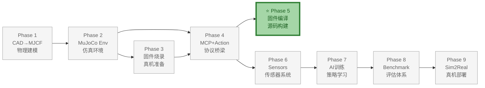
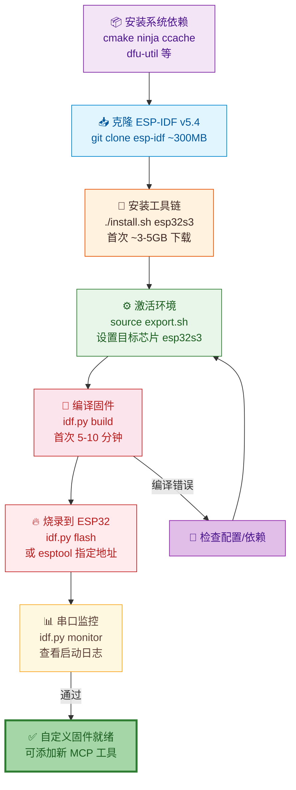

# Phase 5：源码编译与烧录

> **目标**：搭建 ESP-IDF 编译环境，从项目源码 `xiaozhi-esp32-2.2.6/` 编译 ElectronBot 固件并烧录到真机。
>
> **前置依赖**：Phase 3 完成（真机已烧录 v2.2.6-2），Phase 4 完成（MCP Bridge 真机验证通过）
>
> **预计耗时**：2-4 小时（首次需下载 ESP-IDF 工具链约 3-5 GB）
>
> **输出**：
> - ESP-IDF v5.4 编译环境搭建完成
> - 源码编译烧录流程可复现
> - 理解关键源码文件位置

**文档版本**: v1.0  
**最后更新**: 2026-07-08  
**变更类型**: 从原 Phase 4 拆分——源码编译烧录独立任务

---

## 整体架构中的位置

Phase 5（源码编译与烧录）是 ElectronBot-SIM **9 Phase 全链路** 中真机侧的**高级能力**，从源码编译固件，为自定义 MCP 工具、调整舵机参数、添加新功能做准备。

- **上游依赖**：Phase 4（MCP+Action）——需要在 Phase 4 MCP 协议验证通过后，才能确认需要哪些自定义功能
- **下游支撑**：Phase 9（Sim2Real）——编译自定义固件用于高级部署场景
- **核心价值**：让开发者不依赖预编译固件，可以深度定制真机行为；与 Phase 3 互为补充（预编译 vs 源码）



### 本 Phase 实现过程



---

## 0. 背景

> 做完 Phase 4 后，你已能用预编译固件控制真机。本 Phase 学习从源码编译，为后续自定义 MCP 工具、调整舵机参数、添加新功能做准备。

---

## 1. 源码位置

项目内本地源码：

```
xiaozhi-esp32-2.2.6/
├── CMakeLists.txt                    # 顶层构建，项目名 xiaozhi v2.2.6
├── sdkconfig.defaults                # ESP-IDF 默认配置
├── main/
│   ├── CMakeLists.txt                # 主源码构建文件
│   ├── mcp_server.cc / .h            # MCP JSON-RPC 2.0 服务器
│   └── boards/
│       └── electron-bot/             # ★ ElectronBot 板级配置
│           ├── config.json           #   目标: esp32s3
│           ├── config.h              #   引脚: 6路舵机 GPIO 4/5/6/7/15/16
│           ├── electron_bot.cc       #   板级初始化
│           ├── electron_bot_controller.cc  # MCP 工具注册（8 个）
│           ├── movements.cc / .h     #   动作控制库
│           └── oscillator.cc / .h    #   舵机振荡器
├── partitions/v2/16m.csv             # 16MB Flash 分区表
│                                     #   ota_0 4M + ota_1 4M + assets 8M
└── docs/
    ├── mcp-protocol_zh.md            # MCP 协议文档
    └── mcp-usage_zh.md               # MCP 用法文档
```

---

## 2. 系统依赖（Ubuntu 22.04）

```bash
sudo apt update
sudo apt install -y \
    git wget flex bison gperf \
    python3 python3-pip python3-venv python3-dev \
    cmake ninja-build ccache \
    libffi-dev libssl-dev libusb-1.0-0-dev \
    dfu-util

# 串口权限
sudo usermod -a -G dialout,plugdev $USER
# 重新登录生效
```

---

## 3. 安装 ESP-IDF

```bash
# 克隆 ESP-IDF v5.4（xiaozhi v2.2.6 + 需要）
git clone -b v5.4 --recursive https://github.com/espressif/esp-idf.git ~/esp-idf-v5.4

# 安装工具链（仅 esp32s3，首次约 10-15 分钟）
cd ~/esp-idf-v5.4
./install.sh esp32s3
```

> 可选：将 `source ~/esp-idf-v5.4/export.sh` 添加到 `~/.bashrc` 末尾，每次打开终端自动激活。

---

## 4. 编译

```bash
# 1. 激活 ESP-IDF 环境
source ~/esp-idf-v5.4/export.sh

# 2. 进入源码目录
cd /home/maple/数据盘/projects/xiaozhi/xiaozhi-esp32-2.2.6

# 3. 设置目标芯片
idf.py set-target esp32s3

# 4. 编译（首次 5-10 分钟）
idf.py build
```

> `sdkconfig.defaults` 已配置好 ElectronBot 所需的 LVGL、SPI、分区表等，**不需要手动 menuconfig**。

成功标志：

```
Project build complete. To flash, run:
 idf.py -p PORT flash
```

---

## 5. 烧录

> **硬件连接**：参见 [03-Firmware-Flashing 第 3 节](../03-Firmware-Flashing/03-Firmware-Flashing-详细设计说明书.md#3-硬件连接与进入下载模式) 了解 USB 接口选择、串口识别和 BOOT/RST 进入下载模式的方法。

```bash
# 方式 A：idf.py 一键烧录
idf.py -p /dev/ttyUSB0 flash

# 方式 B：合并分区 + esptool 烧录
esptool.py --chip esp32s3 merge_bin -o merged-flash.bin \
  --flash_mode dio --flash_size 16MB \
  0x0 build/bootloader/bootloader.bin \
  0x8000 build/partition_table/partition-table.bin \
  0xd000 build/ota_data_initial.bin \
  0x20000 build/xiaozhi.bin \
  0x800000 build/generated_assets.bin

esptool.py --chip esp32s3 --port /dev/ttyUSB0 --baud 921600 \
  write_flash 0x0 merged-flash.bin
```

---

## 6. 验证

与 Phase 4 第 6 节相同的验证流程：

```bash
websocat ws://真机IP:8080/ws
> {"type":"mcp","payload":{"jsonrpc":"2.0","method":"tools/call","params":{"name":"self.electron.get_status","arguments":{}},"id":1}}
< {"type":"mcp","payload":{"jsonrpc":"2.0","id":1,"result":{"content":[{"type":"text","text":"idle"}],"isError":false}}}
```

自动化测试脚本见 Phase 4 设计文档中的 `tests/test_firmware_ws.py`。

---

## 7. 完成标准

- [ ] ESP-IDF v5.4 环境安装成功
- [ ] `idf.py build` 编译通过
- [ ] 编译产物烧录成功，WebSocket 直连正常
- [ ] 理解关键源码位置：`mcp_server.cc`、`electron_bot_controller.cc`、`movements.cc`

---

## 8. 常见问题

| 现象 | 原因 | 解决 |
|------|------|------|
| `idf.py: command not found` | 未激活 ESP-IDF | `source ~/esp-idf-v5.4/export.sh` |
| `CMake Error: toolchain not found` | ESP-IDF 版本不对 | 确认使用 v5.4 |
| `fatal error: lvgl.h` | 子模块未拉取 | `git submodule update --init --recursive` |
| 烧录失败 | 未进入下载模式 | 按住 BOOT + 按 RST |

---

## 9. 变更记录

| 版本 | 日期 | 变更内容 | 作者 |
|------|------|---------|------|
| v1.0 | 2026-07-08 | 从原 Phase 4 拆分——源码编译烧录 | AI 助手 |
