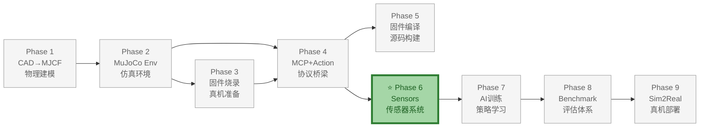
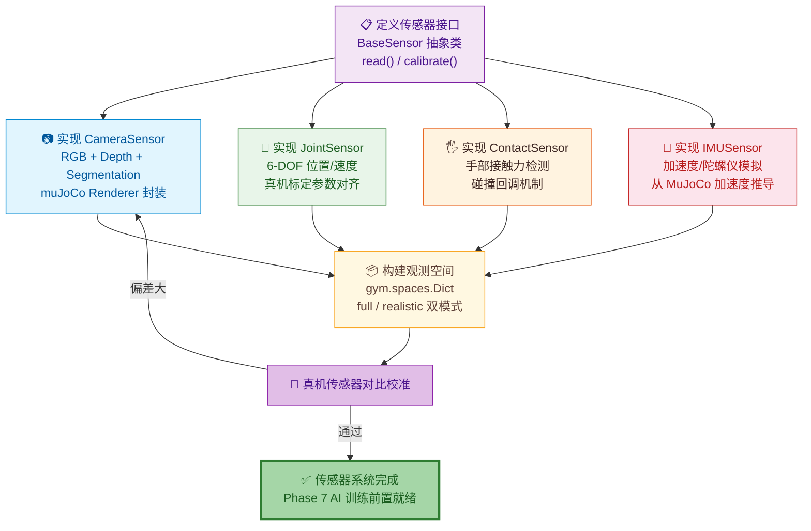

# Phase 6：传感器与观测空间

> **目标**：实现完整的传感器模拟系统，包括摄像头渲染（RGB+深度+分割图）、关节编码器、IMU、碰撞/接触力传感器，构建标准化的观测空间。
>
> **前置依赖**：Phase 3 完成（MCP Bridge + WebSocket）、Phase 4 完成（真机 WebSocket 验证通过）
>
> **真机参考**：真机 ElectronBot 传感器配置参见 [原版 vs 小智版差异分析 - 传感器系统](../../概要设计/ElectronBot-原版vs小智版-差异分析.md#8-传感器系统差异) | [概要设计 - 电子接口与 GPIO](../../概要设计/ElectronBot_SIM-概要设计文档.md#814-电子接口与-gpio)
>
> **输出**：`src/electronbot_sim/sensors/`——独立传感器模块
>
> **文档版本**: v1.2  
> **最后更新**: 2026-07-08  
> **变更类型**: 重编号 Phase 5→6

---

## 整体架构中的位置

Phase 6（传感器与观测空间）是 ElectronBot-SIM **9 Phase 全链路** 中的**感知层**，实现摄像头渲染、关节编码器、IMU、接触力等多种传感器的仿真模拟。

- **上游依赖**：Phase 4（MCP+Action）——传感器数据通过 MCP 协议与真机对齐校准
- **下游支撑**：Phase 7（AI 训练）——AI 策略的观测输入完全来自本 Phase 的传感器系统
- **核心价值**：传感器仿真精度直接影响 Sim2Real 迁移成功率——仿真中"看到"的世界越接近真机，迁移后的表现越好



### 本 Phase 实现过程



---

## 1. 预期效果

```python
from electronbot_sim.env import ElectronBotEnv
from electronbot_sim.sensors import CameraSensor, JointSensor, ContactSensor

env = ElectronBotEnv(render_mode=None)

# 摄像头渲染——模拟 GC9A01 视角
camera = CameraSensor(env, name="head_cam", width=240, height=240)
rgb, depth, seg = camera.capture()
# rgb:   (240, 240, 3)  uint8 RGB
# depth: (240, 240, 1)  float32 meters
# seg:   (240, 240, 1)  int32 object id

# 关节传感器
joint = JointSensor(env)
angles = joint.get_positions()    # (6,) 度
velocities = joint.get_velocities()  # (6,) 度/秒

# 接触传感器——检测手部是否触碰物体
contact = ContactSensor(env, body_name="left_hand")
forces = contact.get_contact_forces()  # (3,) N
is_touching = contact.is_in_contact()  # bool
```

---

## 2. 传感器实现

### 2.1 摄像头传感器

```python
# src/electronbot_sim/sensors/camera.py

import numpy as np
import mujoco

class CameraSensor:
    """摄像头传感器——渲染 MuJoCo 场景到 RGB/D/Seg 图像"""
    
    def __init__(self, env, name: str = "head_cam", width: int = 240, height: int = 240):
        self.env = env
        self.model = env.model
        self.data = env.data
        self.name = name
        self.width = width
        self.height = height
        
        # 检查相机是否存在
        cam_id = mujoco.mj_name2id(self.model, mujoco.mjtObj.mjOBJ_CAMERA, name)
        if cam_id < 0:
            raise ValueError(f"相机 '{name}' 不存在")
        self.cam_id = cam_id
        
        # 创建渲染器
        self.renderer = mujoco.Renderer(self.model, width, height)
        
        # 分割图渲染器（需要额外渲染器）
        self.seg_renderer = mujoco.Renderer(self.model, width, height)
        self.seg_renderer.enable_segmentation_rendering()
    
    def capture(self) -> tuple:
        """渲染一帧——RGB + Depth + Segmentation"""
        # 更新场景
        self.renderer.update_scene(self.data, camera=self.cam_id)
        self.seg_renderer.update_scene(self.data, camera=self.cam_id)
        
        # 渲染
        rgb = self.renderer.render()          # (H, W, 3) uint8
        depth = self.renderer.render_depth()   # (H, W) float32
        seg = self.seg_renderer.render()       # (H, W, 3) uint8
        
        return rgb, depth, seg
    
    def get_intrinsics(self) -> dict:
        """获取相机内参"""
        cam = self.model.cam(self.cam_id)
        fovy = cam.fovy
        focal = self.height / 2 / np.tan(np.radians(fovy) / 2)
        cx, cy = self.width / 2, self.height / 2
        return {
            "fx": focal, "fy": focal,
            "cx": cx, "cy": cy,
            "width": self.width, "height": self.height,
            "fovy": fovy
        }
```

### 2.2 关节传感器

```python
# src/electronbot_sim/sensors/joint.py

class JointSensor:
    """关节状态传感器——模拟舵机编码器回传"""
    
    def __init__(self, env):
        self.env = env
        self.model = env.model
        self.data = env.data
        
        # 噪声参数（可配置，域随机化用）
        self.pos_noise_std = 0.0   # 位置观测噪声标准差（度）
        self.vel_noise_std = 0.0   # 速度观测噪声标准差（度/秒）
    
    def get_positions(self, add_noise: bool = True) -> np.ndarray:
        """获取 6 个关节的机械角度（度）"""
        pos = self.data.qpos[:6].copy()
        if add_noise and self.pos_noise_std > 0:
            pos += np.random.randn(6) * self.pos_noise_std
        return pos
    
    def get_velocities(self, add_noise: bool = True) -> np.ndarray:
        """获取 6 个关节的角速度（度/秒）
        
        ⚠️ Sim2Real 注意: 真机舵机无编码器反馈,此数据在真实硬件不可用。
        仅用于仿真中的 obs_mode="full",在 obs_mode="realistic" 时应使用开环估计或置零。
        """
        vel = np.rad2deg(self.data.qvel[:6].copy())
        if add_noise and self.vel_noise_std > 0:
            vel += np.random.randn(6) * self.vel_noise_std
        return vel
    
    def get_servo_angles(self) -> np.ndarray:
        """机械角度 → 舵机角度（用于与 MCP 状态对比）"""
        # 需要访问 mcp_bridge 的转换方法
        raise NotImplementedError("通过 McpSimBridge._joint_to_servo 转换")
    
    def get_end_effector_positions(self) -> dict:
        """获取左右手末端执行器位置"""
        left_id = mujoco.mj_name2id(self.model, mujoco.mjtObj.mjOBJ_BODY, "left_hand")
        right_id = mujoco.mj_name2id(self.model, mujoco.mjtObj.mjOBJ_BODY, "right_hand")
        
        return {
            "left":  self.data.xpos[left_id].copy(),   # (3,) 世界坐标
            "right": self.data.xpos[right_id].copy(),
        }
```

### 2.3 接触传感器

```python
# src/electronbot_sim/sensors/contact.py

class ContactSensor:
    """接触力传感器——检测特定 body 是否触碰物体"""
    
    def __init__(self, env, body_name: str):
        self.env = env
        self.model = env.model
        self.data = env.data
        self.body_id = mujoco.mj_name2id(self.model, mujoco.mjtObj.mjOBJ_BODY, body_name)
    
    def is_in_contact(self, threshold: float = 0.01) -> bool:
        """是否发生接触"""
        total_force = self.get_total_contact_force()
        return total_force > threshold
    
    def get_total_contact_force(self) -> float:
        """总接触力大小 (N)"""
        force = 0.0
        for i in range(self.data.ncon):
            contact = self.data.contact[i]
            if contact.geom1 in self._body_geom_ids or contact.geom2 in self._body_geom_ids:
                # 读取接触力
                mujoco.mj_contactForce(self.model, self.data, i, self._force_buffer)
                force += np.linalg.norm(self._force_buffer[:3])
        return force
    
    def get_contact_forces(self) -> np.ndarray:
        """各次接触的力向量 [(x,y,z), ...]"""
        forces = []
        for i in range(self.data.ncon):
            contact = self.data.contact[i]
            if contact.geom1 in self._body_geom_ids or contact.geom2 in self._body_geom_ids:
                mujoco.mj_contactForce(self.model, self.data, i, self._force_buffer)
                forces.append(self._force_buffer[:3].copy())
        return np.array(forces)
    
    @property
    def _body_geom_ids(self) -> set:
        """该 body 的所有 geom 编号"""
        if not hasattr(self, '_cached_geom_ids'):
            body_geom_start = self.model.body_geomadr[self.body_id]
            body_geom_num = self.model.body_geomnum[self.body_id]
            self._cached_geom_ids = set(range(body_geom_start, body_geom_start + body_geom_num))
        return self._cached_geom_ids
```

---

## 3. 观测空间标准化

仿真导出标准观测字典，供 RL/IL/VLA 策略使用：

```python
def build_observation(bridge, camera, joint_sensor, contact_left, contact_right):
    """构建完整观测——所有 AI 策略的统一输入格式"""
    rgb, depth, seg = camera.capture()
    
    return {
        # ── 本体感知 ──
        "joint_pos": joint_sensor.get_positions().astype(np.float32),      # (6,) 度
        "joint_vel": joint_sensor.get_velocities().astype(np.float32),    # (6,) 度/秒
        "ee_pos_left": joint_sensor.get_end_effector_positions()["left"].astype(np.float32),  # (3,) m
        "ee_pos_right": joint_sensor.get_end_effector_positions()["right"].astype(np.float32),# (3,) m
        
        # ── 视觉 ──
        "image": rgb,                                 # (240, 240, 3) uint8
        "depth": depth,                               # (240, 240) float32
        "segmentation": seg,                         # (240, 240, 3) uint8
        
        # ── 触觉 ──
        "contact_left": contact_left.is_in_contact(),   # bool
        "contact_right": contact_right.is_in_contact(), # bool
        "contact_force_left": contact_left.get_total_contact_force(),   # float
        "contact_force_right": contact_right.get_total_contact_force(), # float
        
        # ── 任务相关（可选）──
        "target_pos": ...          # 目标物体位置 (3,) m
        "task_embedding": ...      # 任务类型编码 (N,) float32
    }
```

---

## 4. 验证方法

```python
# tests/test_sensors.py

def test_camera_sensor():
    """摄像头渲染测试"""
    env = ElectronBotEnv(render_mode=None)
    env.reset()
    camera = CameraSensor(env, width=240, height=240)
    
    rgb, depth, seg = camera.capture()
    assert rgb.shape == (240, 240, 3)
    assert rgb.dtype == np.uint8
    assert depth.shape == (240, 240)
    assert not np.all(depth == 0)  # 不应全零
    
    intrinsics = camera.get_intrinsics()
    assert "fx" in intrinsics
    print(f"  相机内参: fx={intrinsics['fx']:.1f}, fovy={intrinsics['fovy']:.1f}°")

def test_joint_sensor():
    """关节传感器测试"""
    env = ElectronBotEnv(render_mode=None)
    env.reset()
    sensor = JointSensor(env)
    
    pos = sensor.get_positions()
    assert pos.shape == (6,)
    # home 姿态下的关节角度
    expected = np.array([0, -45, 0, -45, 0, 0])
    assert np.allclose(pos, expected, atol=1.0)
    
    # 发送动作后应能检测到位置变化
    env.step(np.array([10, 0, 0, 0, 0, 0]))
    pos2 = sensor.get_positions()
    assert pos2[0] > pos[0]  # 右臂 pitch 增大

def test_contact_sensor():
    """接触传感器测试——将物体放在手旁，应检测到接触"""
    env = ElectronBotEnv(render_mode=None)
    env.reset()
    
    # 需要手动设置物体位置靠近左手
    # ... (具体取决于场景配置)
    
    contact = ContactSensor(env, "left_hand")
    # 初始无接触
    assert not contact.is_in_contact()
```

**手动验证**：
```bash
# RGB 渲染输出到文件
python scripts/test_camera.py → outputs/camera_rgb.png
# 查看 outputs/camera_rgb.png → 与真机 GC9A01 摄像头视角对比
```

---

## 5. 交付物清单

| 文件 | 描述 |
|------|------|
| `src/electronbot_sim/sensors/__init__.py` | 传感器模块入口 |
| `src/electronbot_sim/sensors/camera.py` | CameraSensor |
| `src/electronbot_sim/sensors/joint.py` | JointSensor |
| `src/electronbot_sim/sensors/contact.py` | ContactSensor |
| `src/electronbot_sim/observation.py` | 观测构建函数 |
| `tests/test_sensors.py` | 传感器测试 |

---

## 6. 接口设计

### 6.1 模块对外接口

传感器模块位于 `src/electronbot_sim/sensors/`，对外暴露 4 个核心接口（3 个类 + 1 个观测构建函数）。

#### 6.1.1 `CameraSensor`

```python
class CameraSensor:
    def __init__(self, env, name: str = "head_cam",
                 width: int = 240, height: int = 240) -> None: ...

    def capture(self) -> tuple[np.ndarray, np.ndarray, np.ndarray]:
        """
        渲染一帧。
        返回: (rgb, depth, seg)
          - rgb:   (H, W, 3) uint8, RGB 顺序
          - depth: (H, W)    float32, 单位 m
          - seg:   (H, W, 3) uint8, 分割图（object id 编码）
        """

    def get_intrinsics(self) -> dict:
        """
        返回相机内参字典: {fx, fy, cx, cy, width, height, fovy}
        fx/fy/cx/cy 单位为像素，fovy 单位为度。
        """
```

#### 6.1.2 `JointSensor`

```python
class JointSensor:
    def __init__(self, env) -> None: ...

    def get_positions(self, add_noise: bool = True) -> np.ndarray:
        """返回 (6,) float64，单位 度，顺序 [RP, RR, LP, LR, BODY, HEAD]。"""

    def get_velocities(self, add_noise: bool = True) -> np.ndarray:
        """返回 (6,) float64，单位 度/秒。
        ⚠️ 真机无编码器，obs_mode="realistic" 时应置零或开环估计。"""

    def get_end_effector_positions(self) -> dict:
        """返回 {"left": (3,) m, "right": (3,) m}，世界坐标系。"""

    def get_servo_angles(self) -> np.ndarray:
        """机械角度 → 舵机角度（待 McpSimBridge 集成）。"""
```

#### 6.1.3 `ContactSensor`

```python
class ContactSensor:
    def __init__(self, env, body_name: str) -> None: ...

    def is_in_contact(self, threshold: float = 0.01) -> bool:
        """总接触力 > threshold (N) 时返回 True。"""

    def get_total_contact_force(self) -> float:
        """返回该 body 所有接触力的合力大小 (N)。"""

    def get_contact_forces(self) -> np.ndarray:
        """返回 (K, 3) float64，K 为接触点数，每行为 (fx, fy, fz) N。"""
```

#### 6.1.4 `build_observation()`

```python
def build_observation(
    bridge,
    camera: CameraSensor,
    joint_sensor: JointSensor,
    contact_left: ContactSensor,
    contact_right: ContactSensor,
) -> dict:
    """
    构建 RL/IL/VLA 策略的统一观测字典。
    返回结构详见 §7.1。
    """
```

### 6.2 输入输出契约

| 接口 | 输入格式 | 输出格式 | 异常条件 |
|------|----------|----------|----------|
| `CameraSensor.__init__` | env, name, width, height | — | `cam_id < 0`（相机名不存在）→ `ValueError` |
| `CameraSensor.capture` | 无（使用初始化 env） | `(rgb(H,W,3), depth(H,W), seg(H,W,3))` | EGL 上下文初始化失败；分辨率过高 OOM |
| `CameraSensor.get_intrinsics` | 无 | `dict{fx,fy,cx,cy,width,height,fovy}` | — |
| `JointSensor.get_positions` | `add_noise: bool` | `ndarray(6,)` 度 | — |
| `JointSensor.get_velocities` | `add_noise: bool` | `ndarray(6,)` 度/秒 | — |
| `JointSensor.get_end_effector_positions` | 无 | `{"left":(3,), "right":(3,)}` m | body `left_hand`/`right_hand` 不存在 |
| `ContactSensor.__init__` | env, body_name | — | `body_name` 不存在 → `mujoco` 名称查找失败 |
| `ContactSensor.is_in_contact` | `threshold: float` | `bool` | — |
| `ContactSensor.get_total_contact_force` | 无 | `float` N | — |
| `build_observation` | bridge, camera, joint, 2×contact | `dict`（见 §7.1） | 任一子传感器异常向上传播 |

---

## 7. 数据模型

### 7.1 观测字典完整 schema

```python
observation = {
    # ── 本体感知 ──
    "joint_pos":            np.ndarray,  # (6,)    float32  度
    "joint_vel":            np.ndarray,  # (6,)    float32  度/秒
    "ee_pos_left":          np.ndarray,  # (3,)    float32  m, 世界坐标
    "ee_pos_right":         np.ndarray,  # (3,)    float32  m, 世界坐标

    # ── 视觉 ──
    "image":                np.ndarray,  # (240, 240, 3) uint8   RGB
    "depth":                np.ndarray,  # (240, 240)    float32 m
    "segmentation":         np.ndarray,  # (240, 240, 3) uint8   分割图

    # ── 触觉 ──
    "contact_left":         bool,        # 标量
    "contact_right":        bool,        # 标量
    "contact_force_left":   float,       # 标量 N
    "contact_force_right":  float,       # 标量 N

    # ── 任务相关（可选）──
    "target_pos":           np.ndarray,  # (3,)    float32  m
    "task_embedding":       np.ndarray,  # (N,)    float32
}
```

### 7.2 相机内参结构

```python
intrinsics = {
    "fx":     float,   # x 方向焦距（像素），= height / 2 / tan(fovy/2)
    "fy":     float,   # y 方向焦距（像素），等于 fx（正方形像素）
    "cx":     float,   # 主点 x，= width / 2
    "cy":     float,   # 主点 y，= height / 2
    "width":  int,     # 240（对齐 GC9A01）
    "height": int,     # 240
    "fovy":   float,   # 60.0 度
}
```

> 默认配置下：`fx = fy = 240 / 2 / tan(30°) ≈ 207.85`，`cx = cy = 120.0`

### 7.3 接触力数据结构

```python
# ContactSensor 内部
force_buffer: np.ndarray  # (6,) float64, [fx, fy, fz, tx, ty, tz]

# get_contact_forces 返回
forces: np.ndarray  # (K, 3) float64, K 为当前帧接触点数
                    # 每行 = (fx, fy, fz) N

# body 的 geom id 缓存
_body_geom_ids: set[int]  # 该 body 拥有的所有 geom 编号
```

### 7.4 数据流

```
   ┌─────────────────────────────────────────────────────┐
   │                ElectronBotEnv (MuJoCo)              │
   │   model / data (qpos, qvel, xpos, contact)          │
   └───────┬─────────────┬───────────────┬───────────────┘
           │             │               │
           ▼             ▼               ▼
   ┌──────────────┐ ┌──────────────┐ ┌──────────────────┐
   │ CameraSensor │ │ JointSensor  │ │ ContactSensor×2  │
   │  renderer    │ │  qpos[:6]    │ │  left_hand       │
   │  seg_renderer│ │  qvel[:6]    │ │  right_hand      │
   │  → rgb/depth │ │  xpos[hand]  │ │  → force/bool    │
   │  /seg        │ │  → pos/vel   │ │                  │
   └──────┬───────┘ └──────┬───────┘ └────────┬─────────┘
          │                │                  │
          └────────────────┼──────────────────┘
                           ▼
              ┌─────────────────────────┐
              │   build_observation()   │
              │   合并 → obs dict       │
              └────────────┬────────────┘
                           ▼
              ┌─────────────────────────┐
              │  RL / IL / VLA Policy   │
              └─────────────────────────┘
```

---

## 8. 错误处理与恢复

### 8.1 错误分类

| 错误类型 | 触发条件 | 处理策略 | 用户感知 |
|----------|----------|----------|----------|
| 相机名称不存在 | `mj_name2id` 返回 `cam_id < 0` | `ValueError("相机 '{name}' 不存在")` | 初始化即失败，提示检查 MJCF `<camera name=>` |
| EGL 渲染上下文初始化失败 | 无 GPU 或驱动缺失 | `mujoco.Renderer` 构造抛 `mujoco.FatalError` | 提示设置 `MUJOCO_GL=osmesa` 回退 CPU 渲染 |
| `body_name` 不存在 | `ContactSensor(body_name=...)` 拼写错误 | `mj_name2id` 返回 -1，后续索引报错 | 初始化失败，提示可用 body 列表 |
| 渲染 OOM | 分辨率过高（如 1024×1024） | `RuntimeError` from EGL driver | 建议降到 240×240 或 480×480 |
| 深度图全零 | 相机朝向天空或场景为空 | `assert not np.all(depth==0)` 测试失败 | 检查相机位姿与场景几何体 |
| 关节位置 NaN | 仿真发散（关节超出 range） | `np.isnan` 检测后 reset env | 日志 WARNING，自动 reset |
| 分割图全零 | 场景无 geom 或渲染器未启用 seg | 检查 `seg_renderer.enable_segmentation_rendering()` | 配置错误提示 |
| 接触力读取异常 | `data.ncon` 超大（穿透严重） | 限制最大遍历数 1000，超出告警 | 日志 WARNING |

### 8.2 异常恢复流程

#### 8.2.1 渲染后端回退

```
CameraSensor 初始化
   │
   try: mujoco.Renderer(model, w, h)  # 默认 EGL
   │
   except mujoco.FatalError:
   │   logger.warning("EGL 渲染初始化失败，回退到 osmesa")
   │   os.environ["MUJOCO_GL"] = "osmesa"
   │   # 需要重新 import mujoco 以重新加载渲染后端
   │   → 提示用户重启进程
   │
   └─ 仍失败 → 抛出，要求用户检查 GPU/驱动
```

#### 8.2.2 NaN 数据检测与恢复

```
build_observation 每帧调用
   │
   for key in ["joint_pos", "joint_vel"]:
       if np.isnan(obs[key]).any():
           logger.warning(f"{key} 含 NaN, 触发 env.reset()")
           obs = env.reset()
           return obs  # 返回 reset 后的初始观测
   │
   for key in ["depth"]:
       if np.all(obs[key] == 0):
           logger.warning(f"{key} 全零, 相机可能朝向空场景")
```

---

## 9. 配置管理

### 9.1 配置参数表

| 参数名 | 类型 | 默认值 | 范围 | 说明 |
|--------|------|--------|------|------|
| `camera.width` | int | 240 | 64 ~ 1024 | 相机水平分辨率（对齐 GC9A01 240×240） |
| `camera.height` | int | 240 | 64 ~ 1024 | 相机垂直分辨率 |
| `camera.fovy` | float | 60.0 | 30 ~ 120 | 垂直视场角（度） |
| `camera.name` | str | "head_cam" | — | MJCF 中定义的相机名 |
| `pos_noise_std` | float | 0.0 | 0 ~ 5.0 | 关节位置观测噪声标准差（度） |
| `vel_noise_std` | float | 0.0 | 0 ~ 20.0 | 关节速度观测噪声标准差（度/秒） |
| `contact_threshold` | float | 0.01 | 0 ~ 10.0 | 接触判定阈值（N） |
| `obs_mode` | str | "full" | "full" / "realistic" | full=含 joint_vel+视觉；realistic=真机可部署 |
| `max_render_resolution` | int | 512 | 128 ~ 2048 | 防止 OOM 的硬上限 |
| `max_contacts_traverse` | int | 1000 | 100 ~ 10000 | 接触力遍历上限，防穿透卡死 |

> **obs_mode 说明**：
> - `"full"`：仿真训练用，包含 `joint_vel`、`depth`、`segmentation` 等真机不可得信号
> - `"realistic"`：Sim2Real 用，`joint_vel` 置零或开环估计，移除 depth/seg，仅保留 RGB

### 9.2 环境变量

| 环境变量 | 默认值 | 说明 |
|----------|--------|------|
| `MUJOCO_GL` | 未设置（自动） | `egl`（GPU 无头）/ `osmesa`（CPU）/ `glfw`（X11 窗口） |
| `ELECTRONBOT_OBS_MODE` | `full` | 覆盖 obs_mode 配置 |
| `ELECTRONBOT_CAM_WIDTH` | 240 | 覆盖相机宽度 |
| `ELECTRONBOT_CAM_HEIGHT` | 240 | 覆盖相机高度 |
| `ELECTRONBOT_POS_NOISE` | 0.0 | 覆盖位置噪声标准差 |
| `ELECTRONBOT_VEL_NOISE` | 0.0 | 覆盖速度噪声标准差 |

---

## 10. 日志与可观测性

### 10.1 日志规范

日志级别：`DEBUG` / `INFO` / `WARNING` / `ERROR`，默认 `INFO`。
格式：`[%(asctime)s][%(levelname)s][%(name)s] %(message)s`

关键事件：

| 阶段 | 级别 | 事件 | 字段 |
|------|------|------|------|
| 相机初始化 | INFO | `camera init` | name, width, height, fovy, fx |
| 渲染后端回退 | WARNING | `egl fallback to osmesa` | 错误信息 |
| 帧渲染 | DEBUG | `frame rendered` | render_ms, seg_ms, total_ms |
| 关节读数 | DEBUG | `joint read` | pos(6), vel(6) |
| 接触检测 | DEBUG | `contact detected` | body, force_N, n_contacts |
| NaN 检测 | WARNING | `nan detected` | field, action=reset |
| 性能告警 | WARNING | `render slow` | elapsed_ms > 5 |
| 数据质量 | WARNING | `depth all zero` | cam_name |

示例日志：
```
[2026-07-04T10:30:01][INFO][camera] camera init name=head_cam width=240 height=240 fovy=60.0 fx=207.85
[2026-07-04T10:30:01][DEBUG][camera] frame rendered render_ms=3.2 seg_ms=1.1 total_ms=4.3
[2026-07-04T10:30:01][DEBUG][joint] joint read pos=[0,-45,0,-45,0,0] vel=[0.1,0,0,0,0,0]
[2026-07-04T10:30:01][DEBUG][contact] contact detected body=left_hand force_N=0.34 n_contacts=2
[2026-07-04T10:30:02][WARNING][obs] nan detected field=joint_pos action=reset
```

### 10.2 关键指标

| 指标名 | 类型 | 采集方式 | 告警阈值 |
|--------|------|----------|----------|
| `render_latency_ms` | gauge | 每帧计时 | > 5 告警（目标 < 5ms/帧） |
| `seg_render_latency_ms` | gauge | 分割图渲染计时 | > 3 告警 |
| `render_fps` | gauge | 1/latency 换算 | < 150 告警 |
| `nan_count` | counter | build_observation 累计 | > 10/min 告警 |
| `depth_zero_ratio` | gauge | 全零帧/总帧 | > 0.2 告警 |
| `contact_false_positive` | gauge | 无物体却报接触 | > 0 告警 |
| `egl_fallback` | bool(0/1) | 渲染后端 | =1 告警（性能下降） |

---

## 11. 风险评估

### 11.1 技术风险

| 风险项 | 概率 | 影响 | 缓解措施 |
|--------|:---:|:---:|----------|
| 真机无摄像头 → 视觉 VLA 不可部署 | 高（确定） | 高 | obs_mode="realistic" 移除视觉依赖；保留仿真视觉用于预训练 |
| 真机无编码器 → joint_vel 不可用 | 高（确定） | 中 | realistic 模式置零；提供开环估计工具（基于 ctrl 历史） |
| 渲染性能瓶颈（深度+分割图渲染慢） | 中 | 中 | 双 renderer 复用场景；seg 仅在需要时启用；目标 < 5ms/帧 |
| EGL 上下文初始化失败（无 GPU 环境） | 中 | 高 | 自动回退 osmesa；CI 用 osmesa 跑通 |
| 分割图 object id 编码不稳定 | 低 | 中 | 固定 geom 渲染顺序；用 body id 而非 geom id |
| 接触力误报（手部自接触） | 中 | 低 | 排除同一 body 内 geom 间的接触 |
| 渲染 OOM（高分辨率训练） | 低 | 高 | max_render_resolution 硬上限 512；默认 240×240 |
| MuJoCo 版本升级 Renderer API 变化 | 低 | 中 | 锁定 mujoco==3.x；CI 覆盖 capture/get_intrinsics |

### 11.2 依赖风险

| 外部依赖 | 版本 | 风险 | 应对 |
|----------|------|------|------|
| `mujoco` (Renderer) | 3.x | `render_depth` / `enable_segmentation_rendering` API 变化 | 锁版本，CI 测试覆盖 |
| `numpy` | >=1.24 | dtype 默认变化 | 显式 `.astype(np.float32)` |
| EGL 驱动 | — | 无头服务器驱动缺失 | osmesa 回退方案 |
| `ElectronBotEnv` (Phase 1-3) | — | env 接口变化破坏传感器初始化 | 传感器通过 `env.model`/`env.data` 访问，解耦 |
| GC9A01 硬件规格 | — | 真机屏幕分辨率/视场变化 | camera.width/height/fovy 可配置 |

---

## 12. 变更记录

| 版本 | 日期 | 变更内容 | 作者 |
|------|------|----------|------|
| v1.0 | 2026-07-03 | 初始版本 | — |
| v1.1 | 2026-07-04 | 补充软件工程规范章节 | 架构师 |
