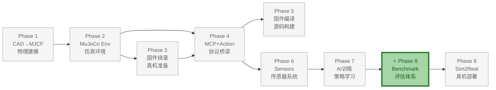
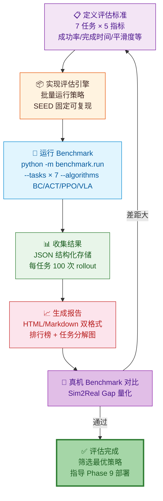

# Phase 8：Benchmark 评估系统

> **目标**：建立标准化的评估体系，量化不同 AI 策略在 7 个标准任务上的表现。支持自动化批量评估、结果可视化、排行榜生成。
>
> **前置依赖**：Phase 7 完成（至少一个可训练的策略）
>
> **真机评测**：Benchmark 结果可在真机复现验证，参见 [Sim2Real Benchmark 验证](../09-Sim2Real/09-Sim2Real-详细设计说明书.md)。
>
> **输出**：`src/electronbot_benchmark/`——标准 Benchmark Suite
>
> **文档版本**: v1.2  
> **最后更新**: 2026-07-08  
> **变更类型**: 重编号 Phase 7→8

---

## 整体架构中的位置

Phase 8（Benchmark 评估系统）是 ElectronBot-SIM **9 Phase 全链路** 中的**评估验证层**，在 7 个标准任务上量化不同 AI 策略的表现，提供排行榜和可视化报告。

- **上游依赖**：Phase 7（AI 训练）——需要 Phase 7 产出的训练策略作为评估对象
- **下游支撑**：Phase 9（Sim2Real）——Benchmark 结果作为决策依据，筛选最优策略进行真机部署；真机上可复现 Benchmark 进行对比
- **核心价值**：建立可量化的指标体系，使不同策略、不同超参数的效果可对比，避免"拍脑袋"选策略



### 本 Phase 实现过程



---

## 1. 预期效果

```bash
# 运行完整 Benchmark
python -m electronbot_benchmark.run \
    --tasks reach push pick_place stack follow gesture voice \
    --algorithms bc act ppo \
    --episodes 100 \
    --output results/benchmark_2026_07_03.json

# 输出结果表格
┌─────────────┬──────┬──────┬──────┬──────┐
│ Task        │ BC   │ ACT  │ PPO  │ VLA  │
├─────────────┼──────┼──────┼──────┼──────┤
│ EB-Reach    │ 87%  │ 94%  │ 98%  │ 75%  │
│ EB-Push     │ 72%  │ 85%  │ 91%  │ 60%  │
│ EB-PickPlace│ 45%  │ 68%  │ 82%  │ 40%  │
│ EB-Stack    │ 30%  │ 48%  │ 65%  │ 25%  │
│ EB-Follow   │ 55%  │ 70%  │ 78%  │ 35%  │
│ EB-Gesture  │ 80%  │ 88%  │ 92%  │ 65%  │
│ EB-VoiceCmd │  ─   │  ─   │  ─   │ 55%  │
└─────────────┴──────┴──────┴──────┴──────┘
```

### 每个任务的评估维度

| 指标 | 含义 | 计算方式 |
|------|------|---------|
| **Success Rate** | 成功率 | 成功次数 / 总尝试次数 |
| **Mean Completion Time** | 平均完成时间 (s) | 从 reset 到 success 的墙钟时间 |
| **Trajectory Smoothness** | 轨迹平滑度 | 关节加速度的 L2 范数平均值 |
| **Generalization Gap** | 泛化差距 | (ID成功率 - OOD成功率) / ID成功率 |
| **Sim2Real Gap** | 仿真→真机差距 | (仿真成功率 - 真机成功率) / 仿真成功率 |

---

## 2. 7 个标准任务详细定义

### 2.1 EB-Reach（触碰目标）

```
场景：桌面上随机位置出现一个目标球
任务：使用右手触碰目标球
成功条件：手部与球的距离 < 2cm
难度：★☆☆☆☆

随机化参数：
  - 目标位置：x~[-8,8]cm, y~[-2,5]cm, z~[-3,0]cm
  - 目标大小：r~[1,2]cm
  - 初始姿态：关节随机偏移 ±10°
```

### 2.2 EB-Push（推物体）

```
场景：桌面上有一个方块，需要推到目标区域
任务：用左/右手将方块推到标记的位置
成功条件：方块位置距目标 < 3cm
难度：★★☆☆☆

随机化参数：
  - 方块位置和大小
  - 目标位置
  - 推的方向和距离
```

### 2.3 EB-PickPlace（抓取放置）

```
场景：桌面上有一个小物体，需抓起放入指定容器
任务：准确定位→抓取→抬臂→放入容器→释放
成功条件：物体进入容器
难度：★★★★☆

奖励分解：
  - 靠近物体: +0.5 (d < 5cm)
  - 抓取物体: +2.0 (接触力 > 阈值, 物体离桌面 > 1cm)
  - 靠近容器: +1.0 (带物体距容器 < 5cm)
  - 放入容器: +10.0 (物体在容器内)
```

### 2.4 EB-Stack（叠方块）

```
场景：桌面上有两个方块
任务：将一个方块叠在另一个上面
成功条件：上方方块稳定叠放 > 2秒
难度：★★★★★
```

### 2.5 EB-Follow（追踪移动物体）

```
场景：桌面上一个物体沿随机轨迹移动
任务：头部/手臂持续追踪物体位置
成功条件：连续 5 秒内手-物距离 < 3cm
难度：★★★☆☆
```

### 2.6 EB-Gesture（手势/动作模仿）

```
场景：给定目标关节姿态
任务：从当前姿态移动到目标姿态
成功条件：所有关节误差 < 5°
难度：★★☆☆☆

测试用目标姿态：
  - home:     [180,180,0,0,90,90]
  - wave:     [150,180,0,0,90,90]
  - t-pose:   [90,140,90,40,90,90]
  - look_side:[180,180,0,0,60,90]
  - nod:      [180,180,0,0,90,105]
```

### 2.7 EB-VoiceCommand（语音指令理解）

```
场景：接收自然语言指令
任务：LLM 正确理解并生成可执行的动作序列
成功条件：人类评审认为指令被执行正确

测试指令集：
  "举起右手"
  "挥挥手"
  "转过来看我"
  "点点头"
  "把红色方块推过去"
```

---

## 3. Benchmark 系统实现

### 3.1 核心类

```python
# src/electronbot_benchmark/suite.py

import json
import time
import numpy as np
from dataclasses import dataclass, field
from typing import List, Dict, Callable

@dataclass
class BenchmarkResult:
    """单次 Benchmark 结果"""
    task_name: str
    algorithm: str
    success_rate: float
    mean_completion_time: float
    trajectory_smoothness: float
    generalization_gap: float = 0.0
    
    num_episodes: int = 100
    num_successes: int = 0
    per_episode_times: List[float] = field(default_factory=list)
    per_episode_smoothness: List[float] = field(default_factory=list)

class ElectronBotBenchmark:
    """标准 Benchmark Suite"""
    
    def __init__(self, output_dir: str = "results"):
        self.output_dir = output_dir
        self.results: List[BenchmarkResult] = []
    
    def run_task(self, task, policy, num_episodes: int = 100,
                 render: bool = False) -> BenchmarkResult:
        """运行单个任务评估"""
        successes = 0
        times = []
        smoothness_vals = []
        
        for ep in range(num_episodes):
            obs = task.reset()
            start_time = time.time()
            done = False
            prev_action = None
            
            while not done:
                action = policy.predict(obs)
                
                # 计算平滑度
                if prev_action is not None:
                    smoothness = np.linalg.norm(action - prev_action)
                    smoothness_vals.append(smoothness)
                prev_action = action
                
                obs, _, done, _, _ = task.step(action)
                
                if task.is_success():
                    successes += 1
                    times.append(time.time() - start_time)
                    break
                
                # 超时
                if time.time() - start_time > 60:
                    break
        
        return BenchmarkResult(
            task_name=task.name,
            algorithm=policy.name,
            success_rate=successes / num_episodes,
            mean_completion_time=np.mean(times) if times else 60.0,
            trajectory_smoothness=np.mean(smoothness_vals) if smoothness_vals else 0.0,
            num_episodes=num_episodes,
            num_successes=successes,
            per_episode_times=times,
            per_episode_smoothness=smoothness_vals,
        )
    
    def run_all(self, tasks: List, policies: Dict, num_episodes: int = 100):
        """运行完整 Benchmark"""
        for task in tasks:
            for algo_name, policy in policies.items():
                print(f"\n🏃 运行 {task.name} / {algo_name} ...")
                result = self.run_task(task, policy, num_episodes)
                self.results.append(result)
                print(f"   成功率: {result.success_rate:.1%}")
                print(f"   平均时间: {result.mean_completion_time:.1f}s")
        
        self._save_results()
        self._print_table()
    
    def _print_table(self):
        """打印结果表格"""
        tasks = sorted(set(r.task_name for r in self.results))
        algos = sorted(set(r.algorithm for r in self.results))
        
        # 表头
        header = "│ Task".ljust(16)
        for a in algos:
            header += f"│ {a:^8s} "
        print(header + "│")
        
        # 分隔线
        sep = "├" + "─" * 14
        for _ in algos:
            sep += "┼" + "─" * 10
        print(sep + "┤")
        
        # 数据行
        for task in tasks:
            row = f"│ {task:<14s}"
            for algo in algos:
                matched = [r for r in self.results if r.task_name == task and r.algorithm == algo]
                if matched:
                    row += f"│ {matched[0].success_rate:7.0%} "
                else:
                    row += "│    ─    "
            print(row + "│")
    
    def _save_results(self):
        import os
        os.makedirs(self.output_dir, exist_ok=True)
        path = os.path.join(self.output_dir, "benchmark_results.json")
        with open(path, "w") as f:
            json.dump([{
                "task": r.task_name,
                "algorithm": r.algorithm,
                "success_rate": r.success_rate,
                "mean_time": r.mean_completion_time,
                "smoothness": r.trajectory_smoothness,
                "num_episodes": r.num_episodes,
                "num_successes": r.num_successes,
            } for r in self.results], f, indent=2)
```

---

## 4. 验证方法

```bash
# 运行最小 Benchmark（快速测试）
python -m electronbot_benchmark.run \
    --tasks reach \
    --algorithms bc \
    --episodes 10 \
    --name quick_test

# 检查输出
cat results/quick_test.json
# → 应包含 task, algorithm, success_rate 等字段

# 完整 Benchmark
python -m electronbot_benchmark.run \
    --tasks reach push pick_place stack follow gesture voice \
    --algorithms bc act ppo \
    --episodes 100 \
    --name full_benchmark

# 生成报告
python -m electronbot_benchmark.report results/full_benchmark.json
```

**验收标准**：
```
□ BC 基线在 reach 任务上成功率 > 70%
□ ACT 在所有任务上优于 BC（至少 3 个任务差距 > 10%）
□ PPO 在 pick_place 上成功率 > 75%
□ Benchmark 表格正确生成
□ 每次运行结果可复现（相同 seed → 相同结果）
□ 结果 JSON 包含所有必要字段
```

---

## 5. 交付物清单

| 文件 | 描述 |
|------|------|
| `src/electronbot_benchmark/__init__.py` | Benchmark 入口 |
| `src/electronbot_benchmark/suite.py` | Benchmark 核心类 |
| `src/electronbot_benchmark/run.py` | CLI 运行脚本 |
| `src/electronbot_benchmark/report.py` | 报告生成 |
| `src/electronbot_benchmark/tasks/` | 7 个标准任务定义 |
| `results/` | Benchmark 结果输出目录 |

---

## 6. 接口设计

### 6.1 模块对外接口

`ElectronBotBenchmark` 作为标准 Benchmark Suite 的核心入口，对上层 CLI、报告生成器、CI 流水线提供两类接口：编程式 API（用于集成到自定义评估流程）与命令行接口（用于独立运行批量评估）。

#### 6.1.1 编程式 API

| 接口方法 | 签名 | 返回值 | 语义说明 |
|---------|------|--------|---------|
| `__init__` | `(output_dir: str = "results", seed: int = 42)` | `ElectronBotBenchmark` | 创建 Suite 实例；`output_dir` 指定结果输出目录；`seed` 控制全局可复现性 |
| `run_task` | `(task, policy, num_episodes: int = 100, render: bool = False) -> BenchmarkResult` | `BenchmarkResult` | 运行单个 task×algorithm 组合的评估 |
| `run_all` | `(tasks: List[Task], policies: Dict[str, Policy], num_episodes: int = 100)` | `List[BenchmarkResult]` | 运行完整 Benchmark 矩阵（笛卡尔积） |
| `load_results` | `(path: str) -> List[BenchmarkResult]` | `List[BenchmarkResult]` | 从 JSON 文件加载历史结果 |
| `compare` | `(baseline: BenchmarkResult, candidate: BenchmarkResult) -> dict` | `dict` | 对比两个结果的指标差异 |
| `generate_report` | `(results: List[BenchmarkResult], fmt: str = "markdown") -> str` | `str` | 生成 Markdown / HTML 报告 |
| `print_table` | `(results: List[BenchmarkResult]) -> None` | `None` | 打印结果矩阵到终端 |

#### 6.1.2 CLI 接口

```bash
python -m electronbot_benchmark.run \
    --tasks reach push pick_place stack follow gesture voice \
    --algorithms bc act ppo \
    --episodes 100 \
    --seed 42 \
    --output results/benchmark_2026_07_04.json \
    --render false
```

| CLI 参数 | 类型 | 默认值 | 说明 |
|---------|------|--------|------|
| `--tasks` | `List[str]` | 全部 7 个任务 | 任务名列表，支持子集选择 |
| `--algorithms` | `List[str]` | `bc` | 算法名列表，对应已注册的策略工厂 |
| `--episodes` | `int` | `100` | 每个 task×algorithm 组合的评估 episode 数 |
| `--seed` | `int` | `42` | 全局随机种子，保证可复现 |
| `--output` | `str` | `results/benchmark_results.json` | 结果 JSON 输出路径 |
| `--render` | `bool` | `false` | 是否开启渲染（影响评估速度） |
| `--name` | `str` | `benchmark_<timestamp>` | 本次评估的命名标识 |
| `--timeout` | `int` | `60` | 单 episode 超时上限（秒） |
| `--report` | `str` | `None` | 报告输出路径，指定后生成 Markdown 报告 |

### 6.2 输入输出契约

#### 6.2.1 输入：Task 接口契约

`run_task` / `run_all` 接收的 `task` 对象须实现以下协议：

| 方法 | 签名 | 说明 |
|------|------|------|
| `reset()` | `-> obs` | 重置任务，返回初始观测 |
| `step(action)` | `-> (obs, reward, done, truncated, info)` | 推进一步 |
| `is_success()` | `-> bool` | 判断当前 episode 是否成功 |
| `name` | `str` 属性 | 任务名（如 `EB-Reach`） |
| `difficulty` | `int` 属性 | 难度等级（1-5 星） |

#### 6.2.2 输入：Policy 接口契约

`run_task` / `run_all` 接收的 `policy` 对象须实现以下协议：

| 方法 | 签名 | 说明 |
|------|------|------|
| `predict(obs)` | `-> action: np.ndarray` | 根据观测输出动作 |
| `name` | `str` 属性 | 算法名（如 `bc` / `act` / `ppo`） |
| `reset()` | `-> None` | episode 开始时重置内部状态（RNN 隐藏态等） |

#### 6.2.3 输出：BenchmarkResult 契约

`run_task` 返回 `BenchmarkResult` dataclass，详见 7.1 节字段定义。

---

## 7. 数据模型

### 7.1 核心数据结构

#### 7.1.1 BenchmarkResult 完整字段定义

```python
@dataclass
class BenchmarkResult:
    """单次 Benchmark 结果"""
    # ─── 标识字段 ───
    task_name: str                    # 任务名，如 "EB-Reach"
    algorithm: str                    # 算法名，如 "ppo"

    # ─── 核心指标 ───
    success_rate: float               # 成功率 [0, 1]
    mean_completion_time: float       # 平均完成时间（秒），失败 episode 计为超时
    trajectory_smoothness: float      # 轨迹平滑度（关节加速度 L2 范数均值）
    generalization_gap: float = 0.0   # 泛化差距：(ID成功率 - OOD成功率) / ID成功率

    # ─── 统计元数据 ───
    num_episodes: int = 100           # 总评估 episode 数
    num_successes: int = 0            # 成功 episode 数
    seed: int = 42                    # 评估种子

    # ─── 逐 episode 明细（可选，用于统计分析）───
    per_episode_times: List[float] = field(default_factory=list)
    per_episode_smoothness: List[float] = field(default_factory=list)
    per_episode_success: List[bool] = field(default_factory=list)

    # ─── Sim2Real 指标（可选，需真机数据）───
    sim2real_gap: Optional[float] = None  # (仿真成功率 - 真机成功率) / 仿真成功率
```

| 字段 | 类型 | 单位 | 计算方式 |
|------|------|------|---------|
| `success_rate` | `float` | [0, 1] | `num_successes / num_episodes` |
| `mean_completion_time` | `float` | 秒 | `mean(per_episode_times)`，无成功时取超时上限 60s |
| `trajectory_smoothness` | `float` | — | `mean(‖a_t - a_{t-1}‖₂)`，所有步动作增量的 L2 范数均值 |
| `generalization_gap` | `float` | [0, 1] | `(SR_id - SR_ood) / SR_id`，ID/OOD 数据集成功率之差归一化 |
| `sim2real_gap` | `float` | [0, 1] | `(SR_sim - SR_real) / SR_sim`，需真机评估数据 |

#### 7.1.2 结果 JSON Schema

`_save_results()` 输出的 JSON 文件结构如下：

```json
{
  "metadata": {
    "name": "full_benchmark",
    "timestamp": "2026-07-04T10:30:00",
    "seed": 42,
    "total_combinations": 21
  },
  "results": [
    {
      "task": "EB-Reach",
      "algorithm": "ppo",
      "success_rate": 0.98,
      "mean_time": 2.3,
      "smoothness": 0.15,
      "generalization_gap": 0.05,
      "sim2real_gap": null,
      "num_episodes": 100,
      "num_successes": 98
    }
  ]
}
```

JSON 字段映射表：

| JSON 字段 | dataclass 字段 | 类型 | 必填 | 说明 |
|-----------|---------------|------|------|------|
| `task` | `task_name` | `string` | 是 | 任务名 |
| `algorithm` | `algorithm` | `string` | 是 | 算法名 |
| `success_rate` | `success_rate` | `number` | 是 | 成功率 |
| `mean_time` | `mean_completion_time` | `number` | 是 | 平均完成时间（秒） |
| `smoothness` | `trajectory_smoothness` | `number` | 是 | 轨迹平滑度 |
| `generalization_gap` | `generalization_gap` | `number` | 否 | 泛化差距 |
| `sim2real_gap` | `sim2real_gap` | `number` \| `null` | 否 | Sim2Real 差距 |
| `num_episodes` | `num_episodes` | `integer` | 是 | 总 episode 数 |
| `num_successes` | `num_successes` | `integer` | 是 | 成功数 |

#### 7.1.3 7 任务 × 5 指标评估矩阵

每个 task×algorithm 组合产出以下 5 项指标，构成完整的评估矩阵：

| 任务 | 难度 | success_rate | mean_time | smoothness | generalization_gap | sim2real_gap |
|------|------|-------------|-----------|------------|-------------------|--------------|
| EB-Reach | ★☆☆☆☆ | ✓ | ✓ | ✓ | ✓ | 可选 |
| EB-Push | ★★☆☆☆ | ✓ | ✓ | ✓ | ✓ | 可选 |
| EB-PickPlace | ★★★★☆ | ✓ | ✓ | ✓ | ✓ | 可选 |
| EB-Stack | ★★★★★ | ✓ | ✓ | ✓ | ✓ | 可选 |
| EB-Follow | ★★★☆☆ | ✓ | ✓ | ✓ | ✓ | 可选 |
| EB-Gesture | ★★☆☆☆ | ✓ | ✓ | ✓ | ✓ | 可选 |
| EB-VoiceCmd | — | ✓ | ✓ | ✓ | N/A | 可选 |

> **说明**：`generalization_gap` 对 VoiceCmd 任务标记 N/A，因语音指令集较小，ID/OOD 划分意义有限。`sim2real_gap` 全部为可选，依赖真机评估资源。

### 7.2 数据流

```
CLI 参数解析 (--tasks, --algorithms, --episodes, --seed)
        │
        ▼
┌─────────────────────────────────┐
│  1. 初始化 Benchmark Suite       │  设置全局 seed、output_dir
└──────────────┬──────────────────┘
               ▼
┌─────────────────────────────────┐
│  2. 构建 task × algorithm 矩阵   │  笛卡尔积，7 任务 × N 算法
└──────────────┬──────────────────┘
               ▼
  ┌────────────┴────────────┐
  ▼                         ▼
┌─────────────┐       ┌─────────────┐
│  for task    │       │  for algo    │
└──────┬──────┘       └──────┬──────┘
       ▼                      ▼
┌─────────────────────────────────┐
│  3. run_task(task, policy)       │
│     ├─ for ep in range(N):       │
│     │    ├─ task.reset()         │
│     │    ├─ while not done:      │
│     │    │    ├─ policy.predict  │
│     │    │    ├─ task.step       │
│     │    │    └─ 超时/成功检测    │
│     │    └─ 记录 per-episode     │
│     └─ 聚合为 BenchmarkResult     │
└──────────────┬──────────────────┘
               ▼
┌─────────────────────────────────┐
│  4. 汇总所有 BenchmarkResult      │  self.results.append(...)
└──────────────┬──────────────────┘
               ▼
┌─────────────────────────────────┐
│  5. _save_results() → JSON       │  写入 output_dir
│     _print_table() → 终端表格     │
│     generate_report() → Markdown │  （可选）
└─────────────────────────────────┘
```

---

## 8. 错误处理与恢复

### 8.1 错误分类

| 错误码 | 错误类别 | 触发条件 | 影响 | 严重级别 |
|--------|---------|---------|------|---------|
| `B001` | 策略推理异常 | `policy.predict()` 抛出异常（模型加载失败、输入维度不匹配等） | 当前 episode 失败 | 中等 |
| `B002` | episode 超时 | 单 episode 执行时间超过 60s | episode 强制终止，计为失败 | 信息 |
| `B003` | 环境崩溃 | `task.step()` 抛出异常（NaN、仿真爆炸等底层错误） | 当前 episode 失败，可能需重启环境 | 严重 |
| `B004` | 任务未注册 | `--tasks` 指定的任务名不存在 | 整个任务跳过 | 警告 |
| `B005` | 算法未注册 | `--algorithms` 指定的算法名无对应策略工厂 | 整个算法跳过 | 警告 |
| `B006` | 结果写入失败 | `output_dir` 无写权限或磁盘满 | 结果丢失 | 严重 |
| `B007` | 真机评估失败 | Sim2Real 评估时真机通信断开 | `sim2real_gap` 置 `null` | 中等 |
| `B008` | 评审缺失 | VoiceCmd 任务无人类评审可用 | `success_rate` 标记为 `null` | 中等 |

### 8.2 异常恢复流程

#### 8.2.1 策略推理异常

`policy.predict()` 抛出异常时，捕获并记录失败 episode，继续下一 episode，不中断整体评估：

```python
for ep in range(num_episodes):
    try:
        obs = task.reset()
        policy.reset()
        start_time = time.time()
        done = False
        while not done:
            action = policy.predict(obs)  # ← 可能抛异常
            obs, _, done, _, _ = task.step(action)
            if task.is_success():
                successes += 1
                times.append(time.time() - start_time)
                break
            if time.time() - start_time > timeout:
                break
    except Exception as e:
        logger.warning("B001 策略推理异常 [%s/%s] ep=%d: %s",
                       task.name, policy.name, ep, e)
        failed_episodes.append({"episode": ep, "error": str(e)})
        continue  # ← 关键：不中断，继续下一 episode
```

#### 8.2.2 超时处理

单 episode 执行时间超过 `timeout`（默认 60s）时强制终止，计为失败并记录：

```python
TIMEOUT = 60  # 秒

while not done:
    if time.time() - start_time > TIMEOUT:
        logger.debug("B002 episode 超时 (%.1fs)，计为失败", time.time() - start_time)
        break
    action = policy.predict(obs)
    obs, _, done, _, _ = task.step(action)
```

超时 episode 的 `per_episode_time` 记录为 `TIMEOUT`（60s），影响 `mean_completion_time` 的统计。

#### 8.2.3 环境崩溃恢复

`task.step()` 抛出底层异常（NaN、仿真爆炸）时，销毁并重建环境实例，记录崩溃事件后继续：

```python
except RuntimeError as e:
    # 环境崩溃（NaN/爆炸）→ 重启环境
    logger.error("B003 环境崩溃 [%s] ep=%d: %s，重建环境", task.name, ep, e)
    crash_count += 1
    task = task_factory.rebuild(task.name, seed=seed + ep)  # 重建实例
    continue
```

崩溃恢复策略：

| 崩溃次数 | 处理方式 |
|---------|---------|
| 1-3 次 | 重建环境，继续评估 |
| 4-9 次 | 重建环境，降低该组合的可信度标记 |
| ≥ 10 次 | 放弃该 task×algorithm 组合，结果标记为 `unstable` |

---

## 9. 配置管理

### 9.1 配置参数表

| 参数名 | 类型 | 默认值 | 取值范围 | 说明 |
|--------|------|--------|---------|------|
| `num_episodes` | `int` | `100` | `≥ 10` | 每个 task×algorithm 组合的评估 episode 数 |
| `timeout` | `int` | `60` | `10 ~ 300` | 单 episode 超时上限（秒） |
| `seed` | `int` | `42` | — | 全局随机种子，保证可复现 |
| `output_dir` | `str` | `results/` | — | 结果输出目录 |
| `render` | `bool` | `False` | — | 是否开启渲染 |
| `report_fmt` | `str` | `markdown` | `markdown` / `html` | 报告输出格式 |
| `crash_threshold` | `int` | `10` | — | 环境崩溃放弃阈值 |
| `eval_id_ood_split` | `float` | `0.5` | `0.1 ~ 0.9` | ID/OOD 数据集划分比例 |
| `sim2real_enabled` | `bool` | `False` | — | 是否启用真机评估 |
| `voice_reviewer_count` | `int` | `3` | `≥ 1` | VoiceCmd 任务人类评审人数 |

### 9.2 环境变量

| 环境变量 | 取值 | 默认值 | 说明 |
|---------|------|--------|------|
| `ELECTRONBOT_BENCH_EPISODES` | `int` | `100` | 覆盖默认 episode 数 |
| `ELECTRONBOT_BENCH_TIMEOUT` | `int` | `60` | 覆盖默认超时（秒） |
| `ELECTRONBOT_BENCH_OUTPUT` | `path` | `results/` | 覆盖输出目录 |
| `ELECTRONBOT_BENCH_SEED` | `int` | `42` | 覆盖全局种子 |
| `ELECTRONBOT_BENCH_LOG_LEVEL` | `str` | `INFO` | 日志级别 |
| `ELECTRONBOT_BENCH_SIM2REAL` | `1` / `0` | `0` | 启用真机评估 |

**可复现性种子管理**：

```python
# 全局种子派生策略，确保每个 task×algorithm×episode 组合独立可复现
def derive_seed(global_seed: int, task_idx: int, algo_idx: int, ep: int) -> int:
    """从全局种子派生确定性子种子"""
    return hash((global_seed, task_idx, algo_idx, ep)) % (2**32)
```

相同 `--seed` 下，相同 task×algorithm×episode 组合必须产生完全一致的结果（确定性模式），这是验收标准之一。

---

## 10. 日志与可观测性

### 10.1 日志规范

采用 Python `logging` 标准库，日志命名空间 `electronbot_benchmark.suite`。

**日志级别约定**：

| 级别 | 使用场景 |
|------|---------|
| `DEBUG` | 每 episode 的 step 计数、reward 累计 |
| `INFO` | task×algorithm 组合开始/完成、进度百分比、汇总指标 |
| `WARNING` | 策略推理异常（B001）、超时（B002）、任务/算法未注册（B004/B005） |
| `ERROR` | 环境崩溃（B003）、结果写入失败（B006）、真机评估失败（B007） |

**关键日志事件**：

1. **进度日志**：每个 task×algorithm 组合的开始与完成

```python
logger.info("🏃 运行 %s / %s ... (组合 %d/%d)",
            task.name, algo_name, combo_idx, total_combos)
# ... 评估完成后 ...
logger.info("✅ %s / %s 完成: SR=%.1%%, time=%.1fs, smooth=%.3f",
            task.name, algo_name, result.success_rate,
            result.mean_completion_time, result.trajectory_smoothness)
```

2. **异常 episode 记录**：所有失败的 episode 记录到 `failed_episodes` 列表，评估结束后输出摘要

```python
if failed_episodes:
    logger.warning("异常 episode 汇总 (%d 个): %s",
                   len(failed_episodes), failed_episodes)
```

3. **崩溃事件**：环境崩溃记录错误码、堆栈、重建次数

### 10.2 关键指标

| 指标名 | 类型 | 采集方式 | 阈值/目标 | 说明 |
|--------|------|---------|----------|------|
| `success_rate` | `float` | 成功数/总数 | — | 核心指标，验收标准见 4 节 |
| `mean_completion_time` | `float` | 成功 episode 均时 | — | 平均完成时间（秒） |
| `trajectory_smoothness` | `float` | 动作增量 L2 均值 | 越低越平滑 | 轨迹平滑度 |
| `generalization_gap` | `float` | (ID-OOD)/ID | < 0.2 为优 | 泛化差距 |
| `sim2real_gap` | `float` | (sim-real)/sim | < 0.15 为优 | Sim2Real 差距 |
| `eval_throughput` | `float` | 组合数/总耗时 | — | 评估吞吐量（组合/分钟） |
| `crash_rate` | `float` | 崩溃数/总 episode | < 5% | 环境稳定性 |
| `reproducibility_diff` | `float` | 两次运行 SR 差值 | < 1% | 可复现性偏差 |

**验收指标矩阵**：

| 指标 | 优秀 | 合格 | 不合格 |
|------|------|------|--------|
| BC @ EB-Reach success_rate | > 80% | 70-80% | < 70% |
| ACT @ 全任务 vs BC | > 10% 差距（≥3 任务） | 5-10% | < 5% |
| PPO @ EB-PickPlace success_rate | > 85% | 75-85% | < 75% |
| 可复现性（同 seed 两次运行） | SR 差 < 1% | SR 差 1-3% | SR 差 > 3% |

---

## 11. 风险评估

### 11.1 技术风险

| 风险 ID | 风险描述 | 影响 | 发生概率 | 严重度 | 缓解措施 |
|---------|---------|------|---------|--------|---------|
| R-T01 | 评估方差大：episode 数不足导致成功率估计置信区间过宽 | 排行榜结论不可靠，算法间差异被噪声淹没 | 中 | 高 | 默认 100 episodes；关键对比实验提升至 300；提供 Wilson 置信区间报告 |
| R-T02 | 任务难度分布不均：7 个任务集中在低难度，难以区分高能力算法 | 高端算法（PPO/VLA）间区分度不足 | 中 | 中 | 引入 EB-Stack（★★★★★）平衡难度分布；报告按难度分层的加权得分 |
| R-T03 | Sim2Real Gap 评估需真机：真机评估成本高、迭代慢 | 无法在 CI 中自动回归 Sim2Real 指标 | 高 | 高 | 仿真端先评估 generalization_gap 作为代理指标；真机评估设为可选（`sim2real_enabled=False`）；建立真机评估批次排期 |
| R-T04 | 人类评审主观性（VoiceCmd 任务）：评审员对"指令执行正确"的判断标准不一 | VoiceCmd 成功率方差大、不可复现 | 高 | 中 | 至少 3 名评审员独立打分，取多数票；制定明确的评审 rubric；记录每位评审员的打分用于一致性检验 |
| R-T05 | 轨迹平滑度指标与任务成功相关性弱：某些任务（Stack）需要非平滑的精细动作 | smoothness 指标误导算法排序 | 中 | 中 | 按任务类型分别解读 smoothness；提供成功 episode 子集的 smoothness 而非全局均值 |
| R-T06 | 策略推理耗时差异大：VLA 模型推理慢于 BC，mean_time 指标不公平 | mean_completion_time 偏向轻量算法 | 中 | 中 | 区分"仿真墙钟时间"与"仿真步数"两个指标；报告时标注算法推理延迟 |

### 11.2 依赖风险

| 依赖项 | 版本要求 | 风险 | 缓解措施 |
|--------|---------|------|---------|
| Phase 2 `ElectronBotEnv` | v0 完成 | 接口变更导致 task 包装层失效 | Task 层通过适配器隔离 Env API；Env 变更触发回归测试 |
| Phase 6 策略工厂 | 至少一个可训练策略 | 策略 `predict` 接口不统一 | 定义 Policy 协议（见 6.2.2）；提供基线策略实现作为参考 |
| `numpy` / `scipy` | ≥ 1.24 / ≥ 1.11 | 统计函数 API 变更 | 锁定版本；置信区间计算用纯 numpy 实现 |
| 真机通信层（Phase 8） | — | Sim2Real 评估依赖未完成模块 | `sim2real_gap` 设为可选字段；真机模块未就绪时跳过 |
| 人类评审资源 | ≥ 3 人 | 评审员不可用导致 VoiceCmd 评估阻塞 | 预录策略执行视频供异步评审；VoiceCmd 结果可后补 |

---

## 12. 变更记录

| 版本 | 日期 | 变更内容 | 作者 |
|------|------|---------|------|
| v1.0 | 2026-07-03 | 初始版本：完成 1-5 章（预期效果、7 任务定义、系统实现、验证方法、交付物清单） | 架构组 |
| v1.1 | 2026-07-04 | 补充软件工程规范章节：新增接口设计（6）、数据模型（7）、错误处理与恢复（8）、配置管理（9）、日志与可观测性（10）、风险评估（11）、变更记录（12）；追加文档元数据 | 架构组 |
