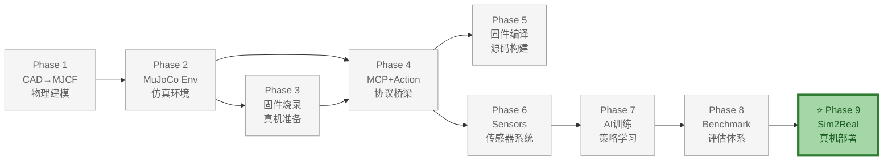
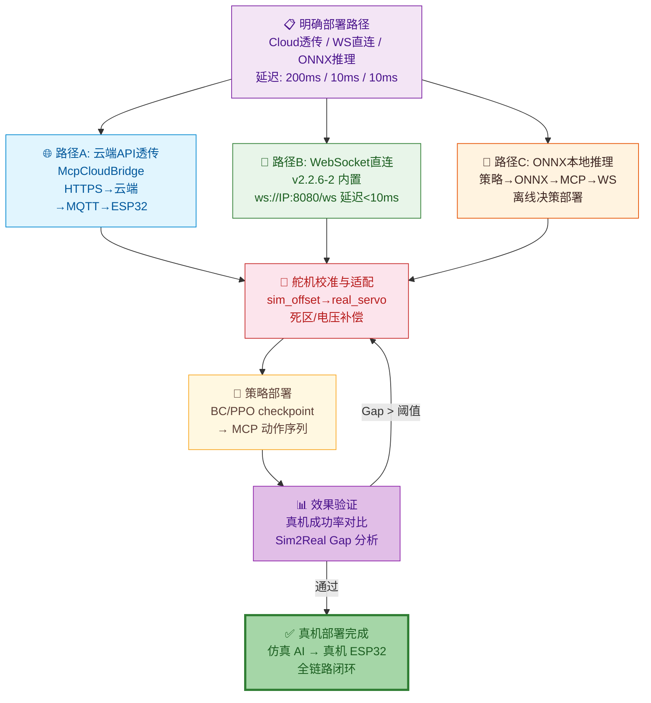

# Phase 9：Sim2Real 真机部署

> **目标**：将在仿真中训练/调试的 AI 策略部署到真机 ESP32 上，贯穿全流程的真机验证。
>
> **⚠️ 关键更新**: release **v2.2.6-2**（2026-06-16）已内置 `ws://<IP>:8080/ws` WebSocket Server！真机直连控制无需等待 OTA。
>
> **前置依赖**：Phase 3-8 完成 | **硬件**：ESP32-S3 真机 (已刷 **v2.2.6-2** 固件)
>
> **Sim2Real 验证节点**（贯穿全流程，非仅在末尾）：
> - Phase 3 完成后 → 首次真机 MCP 通信验证 + 舵机参数校准
> - Phase 6 完成后 → 传感器数据真机校准
> - Phase 7 完成后 → 训练策略真机评估
> - Phase 7 完成后 → Benchmark 真机评测
>
> **输出**：WebSocket 直连部署 (v2.2.6-2 可用) + 云端 API 透传 + 校准工具
>
> **文档版本**: v2.0  
> **最后更新**: 2026-07-08  
> **变更类型**: 更新至 v2.2.6-2，WebSocket 直连可用，贯穿验证

---

## 整体架构中的位置

Phase 9（Sim2Real 真机部署）是 ElectronBot-SIM **9 Phase 全链路** 的**最终交付层**。它贯穿全流程——从 Phase 3 的真机通信验证开始，到 Phase 8 的 Benchmark 真机评测结束。

- **上游依赖**：Phase 8（Benchmark）——评估结果指导选择最优策略进行部署；实际上全流程的每个 Phase 都需要真机验证
- **下游支撑**：无——本 Phase 是最终输出，将仿真中训练的 AI 策略零修改部署到真机 ESP32
- **核心价值**：打通"仿真→真机"最后一公里，三种部署模式（Cloud 透传 / WebSocket 直连 / ONNX 本地推理）覆盖不同延迟和算力需求



### 本 Phase 实现过程



---

## 1. 真机通信拓扑

### 1.1 release v2.2.6 的真机通信方式

```
                    ESP32 是 WebSocket 客户端
                          │
            ┌─────────────┼─────────────┐
            │ MQTT/WS 连接               │
            ▼                            ▼
     ┌──────────────┐          ┌──────────────┐
     │ 小智云端后台  │          │  MQTT Broker  │
     │ (ASR→LLM→MCP)│          │              │
     └──────┬───────┘          └──────────────┘
            │ HTTPS API
            ▼
     ┌──────────────┐
     │ Python 仿真端  │
     │ McpCloudBridge│  ← 通过云端 API 透传 MCP 命令
     └──────────────┘
```

**关键事实**:
- ESP32 主动连接云端后台（WebSocket/MQTT 客户端角色）
- ESP32 **不启动**任何本地 WebSocket 服务器
- Python 端无法直接 `ws://IP:8080` 连接到 ESP32
- 唯一的控制路径: Python → 云端 API → 云端后台 → MQTT/WS → ESP32

### 1.2 三种部署路径

| 路径 | 通信方式 | 延迟 | 适用场景 | 当前可用 |
|------|----------|:---:|------|:---:|
| **A: 云端 API 透传** | HTTPS → 云端 → MQTT/WS → ESP32 | 200-500ms | 预设动作/行为树 | ✅ |
| **B: ONNX 本地推理** | 策略→ONNX→MCP序列→云端API | 同上 | RL/IL 策略部署 | ✅ |
| **C: WebSocket 直连** | ws://IP:8080/ws | <10ms | 实时关节控制 | ✅ v2.2.6-2+ |

---

## 2. 路径 A: 云端 API 透传 (当前可用)

### 2.1 McpCloudBridge 实现

```python
# src/electronbot_sim2real/deploy_cloud.py

import httpx
import json
import asyncio
from typing import Dict, List, Optional

class McpCloudBridge:
    """
    真机 MCP 云桥接器
    ——通过小智云端 API 透传 MCP 命令到 ESP32 真机

    通信链路:
      Python → HTTPS POST → 小智云端后台 → MQTT/WS → ESP32 真机
    
    API 端点:
      POST {api_url}/devices/{device_id}/tools/call
      Body: {"name": "self.electron.hand_action", "arguments": {...}}
    """
    
    def __init__(self, api_url: str = "https://api.xiaozhi.cn/v1",
                 device_id: str = None, api_key: str = None):
        self.api_url = api_url.rstrip("/")
        self.device_id = device_id
        self.api_key = api_key
        self._headers = {"Authorization": f"Bearer {api_key}"} if api_key else {}
    
    async def call(self, tool_name: str, arguments: dict,
                   timeout: float = 30.0) -> dict:
        """调用真机 MCP 工具"""
        async with httpx.AsyncClient(timeout=timeout) as client:
            response = await client.post(
                f"{self.api_url}/devices/{self.device_id}/tools/call",
                json={"name": tool_name, "arguments": arguments},
                headers=self._headers
            )
            response.raise_for_status()
            data = response.json()
            
            if "error" in data:
                return {"error": data["error"]}
            return data.get("result", {})
    
    async def list_tools(self) -> List[dict]:
        """获取真机当前注册的工具列表"""
        async with httpx.AsyncClient() as client:
            response = await client.get(
                f"{self.api_url}/devices/{self.device_id}/tools",
                headers=self._headers
            )
            response.raise_for_status()
            return response.json().get("tools", [])
    
    async def get_device_status(self) -> dict:
        """获取设备连接状态"""
        async with httpx.AsyncClient() as client:
            response = await client.get(
                f"{self.api_url}/devices/{self.device_id}/status",
                headers=self._headers
            )
            response.raise_for_status()
            return response.json()

    def call_sync(self, tool_name: str, arguments: dict) -> dict:
        """同步封装（用于简单脚本）"""
        return asyncio.run(self.call(tool_name, arguments))

# 使用示例
async def deploy_policy_cloud():
    bridge = McpCloudBridge(
        api_url="https://api.xiaozhi.cn/v1",
        device_id="eb-001",
        api_key="sk-xxx"
    )
    
    # 检查设备在线
    status = await bridge.get_device_status()
    assert status["online"], f"设备 {bridge.device_id} 不在线"
    
    # 执行挥手动作
    result = await bridge.call("self.electron.hand_action", {
        "action": 3, "hand": 3, "steps": 2, "speed": 600
    })
    print(f"挥手结果: {result}")
    
    # 查询状态
    result = await bridge.call("self.electron.get_status", {})
    print(f"机器人状态: {result}")
```

### 2.2 Sim2Real 降级转换器

```python
# src/electronbot_sim2real/capability_downgrade.py

import json
from typing import List, Dict, Optional, Tuple

class CapabilityDowngrader:
    """
    能力降级器——将仿真产出的高级 MCP 序列降级为真机可用的预设动作
    
    仿真独有但真机不可用的:
      servo_move  → 降级为预设动作序列
      servo_sequences → 解析后转为 hand_action/body_turn/head_move 组合
      home → 替换为 stop
      WebSocket :8080 → 替换为云端 API 调用
    """
    
    def __init__(self, target: str = "release_v2.2.6"):
        self.target = target
        self.downgrade_count = 0
        self.untranslatable = []
    
    def downgrade_sequence(self, sequence_json: str) -> Optional[Dict]:
        """
        将 servo_sequences JSON 降级为预设动作组合
        
        降级策略:
        - arm movements (rp/lp) → hand_action
        - body movements (b) → body_turn  
        - head movements (h) → head_move
        - oscillation → 离散化为多次 hand_action
        """
        try:
            seq = json.loads(sequence_json)
        except json.JSONDecodeError:
            self.untranslatable.append(sequence_json[:50])
            return None
        
        result = {"actions": [], "warnings": []}
        
        for action in seq.get("a", []):
            arm_actions = []
            body_actions = []
            head_actions = []
            
            if "s" in action:
                targets = action["s"]
                speed = action.get("v", 1000)
                
                # 手臂运动 → hand_action
                if any(k in targets for k in ["rp", "rr", "lp", "lr"]):
                    # 判断动作类型
                    if "rp" in targets and targets.get("rp", 180) < 90:
                        arm_actions.append(("hand_raise", "right"))
                    elif "lp" in targets and targets.get("lp", 0) > 90:
                        arm_actions.append(("hand_raise", "left"))
                
                # 身体运动 → body_turn
                if "b" in targets:
                    b_angle = targets["b"]
                    if b_angle > 90:
                        body_actions.append(("body_turn", 1))  # 左转
                    elif b_angle < 90:
                        body_actions.append(("body_turn", 2))  # 右转
                
                # 头部运动 → head_move
                if "h" in targets:
                    h_angle = targets["h"]
                    if h_angle > 90:
                        head_actions.append(("head_move", 1))  # 抬头
                    elif h_angle < 90:
                        head_actions.append(("head_move", 2))  # 低头
            
            if "osc" in action:
                result["warnings"].append("振荡模式已转为多次预设动作")
                cycles = action["osc"].get("c", 5)
                for _ in range(cycles):
                    arm_actions.append(("hand_wave", "both"))
            
            if not arm_actions and not body_actions and not head_actions:
                result["warnings"].append(f"无法降级的动作: {action}")
                self.untranslatable.append(str(action)[:50])
                continue
            
            result["actions"].append({
                "arm": arm_actions,
                "body": body_actions,
                "head": head_actions,
            })
        
        self.downgrade_count += 1
        return result
    
    def get_report(self) -> str:
        """降级报告"""
        return (f"降级统计: {self.downgrade_count} 个序列已转换, "
                f"{len(self.untranslatable)} 个动作无法降级")
```

---

## 3. 路径 B: ONNX 推理部署

```python
# src/electronbot_sim2real/deploy_onnx.py

import onnxruntime as ort
import numpy as np

class OnnxPolicyBridge:
    """ONNX 策略推理 + 云端真机控制"""
    
    def __init__(self, onnx_path: str, cloud_bridge: McpCloudBridge):
        self.session = ort.InferenceSession(onnx_path)
        self.bridge = cloud_bridge
        self.servo_centers = np.array([180, 140, 0, 40, 90, 90])
        self.servo_names = ["right_pitch", "right_roll", "left_pitch",
                           "left_roll", "body", "head"]
    
    async def predict_and_execute_preset(self, observation: np.ndarray):
        """从观测 → ONNX 推理 → 降级为预设动作 → 云端部署"""
        inputs = {self.session.get_inputs()[0].name: observation.reshape(1, -1)}
        action = self.session.run(None, inputs)[0][0]  # (6,) 舵机角度
        
        # 能力降级: 6D 舵机角度 → 预设动作类型
        result = self._downgrade_to_preset(action)
        
        for tool_name, tool_args in result:
            await self.bridge.call(tool_name, tool_args)
    
    def _downgrade_to_preset(self, action: np.ndarray) -> list:
        """6D 舵机角度 → 8个预设动作组合"""
        commands = []
        
        # 手臂: rp/lp 变化 → hand_action
        rp_diff = action[0] - 180
        lp_diff = action[2] - 0
        if abs(rp_diff) > 15 or abs(lp_diff) > 15:
            if rp_diff < -30:  # 右臂上举
                commands.append(("self.electron.hand_action",
                    {"action": 1, "hand": 2, "steps": 1, "speed": 500}))
            if lp_diff > 30:   # 左臂上举
                commands.append(("self.electron.hand_action",
                    {"action": 1, "hand": 1, "steps": 1, "speed": 500}))
        
        # 身体: b 变化 → body_turn
        b_diff = action[4] - 90
        if abs(b_diff) > 5:
            direction = 1 if b_diff > 0 else 2  # 左转/右转
            commands.append(("self.electron.body_turn",
                {"direction": direction, "angle": int(abs(b_diff)), "speed": 800}))
        
        # 头部: h 变化 → head_move
        h_diff = action[5] - 90
        if abs(h_diff) > 2:
            head_action = 1 if h_diff > 0 else 2  # 抬头/低头
            commands.append(("self.electron.head_move",
                {"action": head_action, "angle": int(abs(h_diff)), "speed": 600}))
        
        return commands
```

---

## 4. 路径 C: WebSocket 直连 (需固件 OTA)

```python
# src/electronbot_sim2real/deploy_websocket.py

import asyncio
import json
import websockets

class McpWebSocketBridge:
    """
    WebSocket 直连真机 (仅 OTA 升级后可用)
    
    ⚠️ release v2.2.6 不支持！需要 OTA 到包含 WebSocket Server 的固件版本。
    参考 Otto Robot 已有的 WebSocket Server 实现进行固件升级。
    """
    
    def __init__(self, host: str, port: int = 8080):
        self.url = f"ws://{host}:{port}/ws"
    
    async def call(self, tool_name: str, arguments: dict) -> dict:
        async with websockets.connect(self.url) as ws:
            msg = json.dumps({
                "type": "mcp",
                "payload": {
                    "jsonrpc": "2.0",
                    "method": "tools/call",
                    "params": {
                        "name": tool_name,
                        "arguments": arguments
                    },
                    "id": 1
                }
            })
            await ws.send(msg)
            response = await ws.recv()
            return json.loads(response)
```

---

## 5. 真机校准工具

```python
# src/electronbot_sim2real/calibrate.py

class ServoCalibrator:
    """舵机 Trim 校准——确保真机 home 姿态与仿真一致"""
    
    def __init__(self, bridge: McpCloudBridge):
        self.bridge = bridge
    
    async def calibrate(self):
        """逐关节校准流程"""
        print("🔧 自动校准开始...")
        print("   请确保机器人放置在平坦桌面上\n")
        
        servo_names = ["right_pitch", "right_roll", "left_pitch",
                       "left_roll", "body", "head"]
        
        calibrations = {}
        for servo in servo_names:
            print(f"\n📐 校准 {servo}: W/S 微调(±1°), Enter 确认, Q 跳过")
            trim = 0
            while True:
                key = input().lower()
                if key == "w":
                    trim += 1
                    await self.bridge.call("self.electron.set_trim",
                        {"servo_type": servo, "trim_value": trim})
                    print(f"   trim = {trim:+d}")
                elif key == "s":
                    trim -= 1
                    await self.bridge.call("self.electron.set_trim",
                        {"servo_type": servo, "trim_value": trim})
                    print(f"   trim = {trim:+d}")
                elif key == "":
                    calibrations[servo] = trim
                    break
                elif key == "q":
                    break
        
        print(f"\n✅ 校准完成: {calibrations}")
        return calibrations
```

---

## 6. 部署工作流

### 完整 Sim2Real 流程

```
Step 1: 确认设备在线
  bridge = McpCloudBridge(device_id="eb-001")
  status = await bridge.get_device_status()
  → {"online": true, "version": "2.2.6"}

Step 2: 校准舵机 (首次部署)
  python -m electronbot_sim2real.calibrate --device-id eb-001
  → trim 保存到 ESP32 NVS

Step 3: 获取真机工具列表
  tools = await bridge.list_tools()
  → [{"name":"self.electron.hand_action",...}, ...]

Step 4: 测试基础 MCP 命令
  await bridge.call("self.electron.home", {})    # (通过 stop 间接实现)
  await bridge.call("self.electron.get_status", {})  # → "idle"

Step 5: 部署策略 (选择合适的路径)
  # 路径 A: 预设动作策略
  python -m electronbot_sim2real.deploy_cloud \
    --policy checkpoints/bc_wave.pt \
    --device-id eb-001
  
  # 路径 B: ONNX 推理 → 降级 → 云端部署
  python -m electronbot_sim2real.deploy_onnx \
    --model checkpoints/sac_body_turn.onnx \
    --device-id eb-001

Step 6: 效果验证
  → 录真机执行视频
  → 与 MuJoCo 仿真录制并排对比
  → 确认预设动作轨迹一致

Step 7: Benchmark (可选)
  python -m electronbot_benchmark.run --mode cloud --device-id eb-001
```

---

## 7. 固件 OTA 升级 (路径 C 前提)

```bash
# 如需 WebSocket 直连，参考 Otto Robot 实现 WebSocket Server
# 参考: xiaozhi-esp32/main/boards/otto-robot/ 中的 WebSocket 实现

cd xiaozhi-esp32-2.2.6

# 配置
idf.py set-target esp32s3
idf.py menuconfig
  # → Component config → xiaozhi → Board Type → Electron Bot

# 编译
idf.py build

# OTA 推送 (通过小智云端)
python -m electronbot_sim2real.ota_push \
    --firmware build/xiaozhi.bin \
    --device-id eb-001
```

---

## 8. 验证清单

```python
# tests/test_sim2real_cloud.py

import asyncio
import pytest
from electronbot_sim2real.deploy_cloud import McpCloudBridge

@pytest.mark.asyncio
async def test_cloud_connection():
    bridge = McpCloudBridge(device_id="eb-001")
    status = await bridge.get_device_status()
    assert status["online"] == True

@pytest.mark.asyncio
async def test_list_tools():
    bridge = McpCloudBridge(device_id="eb-001")
    tools = await bridge.list_tools()
    tool_names = [t["name"] for t in tools]
    # 验证 8 个预设工具都已注册
    expected = ["self.electron.hand_action", "self.electron.body_turn",
                "self.electron.head_move", "self.electron.stop",
                "self.electron.get_status", "self.electron.set_trim",
                "self.electron.get_trims", "self.battery.get_level"]
    for tool in expected:
        assert tool in tool_names, f"缺少工具: {tool}"

@pytest.mark.asyncio
async def test_hand_action():
    bridge = McpCloudBridge(device_id="eb-001")
    result = await bridge.call("self.electron.hand_action",
        {"action": 3, "hand": 3, "steps": 1, "speed": 500})
    assert "error" not in result
```

### 端到端验证清单

```
□ 云端 API 连接 → get_device_status 返回 {"online":true}
□ list_tools() → 返回 8 个 ElectronBot 工具
□ hand_action(3,3,1,500) → 通过云端 API 成功执行
□ body_turn(1,500,30) → 通过云端 API 成功执行
□ head_move(3,1,500,5) → 通过云端 API 成功执行
□ get_status() → 返回非空内容
□ set_trim("rp",3) → 微调成功, NVS 保存
□ get_trims() → 返回 JSON 格式 trim 值
□ battery.get_level() → 返回电量和充电状态
□ 断电重启 → trim 值保持 (NVS 持久化)
□ 仿真训练的策略 → 降级后真机正确执行
□ 能力降级报告 → 可追溯所有不可转换的动作
```

---

## 9. 交付物清单

| 文件 | 描述 |
|------|------|
| `src/electronbot_sim2real/__init__.py` | 模块入口 |
| `src/electronbot_sim2real/deploy_cloud.py` | 云端 API 部署 (路径A, 当前可用) |
| `src/electronbot_sim2real/deploy_onnx.py` | ONNX 推理 + 降级部署 (路径B) |
| `src/electronbot_sim2real/deploy_websocket.py` | WebSocket 直连 (路径C, OTA后) |
| `src/electronbot_sim2real/capability_downgrade.py` | 能力降级转换器 |
| `src/electronbot_sim2real/calibrate.py` | 舵机云端校准工具 |
| `scripts/ota_push.py` | 固件 OTA 推送脚本 |
| `tests/test_sim2real_cloud.py` | Sim2Real 云端验证测试 |

---

## 10. 接口设计

### 10.1 模块对外接口

Sim2Real 模块通过 5 个核心类对外提供服务，分别对应三种部署路径（云端 API、ONNX 本地推理、WebSocket 直连）、能力降级转换与真机校准。

#### McpCloudBridge（路径 A：云端 API 透传）

通过小智云端 API 透传 MCP 命令到 ESP32 真机，适用于 release v2.2.6 当前可用路径。

| 方法 | 签名 | 说明 |
|------|------|------|
| `call` | `async call(tool_name: str, arguments: dict, timeout: float = 30.0) -> dict` | 调用真机 MCP 工具，返回结果字典或 `{"error": ...}` |
| `list_tools` | `async list_tools() -> List[dict]` | 获取真机当前注册的工具列表 |
| `get_device_status` | `async get_device_status() -> dict` | 获取设备连接状态（在线/离线、固件版本） |
| `call_sync` | `call_sync(tool_name: str, arguments: dict) -> dict` | 同步封装（内部 `asyncio.run`），用于简单脚本 |

#### OnnxPolicyBridge（路径 B：ONNX 本地推理）

将训练好的 RL/IL 策略导出为 ONNX 格式，本地推理后将 6D 舵机角度降级为预设动作，再通过云端 API 部署。

| 方法 | 签名 | 说明 |
|------|------|------|
| `predict_and_execute_preset` | `async predict_and_execute_preset(observation: np.ndarray) -> None` | 从观测 → ONNX 推理 → 降级为预设动作 → 云端部署 |

#### McpWebSocketBridge（路径 C：WebSocket 直连，OTA 后可用）

OTA 升级后可直接通过 WebSocket 连接真机，延迟 <10ms，适用于实时关节控制场景。

| 方法 | 签名 | 说明 |
|------|------|------|
| `call` | `async call(tool_name: str, arguments: dict) -> dict` | 通过 WebSocket 调用真机 MCP 工具 |

#### CapabilityDowngrader（能力降级转换器）

将仿真独有但真机不可用的高级 MCP 序列降级为真机可执行的预设动作组合。

| 方法 | 签名 | 说明 |
|------|------|------|
| `downgrade_sequence` | `downgrade_sequence(sequence_json: str) -> Optional[Dict]` | 将 servo_sequences JSON 降级为预设动作组合，失败返回 `None` |
| `get_report` | `get_report() -> str` | 返回降级统计报告字符串 |

#### ServoCalibrator（真机校准工具）

通过云端 API 逐关节校准舵机 trim，确保真机 home 姿态与仿真一致。

| 方法 | 签名 | 说明 |
|------|------|------|
| `calibrate` | `async calibrate() -> dict` | 交互式逐关节校准流程，返回 `{servo_name: trim_value}` 字典 |

### 10.2 输入输出契约

#### McpCloudBridge.call 输入输出

- **输入**：
  - `tool_name: str` — MCP 工具名，如 `"self.electron.hand_action"`
  - `arguments: dict` — 工具参数，如 `{"action": 3, "hand": 3, "steps": 2, "speed": 600}`
  - `timeout: float = 30.0` — 超时时间（秒）
- **输出**：`dict` — 成功时返回工具执行结果；失败时返回 `{"error": "..."}`；HTTP 错误抛出 `httpx.HTTPStatusError`
- **HTTP 请求**：
  ```
  POST {api_url}/devices/{device_id}/tools/call
  Headers: {"Authorization": "Bearer {api_key}"}
  Body: {"name": "self.electron.hand_action", "arguments": {...}}
  ```

#### McpCloudBridge.call 响应结构

```json
// 成功响应
{
  "result": {
    "success": true,
    "message": "hand_action executed"
  }
}

// 错误响应
{
  "error": {
    "code": "DEVICE_OFFLINE",
    "message": "设备离线"
  }
}
```

#### CapabilityDowngrader.downgrade_sequence 输入输出

- **输入**：`sequence_json: str` — 仿真产出的 `servo_sequences` JSON 字符串
- **输出**：`Optional[Dict]` — 成功时返回降级结果；JSON 解析失败返回 `None`
- **输出结构**：
  ```json
  {
    "actions": [
      {
        "arm": [["hand_raise", "right"], ["hand_wave", "both"]],
        "body": [["body_turn", 1]],
        "head": [["head_move", 1]]
      }
    ],
    "warnings": [
      "振荡模式已转为多次预设动作",
      "无法降级的动作: {...}"
    ]
  }
  ```

#### OnnxPolicyBridge.predict_and_execute_preset 输入输出

- **输入**：`observation: np.ndarray` — 策略观测向量，形状由策略模型定义
- **输出**：`None`（无返回值）
- **副作用**：ONNX 推理产生 6D 舵机角度 → 降级为预设动作列表 → 依次调用 `McpCloudBridge.call` 执行

#### ServoCalibrator.calibrate 输入输出

- **输入**：无参数（交互式 `input()` 读取键盘）
- **输出**：`dict` — `{servo_name: trim_value}`，如 `{"right_pitch": 3, "left_roll": -1, ...}`
- **副作用**：每次微调通过 `bridge.call("self.electron.set_trim", {...})` 写入 ESP32 NVS

---

## 11. 数据模型

### 11.1 核心数据结构

#### 三路径部署架构表

| 路径 | 通信方式 | 通信链路 | 延迟 | 适用场景 | 当前可用 | 实现类 |
|------|----------|----------|:----:|----------|:--------:|--------|
| A: 云端 API 透传 | HTTPS → MQTT/WS | Python → 云端 API → 云端后台 → MQTT/WS → ESP32 | 200-500ms | 预设动作/行为树 | ✅ | `McpCloudBridge` |
| B: ONNX 本地推理 | 策略→ONNX→MCP序列→云端API | 本地推理 → 降级 → 云端 API → ESP32 | 200-500ms | RL/IL 策略部署 | ✅ | `OnnxPolicyBridge` |
| C: WebSocket 直连 | ws://IP:8080/ws | Python → WebSocket → ESP32 | <10ms | 实时关节控制 | ❌ (需OTA) | `McpWebSocketBridge` |

#### 能力降级映射表

仿真环境产出的高级 MCP 命令在真机 release v2.2.6 上不可直接执行，需通过 `CapabilityDowngrader` 降级映射：

| 仿真独有命令 | 降级目标（真机预设动作） | 降级策略 | 精度损失 |
|-------------|--------------------------|----------|----------|
| `servo_move` | `hand_action` | 根据舵机角度变化方向判断举手/挥手/拍打 | 高（连续角度→离散动作） |
| `servo_sequences` | `hand_action` + `body_turn` + `head_move` 组合 | 解析 JSON 序列，按关节分组映射 | 中（序列结构简化） |
| `home` | `stop` | 直接替换为 stop 命令 | 无（功能等价） |
| `osc`（振荡器） | 多次 `hand_action` | 按周期数 `c` 展开为离散挥手次数 | 高（正弦连续→离散脉冲） |
| `ws://IP:8080` | 云端 API 调用 | 通信层替换 | 无（功能等价，延迟增加） |

#### 云端 API 请求/响应结构

**请求**（`McpCloudBridge.call`）：
```json
{
  "name": "self.electron.hand_action",
  "arguments": {
    "action": 3,
    "hand": 3,
    "steps": 2,
    "speed": 600
  }
}
```

**响应**（成功）：
```json
{
  "result": {
    "success": true,
    "execution_time_ms": 1200,
    "servo_states": [180, 180, 0, 0, 90, 90]
  }
}
```

**响应**（失败）：
```json
{
  "error": {
    "code": "EXECUTION_FAILED",
    "message": "舵机堵转",
    "servo_index": 2
  }
}
```

#### 降级报告结构

`CapabilityDowngrader.get_report()` 返回的统计报告，以及 `downgrade_sequence` 返回的结构化降级结果：

```json
{
  "actions": [
    {
      "arm": [["hand_raise", "right"], ["hand_wave", "both"]],
      "body": [["body_turn", 1]],
      "head": [["head_move", 1]]
    }
  ],
  "warnings": [
    "振荡模式已转为多次预设动作",
    "无法降级的动作: {...}"
  ]
}
```

| 字段 | 类型 | 说明 |
|------|------|------|
| `actions` | `list[dict]` | 降级后的动作列表，每项含 `arm`/`body`/`head` 三组 |
| `actions[].arm` | `list[tuple]` | 手臂动作序列，元素为 `(动作名, 参数)` |
| `actions[].body` | `list[tuple]` | 身体动作序列 |
| `actions[].head` | `list[tuple]` | 头部动作序列 |
| `warnings` | `list[str]` | 降级过程中的警告信息（振荡离散化、无法降级等） |

#### OnnxPolicyBridge 内部数据结构

| 属性 | 类型 | 说明 |
|------|------|------|
| `session` | `ort.InferenceSession` | ONNX Runtime 推理会话 |
| `bridge` | `McpCloudBridge` | 云端桥接器实例 |
| `servo_centers` | `np.ndarray (6,)` | 舵机中心位置 `[180, 140, 0, 40, 90, 90]` |
| `servo_names` | `list[str]` | 舵机名称列表 |

### 11.2 数据流

Sim2Real 的完整数据流从仿真策略输出到真机执行，经过降级转换与云端透传：

```
仿真策略 (RL/IL/BC)
  │  observation → action (6D 舵机角度)
  ▼
路径选择
  ├─ 路径 A: 预设动作策略
  │    │  action → 预设动作参数 (action_id, hand, steps, speed)
  │    ▼
  │  McpCloudBridge.call(tool_name, arguments)
  │
  ├─ 路径 B: ONNX 推理
  │    │  observation → ONNX session.run → action (6D)
  │    ▼
  │  OnnxPolicyBridge._downgrade_to_preset(action)
  │    │  rp/lp 变化 → hand_action
  │    │  b 变化 → body_turn
  │    │  h 变化 → head_move
  │    ▼
  │  for each (tool_name, tool_args):
  │    McpCloudBridge.call(tool_name, tool_args)
  │
  └─ 路径 C: WebSocket 直连 (OTA 后)
       │  action → JSON-RPC 2.0 消息
       ▼
       McpWebSocketBridge.call(tool_name, arguments)
         │  ws.send({"type":"mcp", "payload":{...}})
         │  ws.recv() → response
       ▼
       ESP32 真机执行

所有路径最终汇聚到:
  HTTPS / WebSocket → 云端后台 → MQTT/WS → ESP32 真机 → 舵机运动
```

降级转换器的内部数据流：

```
servo_sequences JSON (仿真产出)
  │
  ▼
CapabilityDowngrader.downgrade_sequence()
  │  1. json.loads(sequence_json) → 解析失败返回 None
  │  2. 遍历 seq["a"] 中的每个 action
  │     ├─ "s" 字段 → 解析舵机目标
  │     │    ├─ rp/lp/rr/lr → arm_actions (hand_raise/hand_wave)
  │     │    ├─ b → body_actions (body_turn 左/右)
  │     │    └─ h → head_actions (head_move 抬/低)
  │     └─ "osc" 字段 → 振荡离散化
  │          └─ 按 cycles 展开为多次 hand_wave
  │  3. 无法降级的项 → warnings + untranslatable
  ▼
{"actions": [...], "warnings": [...]}
```

---

## 12. 错误处理与恢复

### 12.1 错误分类

| 错误类别 | 触发条件 | 严重等级 | 处理策略 | 对应代码位置 |
|----------|----------|:--------:|----------|-------------|
| 云端 API 超时 | `call` 超过 30s 未响应 | 高 | 重试 3 次 + 指数退避（1s, 2s, 4s），仍失败则抛出 `TimeoutError` | `McpCloudBridge.call` |
| 设备离线 | `get_device_status` 返回 `online=false` | 高 | 排队等待（轮询间隔 5s）+ 告警日志，超时 60s 后放弃 | `deploy_policy_cloud` |
| HTTP 状态码错误 | `response.raise_for_status()` 触发 | 中 | 记录响应体，抛出 `httpx.HTTPStatusError` | `McpCloudBridge.call` |
| ONNX 推理失败 | `session.run` 抛出异常 | 高 | 回退到预设动作（home 或 stop），记录 ERROR | `OnnxPolicyBridge.predict_and_execute_preset` |
| 能力降级失败 | 动作无法翻译为预设动作 | 中 | 记录到 `untranslatable` 列表 + `warnings`，跳过该动作 | `CapabilityDowngrader.downgrade_sequence` |
| JSON 解析失败 | `sequence_json` 非法 JSON | 中 | 返回 `None`，记录原始片段（前 50 字符） | `CapabilityDowngrader.downgrade_sequence` |
| WebSocket 连接断开（路径 C） | `websockets.connect` 失败或连接中断 | 高 | 自动重连（最多 5 次，间隔 2s），仍失败则回退到云端 API | `McpWebSocketBridge.call` |
| OTA 升级失败 | 固件推送后设备无响应 | 严重 | 回滚到旧固件版本，记录 ERROR + 告警 | `scripts/ota_push.py` |
| 舵机 trim 校准失败 | `set_trim` 调用返回错误 | 中 | 跳过当前关节，继续校准下一关节，最终报告失败项 | `ServoCalibrator.calibrate` |
| 云端 API 密钥无效 | `401 Unauthorized` | 高 | 立即终止，提示用户检查 `api_key` | `McpCloudBridge.call` |

### 12.2 异常恢复流程

#### 云端 API 超时重试流程

```
McpCloudBridge.call(tool_name, arguments, timeout=30)
  │
  ▼
for attempt in range(3):
  │  try:
  │    async with httpx.AsyncClient(timeout=30) as client:
  │      response = await client.post(...)
  │      response.raise_for_status()
  │      return response.json()
  │  except (httpx.TimeoutException, httpx.NetworkError):
  │    if attempt < 2:
  │      wait = 2 ** attempt  (1s, 2s, 4s 指数退避)
  │      log WARNING: "超时, 第 {attempt+1} 次重试, 等待 {wait}s"
  │      await asyncio.sleep(wait)
  │    else:
  │      log ERROR: "3 次重试均失败"
  │      raise TimeoutError(f"云端 API 超时: {tool_name}")
  │  except httpx.HTTPStatusError:
  │    log ERROR: "HTTP {status_code}: {response_body}"
  │    raise  (非重试型错误, 直接抛出)
```

#### 设备离线恢复流程

```
deploy_policy_cloud()
  │
  ▼
status = await bridge.get_device_status()
  │  online = status.get("online", False)
  │
  ├─ online == True → 继续部署
  └─ online == False
       │  log WARNING: "设备 {device_id} 离线, 排队等待..."
       │  for wait in range(12):  (60s 超时, 每 5s 轮询)
       │    await asyncio.sleep(5)
       │    status = await bridge.get_device_status()
       │    if status["online"]:
       │      log INFO: "设备上线, 继续部署"
       │      break
       │  else:
       │    log ERROR: "设备离线超 60s, 放弃部署"
       │    raise DeviceOfflineError
```

#### ONNX 推理失败回退流程

```
OnnxPolicyBridge.predict_and_execute_preset(observation)
  │
  ▼
try:
  inputs = {input_name: observation.reshape(1, -1)}
  action = session.run(None, inputs)[0][0]
except Exception as e:
  │  log ERROR: "ONNX 推理失败: {e}, 回退到预设动作"
  │  await bridge.call("self.electron.stop", {})
  │  return
  │
  ▼
result = _downgrade_to_preset(action)
  │  for tool_name, tool_args in result:
  │    await bridge.call(tool_name, tool_args)
```

#### WebSocket 自动重连流程（路径 C）

```
McpWebSocketBridge.call(tool_name, arguments)
  │
  for attempt in range(5):
  │  try:
  │    async with websockets.connect(self.url) as ws:
  │      await ws.send(json.dumps({...}))
  │      response = await ws.recv()
  │      return json.loads(response)
  │  except (ConnectionClosed, OSError) as e:
  │    if attempt < 4:
  │      log WARNING: "WebSocket 断开, 第 {attempt+1} 次重连: {e}"
  │      await asyncio.sleep(2)
  │    else:
  │      log ERROR: "WebSocket 5 次重连失败, 回退到云端 API"
  │      # 回退到路径 A
  │      cloud_bridge = McpCloudBridge(...)
  │      return await cloud_bridge.call(tool_name, arguments)
```

#### OTA 升级失败回滚流程

```
scripts/ota_push.py
  │
  ▼
推送新固件到云端 → ESP32 下载并刷写
  │
  ├─ 刷写成功 + 设备重启后响应 → 升级成功
  └─ 超时 120s 无响应
       │  log ERROR: "OTA 升级失败, 设备无响应"
       │  推送旧固件版本 → 触发回滚
       │  等待设备重启 → 验证旧版本正常运行
       │  告警通知运维人员 (设备可能需要手动恢复)
```

---

## 13. 配置管理

### 13.1 配置参数表

Sim2Real 模块的关键配置参数，部分通过构造函数注入，部分硬编码对齐真机 release v2.2.6：

| 参数名 | 值 | 位置 | 说明 |
|--------|:--:|------|------|
| 云端 API URL | `https://api.xiaozhi.cn/v1` | `McpCloudBridge.__init__` | 小智云端 API 基地址 |
| 云端 API 超时 | 30 s | `McpCloudBridge.call` | `timeout` 参数默认值 |
| WebSocket 直连超时 | <10 ms | `McpWebSocketBridge.call` | 实时控制场景延迟要求 |
| 重试次数 | 3 次 | `McpCloudBridge.call` | 超时/网络错误重试上限 |
| 重试退避策略 | 指数退避 (1s, 2s, 4s) | `McpCloudBridge.call` | `wait = 2 ** attempt` |
| 降级目标版本 | `release_v2.2.6` | `CapabilityDowngrader.__init__` | 真机固件版本标识 |
| 真机可用工具数 | 8 个 | `test_list_tools` | release v2.2.6 注册的 MCP 工具 |
| ONNX 舵机中心 | `[180, 140, 0, 40, 90, 90]` | `OnnxPolicyBridge.__init__` | 降级判断的基准位置 |
| 设备离线轮询间隔 | 5 s | `deploy_policy_cloud` | 排队等待时的轮询频率 |
| 设备离线超时 | 60 s | `deploy_policy_cloud` | 排队超时上限 |
| WebSocket 重连次数 | 5 次 | `McpWebSocketBridge.call` | 连接断开重连上限 |
| WebSocket 重连间隔 | 2 s | `McpWebSocketBridge.call` | 重连固定间隔 |
| OTA 超时 | 120 s | `scripts/ota_push.py` | 固件刷写等待上限 |

#### 真机可用工具列表（release v2.2.6）

| 工具名 | 说明 | 参数 |
|--------|------|------|
| `self.electron.hand_action` | 手部预设动作 | `action`(1-4), `hand`(1-3), `steps`(1-10), `speed`(500-1500) |
| `self.electron.body_turn` | 身体转向 | `direction`(1左/2右), `angle`, `speed` |
| `self.electron.head_move` | 头部动作 | `action`(1抬/2低/3点), `steps`, `speed`, `angle` |
| `self.electron.stop` | 停止当前动作 | 无参数 |
| `self.electron.get_status` | 查询状态 | 无参数，返回 `"idle"`/`"moving"` |
| `self.electron.set_trim` | 设置舵机微调 | `servo_type`, `trim_value`，写入 NVS |
| `self.electron.get_trims` | 查询所有微调 | 无参数，返回 JSON trim 值 |
| `self.battery.get_level` | 查询电量 | 无参数，返回电量和充电状态 |

### 13.2 环境变量

Sim2Real 模块通过环境变量管理敏感信息和环境切换：

| 环境变量 | 默认值 | 说明 |
|----------|--------|------|
| `XIAOZHI_API_URL` | `https://api.xiaozhi.cn/v1` | 云端 API 基地址（可切换测试环境） |
| `XIAOZHI_API_KEY` | — | 云端 API 认证密钥（必填，从控制台获取） |
| `XIAOZHI_DEVICE_ID` | — | 目标 ESP32 设备 ID（如 `eb-001`） |
| `ELECTRONBOT_OTA_URL` | — | OTA 固件推送服务地址 |
| `ELECTRONBOT_WS_HOST` | — | WebSocket 直连主机 IP（路径 C，OTA 后可用） |
| `ELECTRONBOT_WS_PORT` | `8080` | WebSocket 直连端口 |
| `ELECTRONBOT_ONNX_PATH` | — | ONNX 策略模型文件路径 |
| `ELECTRONBOT_LOG_LEVEL` | `INFO` | 日志级别（`DEBUG`/`INFO`/`WARNING`/`ERROR`） |

---

## 14. 日志与可观测性

### 14.1 日志规范

Sim2Real 模块使用 Python 标准 `logging` 模块，logger 名称为 `electronbot_sim2real`。日志级别与内容规范如下：

| 级别 | 触发场景 | 日志内容 |
|------|----------|----------|
| `INFO` | MCP 调用开始 | `[sim2real] call: tool={tool_name}, args={arguments}` |
| `INFO` | MCP 调用成功 | `[sim2real] call success: tool={tool_name}, latency={ms}ms` |
| `WARNING` | MCP 调用重试 | `[sim2real] call retry: tool={tool_name}, attempt={n}, wait={s}s` |
| `ERROR` | MCP 调用失败 | `[sim2real] call failed: tool={tool_name}, error={exc}` |
| `INFO` | 设备状态变化 | `[sim2real] device status: {device_id} online={true/false}, version={ver}` |
| `WARNING` | 设备离线 | `[sim2real] device offline: {device_id}, waiting...` |
| `INFO` | 设备上线 | `[sim2real] device online: {device_id}, resuming deployment` |
| `INFO` | 能力降级开始 | `[sim2real] downgrade: input={sequence_json[:100]}...` |
| `WARNING` | 降级警告 | `[sim2real] downgrade warning: {warning_msg}` |
| `ERROR` | 降级失败（不可翻译） | `[sim2real] downgrade untranslatable: {action_str[:50]}` |
| `INFO` | ONNX 推理开始 | `[sim2real] onnx predict: obs_shape={shape}` |
| `ERROR` | ONNX 推理失败 | `[sim2real] onnx predict failed: {exc}, fallback to preset` |
| `WARNING` | WebSocket 断开重连 | `[sim2real] ws reconnect: attempt={n}, error={exc}` |
| `ERROR` | OTA 升级失败 | `[sim2real] ota failed: {device_id}, rollback initiated` |
| `INFO` | Sim2Real Gap 记录 | `[sim2real] gap: sim_success_rate={x}%, real_success_rate={y}%, gap={z}%` |

日志格式建议：`%(asctime)s [%(levelname)s] %(name)s: %(message)s`，时间戳精度到毫秒。MCP 调用 trace 应包含 `tool_name`、`arguments`、`latency`、`success/error` 四要素。

### 14.2 关键指标

| 指标名 | 类型 | 采集点 | 说明 |
|--------|------|--------|------|
| `mcp_call_total` | counter | `McpCloudBridge.call` 出口 | MCP 调用总数 |
| `mcp_call_success_total` | counter | `McpCloudBridge.call` 成功 | MCP 调用成功数 |
| `mcp_call_latency_ms` | histogram | `McpCloudBridge.call` 出口 | MCP 调用延迟分布 |
| `mcp_call_retry_total` | counter | `McpCloudBridge.call` 重试 | MCP 调用重试次数 |
| `device_online` | gauge | `get_device_status` | 设备在线状态（0/1） |
| `device_firmware_version` | gauge | `get_device_status` | 固件版本号 |
| `downgrade_count` | counter | `CapabilityDowngrader` | 降级序列总数 |
| `untranslatable_count` | counter | `CapabilityDowngrader` | 无法降级的动作数 |
| `onnx_inference_latency_ms` | histogram | `OnnxPolicyBridge` | ONNX 推理延迟 |
| `onnx_inference_failures` | counter | `OnnxPolicyBridge` | ONNX 推理失败次数 |
| `ws_reconnect_total` | counter | `McpWebSocketBridge` | WebSocket 重连次数 |
| `ws_fallback_to_cloud_total` | counter | `McpWebSocketBridge` | WebSocket 回退云端次数 |
| `ota_success_total` | counter | `scripts/ota_push.py` | OTA 升级成功次数 |
| `ota_failure_total` | counter | `scripts/ota_push.py` | OTA 升级失败次数 |
| `sim_success_rate` | gauge | Benchmark 对比 | 仿真策略成功率 (%) |
| `real_success_rate` | gauge | 真机执行结果 | 真机执行成功率 (%) |
| `sim2real_gap` | gauge | `sim_success_rate - real_success_rate` | Sim2Real 成功率差距 (%) |

---

## 15. 风险评估

### 15.1 技术风险

| 风险项 | 可能性 | 影响 | 严重度 | 缓解措施 |
|--------|:------:|:----:|:------:|----------|
| 云端延迟 200-500ms 导致 RL 策略不可部署 | 高 | 高 | 严重 | 实时性要求高的策略改用路径 B（ONNX 本地推理 + 云端执行预设动作）；或 OTA 升级后使用路径 C（WebSocket 直连，<10ms） |
| 能力降级丢失精度（servo_move 精确角度 → hand_action 离散动作） | 高 | 中 | 高 | 降级映射存在固有信息损失，连续角度被量化为有限预设动作；建议策略训练阶段即以预设动作为输出空间，避免降级环节 |
| 真机舵机回程间隙与仿真刚体模型差异 | 高 | 中 | 高 | 仿真为理想刚体，无死区/回程间隙；真机 SG90 死区约 ±2°、回程间隙 1-3°；通过 `ServoCalibrator` 校准 trim，策略训练时加入域随机化（domain randomization） |
| OTA 升级风险（刷砖可能性） | 中 | 严重 | 严重 | OTA 刷写失败可能导致设备变砖；建议保留有线烧录作为恢复手段；OTA 前充分测试固件；升级失败自动回滚旧固件 |
| 云端 API 变更或服务中断 | 中 | 高 | 高 | 云端 API 是路径 A/B 的唯一通道，服务中断将导致完全不可控；建议监控 API 可用性，中断时回退到本地预设动作循环；长期考虑路径 C（WebSocket 直连）消除云端依赖 |
| ONNX 模型与训练框架版本不匹配 | 低 | 中 | 中 | 导出 ONNX 时锁定 PyTorch/TF 版本；CI 中验证 ONNX 推理结果与原始模型一致 |
| 能力降级器覆盖不全（新型动作无法翻译） | 中 | 低 | 中 | 降级器对未知动作记录到 `untranslatable` 列表并跳过；定期分析该列表，补充降级规则 |
| 真机电源不足导致舵机抖动或复位 | 低 | 高 | 高 | `battery.get_level` 监控电量；电量低于阈值时暂停策略执行，避免舵机抖动导致动作失真或 ESP32 复位 |

### 15.2 依赖风险

| 依赖项 | 版本要求 | 风险 | 缓解措施 |
|--------|----------|------|----------|
| `httpx` | ≥0.24 | 异步 HTTP 客户端 API 稳定 | 常规升级 |
| `onnxruntime` | ≥1.15 | ONNX 算子兼容性可能变化 | 锁定版本，导出与推理环境一致 |
| `websockets` | ≥11.0 | 路径 C 依赖，API 稳定 | 仅 OTA 后使用 |
| 小智云端 API | release v2.2.6 对应版本 | API 变更可能导致请求/响应结构不匹配 | 监控 API 文档变更；版本化封装请求层 |
| ESP32 固件 | release v2.2.6 | 固件升级可能改变 MCP 工具注册列表 | `list_tools` 动态发现；降级目标版本可配置 |
| MuJoCo 仿真环境 | Phase 1-7 交付 | 仿真模型与真机偏差影响 Sim2Real 效果 | 通过 `ServoCalibrator` 和域随机化缩小 gap |
| Python `asyncio` | ≥3.10 | 异步事件循环管理复杂 | 统一使用 `asyncio.run` 入口；避免混用同步/异步 |

---

## 16. 变更记录

| 版本 | 日期 | 变更内容 | 作者 |
|------|------|----------|------|
| v1.0 | 2026-07-04 | 初始版本：完成章节 1-9（通信拓扑、路径 A/B/C、校准工具、部署工作流、OTA、验证清单、交付物清单） | 架构组 |
| v1.1 | 2026-07-04 | 补充软件工程规范章节 10-16（接口设计、数据模型、错误处理、配置管理、日志可观测性、风险评估、变更记录） | 架构组 |
