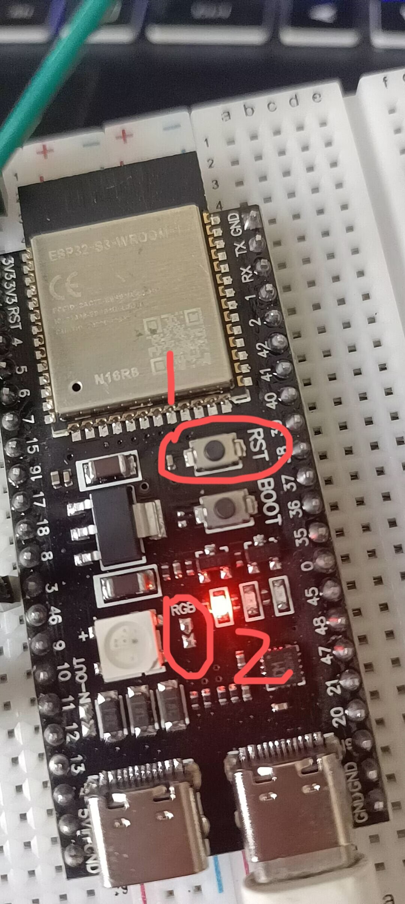

# ElectronBot 固件编译与烧录指南

> **适用环境**: Ubuntu 22.04 x86_64
> **固件版本**: xiaozhi-esp32 v2.2.6
> **目标板型**: electronBot（ESP32-S3，16MB Flash）

---

## 1. 环境准备

### 1.1 系统依赖（apt）

```bash
sudo apt update
sudo apt install -y \
    git wget flex bison gperf \
    python3 python3-pip python3-venv python3-dev \
    cmake ninja-build ccache \
    libffi-dev libssl-dev libusb-1.0-0-dev \
    dfu-util
```

### 1.2 串口权限

将当前用户加入 `dialout` 和 `plugdev` 组，确保有权限访问 USB 串口：

```bash
sudo usermod -a -G dialout,plugdev $USER
```

> **注意**: 加入用户组后需**重新登录**才能生效。可以用 `groups` 命令验证。

### 1.3 安装 ESP-IDF v5.4

推荐通过乐鑫官方安装脚本一键部署：

```bash
# 创建 ESP-IDF 目录
mkdir -p ~/esp
cd ~/esp

# 克隆 ESP-IDF v5.4
git clone --recursive https://github.com/espressif/esp-idf.git -b v5.4

# 运行安装脚本（安装所有工具链）
cd ~/esp/esp-idf
./install.sh esp32s3
```

> **说明**: `esp32s3` 参数只安装 ESP32-S3 所需工具链。如果需要同时编译其他板型，可改为 `./install.sh esp32,esp32s3,esp32c3` 或 `./install.sh all`。

## 2. 获取固件源码

```bash
cd ~/wk/code/xiaozhi
# 固件源码已位于 xiaozhi-esp32-2.2.6/ 目录
cd xiaozhi-esp32-2.2.6
```

> 如需从零克隆:
> ```bash
> git clone https://github.com/78/xiaozhi-esp32.git -b v2.2.6 xiaozhi-esp32-2.2.6
> cd xiaozhi-esp32-2.2.6
> git submodule update --init --recursive
> ```

## 3. 配置与编译

### 3.1 激活 ESP-IDF 环境

每次打开新终端都需要执行：

```bash
source ~/esp/esp-idf/export.sh
```

成功后会显示类似 `Setting up the environment variables...` 的信息，并且 `idf.py` 命令可用。

### 3.2 设置目标芯片

```bash
idf.py set-target esp32s3
```

### 3.3 清理旧构建（首次编译或切换板型时必需）

```bash
idf.py fullclean
```

### 3.4 配置板型

进入 menuconfig 图形菜单：

```bash
idf.py menuconfig
```

在菜单中导航：

```
Xiaozhi Assistant  →  Board Type  →  [*] electronBot
```

关键配置项确认（已由 `sdkconfig.defaults.esp32s3` 预设，无需手动修改）：

| 配置项 | 值 | 说明 |
|--------|-----|------|
| Flash Size | 16 MB | 固件占用 ~4MB，剩余用于 OTA + 资源 |
| Flash Mode | QIO | 四线 SPI，速度最快 |
| CPU Frequency | 240 MHz | ESP32-S3 最高频率 |
| PSRAM | Enabled, OPI, 80MHz | 外置 PSRAM，语音/表情需要 |
| 唤醒词 | 你好小智 (WN9) | 中文离线唤醒词 |
| Partition Table | `partitions/v2/16m.csv` | 16MB 分区表 |

> **提示**: 退出 menuconfig 时按 `Q` → `Y` 保存。

### 3.5 编译

```bash
idf.py build
```

首次编译约需 **5-15 分钟**（取决于机器性能），后续增量编译只需几十秒。

编译产物位于 `build/` 目录：

| 文件 | 说明 |
|------|------|
| `build/xiaozhi.bin` | 主固件 |
| `build/bootloader/bootloader.bin` | 引导程序 |
| `build/partition_table/partition-table.bin` | 分区表 |
| `build/merged-binary.bin` | 合并固件（可单文件烧录） |

## 4. 烧录固件

### 4.1 硬件连接

ElectronBot 主板（ESP32-S3-WROOM）有两个 USB-C 接口，**烧录和串口日志必须使用右侧 UART 接口**：


1. 用支持**数据传输**的 USB-C 线（非纯充电线），连接主板右侧 UART 接口到电脑。
2. 确认设备被识别：

```bash
# Linux
ls /dev/ttyUSB* /dev/ttyACM*

# macOS
ls /dev/cu.usbserial*

# Windows
# 设备管理器 → 端口（COM 和 LPT）
```


通常显示为 `/dev/ttyUSB0` 或 `/dev/ttyACM0`。常见串口驱动芯片：CH340 / CH343 / CP210。

### 4.2 烧录并监视

```bash
idf.py flash monitor
```

这会依次执行：
1. 自动检测串口
2. 擦除对应 Flash 区域
3. 烧录 bootloader → 分区表 → 固件 → 资源文件
4. 启动串口监视器（`Ctrl+]` 退出）

### 4.3 烧录常见问题

**串口权限不足**:
```bash
sudo chmod 666 /dev/ttyUSB0
# 或者临时用 sudo
sudo idf.py flash
```

**设备未进入下载模式**:
- ElectronBot 上 ESP32-S3 通常支持 USB-OTG 自动下载，无需手动按 BOOT 键
- 如果自动下载失败，按住 **BOOT** 键 → 按一下 **RST(EN)** 键 → 松开 BOOT 键，再执行 `idf.py flash`



**烧录后设备不启动**:
- 按 `EN`（复位）键
- 检查串口监视器输出（`idf.py monitor`）

### 4.4 仅更新固件（保留配网信息）

如果只是更新固件而不想丢失 Wi-Fi 配网信息，只烧录 `ota_0` 和 `assets` 分区：

```bash
idf.py flash
```

> idf.py flash 默认会跳过 NVS 分区，因此 Wi-Fi 凭据不会丢失。

## 5. 自动化编译（release.py）

项目提供了自动化脚本，适合批量编译或 CI 环境：

```bash
# 必须在项目根目录执行
cd ~/wk/code/xiaozhi/xiaozhi-esp32-2.2.6

# 需要先激活 ESP-IDF 环境
source ~/esp/esp-idf/export.sh

# 编译 electron-bot 板型固件
python scripts/release.py electron-bot
```

此脚本会自动：
1. 读取 `main/boards/electron-bot/config.json`
2. 设置 `esp32s3` 目标芯片
3. 应用 `sdkconfig.defaults.esp32s3` 默认配置
4. 编译并生成 `build/merged-binary.bin`
5. 打包输出到 `release/` 目录

编译产物: `release/electron-bot_v2.2.6_esp32s3_16MB.zip`

## 6. ElectronBot 硬件配置参考

当前固件源码中的关键硬件引脚（`main/boards/electron-bot/config.h`）：

| 功能 | GPIO | 说明 |
|------|------|------|
| 舵机 RP (右臂 pitch) | 5 | 右臂上下摆动 |
| 舵机 RR (右臂 roll) | 4 | 右臂旋转 |
| 舵机 LP (左臂 pitch) | 7 | 左臂上下摆动 |
| 舵机 LR (左臂 roll) | 15 | 左臂旋转 |
| 舵机 Body (腰部) | 6 | 身体左右旋转 |
| 舵机 Head (头部) | 16 | 头部上下摆动 |
| I2S BCLK | 41 | 音频时钟 |
| I2S WS | 42 | 音频字选 |
| I2S DIN | 2 | 麦克风数据输入 |
| I2S DOUT | 1 | 扬声器数据输出 |
| LCD SPI SCK | 17 | 显示屏时钟 |
| LCD SPI MOSI | 11 | 显示屏数据 |
| LCD DC | 18 | 显示屏命令/数据 |
| LCD RST | 10 | 显示屏复位 |
| LCD CS | 38 | 显示屏片选 |
| Battery ADC | 9 | 电池电量检测 |

## 7. 快速命令速查

```bash
# === 首次完整流程 ===
source ~/esp/esp-idf/export.sh           # 激活 ESP-IDF
idf.py set-target esp32s3                # 设置芯片
idf.py fullclean                         # 清理
idf.py menuconfig                        # 选择 electronBot 板型
idf.py build                             # 编译
idf.py flash monitor                     # 烧录 + 监视

# === 仅修改代码后重新编译烧录 ===
idf.py build flash monitor

# === 仅监视串口输出 ===
idf.py monitor

# === 自动化脚本 ===
python scripts/release.py electron-bot
```

## 8. 常见故障排查

| 症状 | 可能原因 | 解决方法 |
|------|----------|----------|
| `idf.py: command not found` | 未激活 ESP-IDF 环境 | `source ~/esp/esp-idf/export.sh` |
| `CMake Error: IDF_PATH not set` | 同上 | 同上 |
| `No serial port found` | USB 线问题或驱动缺失 | 换数据线（非仅充电线）；检查 `dmesg` |
| 编译失败 `out of memory` | 内存不足 | 关闭其他程序；添加 swap |
| `A stack overflow` | 任务栈太小 | 增大 `CONFIG_ESP_MAIN_TASK_STACK_SIZE` |
| Wi-Fi 连接不上 | 2.4G 频段问题 | 确保路由器 2.4GHz 频段已开启 |
| 舵机不动作 | GPIO 映射错误 | 对照上表检查 config.h |
| OTA 升级失败 | 分区表不兼容 | 首次必须 USB 烧录，不能 OTA 跨 v1/v2 |
