# ElectronBot_SIM — 全栈 AI 机器人仿真与 Sim2Real 平台 · 概要设计文档

> 版本：v2.5
> 日期：2026-07-13（基于实际代码核对更新，已去除代码部分）
> 基于：xiaozhi-esp32 release v2.2.6 + 稚晖君 ElectronBot 机械结构
> 参考硬件文档：[electronBot 官方文档](https://electronbot.tech/docs/intro/)
> 核心目标：仿真中开发的 AI 策略，通过 MCP 协议零修改部署到真机 ESP32 上

---

## 目录

1. [系统架构](#1-系统架构)
2. [模块划分](#2-模块划分)
3. [模块间接口](#3-模块间接口)
4. [技术选型](#4-技术选型)
5. [部署拓扑](#5-部署拓扑)
6. [MCP 统一接口](#6-mcp-统一接口)
7. [Sim2Real 全链路](#7-sim2real-全链路)
8. [真机对接](#8-真机对接)
    - 8.1 真机硬件规格
        - 8.1.1 硬件总览
        - 8.1.2 6 自由度运动学结构
        - 8.1.3 3D 打印部件
        - 8.1.4 电子接口与 GPIO
        - 8.1.5 PCB 与硬件设计
        - 8.1.6 软件 / AI 功能列表
        - 8.1.7 预算参考
        - 8.1.8 官方资源链接
    - 8.2 关键差异：仿真 vs 真机
    - 8.3 仿真↔真机切换
    - 8.4 Sim2Real 分层部署路径
    - 8.5 已知硬件限制 (Sim2Real 关键约束)

---

## 1. 系统架构

### 1.1 7 层分层架构

平台采用 7 层分层架构，自底向上从硬件参考到应用评估：

```
┌─────────────────────────────────────────────────────────────────┐
│                    ElectronBot_SIM 7 层架构                       │
├─────────────────────────────────────────────────────────────────┤
│                                                                 │
│  Layer 7: 应用与评估层                              ◄── 用户入口  │
│  ┌──────────┐ ┌──────────┐ ┌──────────────┐ ┌───────────────┐ │
│  │ MCP 调试 │ │ CLI 工具 │ │ Benchmark    │ │ Sim2Real      │ │
│  │ 面板(Web)│ │ (训练/   │ │ Suite        │ │ Bridge        │ │
│  │ WS 调试) │ │  评估)   │ │ (7 任务×5指标)│ │ (云端API部署) │ │
│  └────┬─────┘ └────┬─────┘ └──────┬───────┘ └───────┬───────┘ │
│       └─────────────┴─────────────┴───────────────┴─────────┘ │
│                              │                                  │
│  Layer 6: 智能决策层                              ◄── AI 大脑   │
│  ┌──────────────────────────────────────────────────────────┐ │
│  │  ┌───────────────┐  ┌───────────────┐  ┌──────────────┐ │ │
│  │  │ RL Training   │  │ Imitation     │  │ Text-VLA      │ │ │
│  │  │ (PPO, 并行环境)│  │ Learning      │  │ Planning      │ │ │
│  │  │               │  │ (BC/ACT)      │  │ (LLM → MCP)  │ │ │
│  │  │ 自定义 PyTorch │  │ 示范→策略     │  │ 语音→MCP序列 │ │ │
│  │  └───────────────┘  └───────────────┘  └──────────────┘ │ │
│  │                                                           │ │
│  │  行为树引擎 (py_trees)                                     │ │
│  │  语音意图 → 任务分解 → 原子动作序列 → MCP 命令              │ │
│  └──────────────────────────────────────────────────────────┘ │
│                              │                                  │
│  Layer 5: 传感器与观测层                          ◄── 感知系统  │
│  ┌──────────────────────────────────────────────────────────┐ │
│  │  ┌──────────┐ ┌──────────┐ ┌──────────┐ ┌────────────┐  │ │
│  │  │ Camera   │ │ Joint    │ │ Contact  │ │ Observation│  │ │
│  │  │ Sensor   │ │ Sensor   │ │ Sensor   │ │ Builder    │  │ │
│  │  │ RGB+D+Seg│ │ 位置+速度│ │ 接触力   │ │ 标准化字典  │  │ │
│  │  └──────────┘ └──────────┘ └──────────┘ └────────────┘  │ │
│  └──────────────────────────────────────────────────────────┘ │
│                              │                                  │
│  Layer 4: MCP 协议层                              ◄── 统一接口  │
│  ┌──────────────────────────────────────────────────────────┐ │
│  │  McpSimBridge (仿真端)          McpCloudBridge (真机端)    │ │
│  │  ┌────────────────────┐       ┌────────────────────┐    │ │
│  │  │ 13 ElectronBot 工具│       │ 云端小智 API 透传  │    │ │
│  │  │ (8 真机对齐+5 sim) │       │ type:"mcp" 封装    │    │ │
│  │  │ tools/call 协议    │       │ 8 个预设动作工具   │    │ │
│  │  │ 舵机→关节转换      │       │                    │    │ │
│  │  └────────────────────┘       └────────────────────┘    │ │
│  │                                                           │ │
│  │  WebSocket Server (:8080)      WebSocket Client → 云端    │ │
│  │  (仿真调试用)                  (ESP32 连接云后台)          │ │
│  └──────────────────────────────────────────────────────────┘ │
│                              │                                  │
│  Layer 3: 动作系统层                              ◄── 运动控制  │
│  ┌──────────────────────────────────────────────────────────┐ │
│  │  ElectronBotActions (语义化高层接口)                        │
│  │  ├── 预设动作: 举手/放手/挥手/拍打/转头/点头/转身 (12种)   │ │
│  │  ├── 单舵机控制: servo_move (线性插值, 仿真专用)           │ │
│  │  ├── 序列执行: execute_sequence (普通+振荡模式, 仿真专用)  │ │
│  │  ├── 安全裁剪: ClampServoTarget (6 组硬限位)              │ │
│  │  └── 振荡器: OscillateServos (正弦插值, 50ms 采样)        │ │
│  └──────────────────────────────────────────────────────────┘ │
│                              │                                  │
│  Layer 2: 物理仿真引擎                            ◄── 物理核心  │
│  ┌──────────────────────────────────────────────────────────┐ │
│  │  MuJoCo 3.x                                               │ │
│  │  ├── 刚体动力学 (7 body, 基础图元几何)                    │ │
│  │  ├── 6 铰链关节 (hinge)                                    │ │
│  │  ├── 6 位置执行器 (50Hz, kp/kv 校准)                       │ │
│  │  ├── 接触力学 (碰撞检测, 接触力)                           │ │
│  │  ├── 摄像头渲染 (RGB/Depth/Segmentation) — 仿真专属        │ │
│  │  └── 域随机化 (阻尼/质量/摩擦/死区/电池)                   │ │
│  │                                                            │ │
│  │  渲染后端: OpenGL (本地) / EGL (headless 训练)              │ │
│  └──────────────────────────────────────────────────────────┘ │
│                              │                                  │
│  Layer 1: 模型描述层                              ◄── 建模基础  │
│  ┌──────────────────────────────────────────────────────────┐ │
│  │  MJCF 运动学模型 (基础图元几何, 零外部 mesh 依赖)         │ │
│  │  ├── 7 body 运动学链 (base_link → body → head/arm)        │ │
│  │  ├── 6 铰链关节 (hinge, 含限位 range)                      │ │
│  │  ├── 6 位置执行器 (kp/kv 按舵机规格校准)                   │ │
│  │  └── 舵机↔关节映射比在 Python 层统一处理 (单一数据源)      │ │
│  └──────────────────────────────────────────────────────────┘ │
│                                                                 │
└─────────────────────────────────────────────────────────────────┘
```

### 1.2 层间数据流

```
Layer 1 (MJCF) ──mjModel──→ Layer 2 (MuJoCo)
                                  │
                          ctrl[]  │  qpos[], sensor[]
                                  ▼
Layer 2 ───────────────────→ Layer 3 (动作系统)
  物理状态                        │
                                  │ hand_raise / servo_move 等
                                  ▼
Layer 3 ───────────────────→ Layer 4 (MCP Bridge)
  方法调用                        │
                                  │ JSON-RPC (tools/call)
                                  ▼
Layer 4 ───────────────────→ Layer 5 (传感器)
  MCP 响应                        │
                                  │ obs dict {joint_pos, image, ...}
                                  ▼
Layer 5 ───────────────────→ Layer 6 (AI 策略)
  观测字典                        │
                                  │ action (6D增量 / MCP命令)
                                  ▼
Layer 6 ───────────────────→ Layer 7 (评估+部署)
  策略推理
```

### 1.3 架构设计原则

1. **MCP 协议是唯一分界线**：AI 策略层只发送 MCP JSON-RPC 命令，完全不感知下面是仿真还是真机
2. **仿真内可观测更多，但 Sim2Real 策略只用真机可得数据**：提供 `obs_mode="full"` 和 `obs_mode="realistic"` 两种模式（`realistic` 不含图像/深度/分割，真机无摄像头、舵机无编码器）
3. **以真机固件为准**：仿真行为 1:1 对齐真实固件源码，不做"优化"或"美化"
4. **渐进式 AI 管线**：BC → RL → VLA，难度递增，仿真验证后 Sim2Real
5. **舵机↔关节映射单一数据源**：映射常量与转换函数集中在 `env.py`，动作系统与 MCP Bridge 复用，禁止多处重复定义

---

## 2. 模块划分

### 2.1 模块总览

```
ElectronBot_SIM/
├── assets/                     # Layer 1 — 模型描述层
│   ├── cad/                    #   原始 CAD 模型 (STEP/FCStd)
│   ├── meshes/                 #   STL 网格 (历史遗留, 当前模型用图元几何)
│   └── mjcf/                   #   MuJoCo 模型文件 + 场景文件 (electronbot.xml / scene_tabletop.xml)
│
├── src/
│   ├── electronbot_sim/        # Layer 2+3+4 — 仿真核心 (无 AI 依赖)
│   │   ├── env.py              #   Gymnasium 环境 (MuJoCo 封装) + 舵机↔关节映射单一数据源
│   │   ├── mcp_bridge.py       #   Layer 4 — MCP 仿真桥接器 (13 工具, 8 真机对齐+5 sim_only)
│   │   ├── mcp_server.py       #   Layer 4 — 仿真 WebSocket 调试服务器 (:8080, localhost)
│   │   ├── backend.py          #   Layer 4 — 统一 Backend API (sim / cloud)
│   │   ├── actions/            #   Layer 3 — 动作系统 (语义化高层接口)
│   │   │   └── __init__.py     #     ElectronBotActions 类
│   │   ├── sensors/            #   Layer 5 — 传感器模块
│   │   │   ├── camera.py       #     CameraSensor (RGB+D+Seg, 仿真专属)
│   │   │   ├── joint.py        #     JointSensor
│   │   │   └── contact.py      #     ContactSensor
│   │   ├── observation.py      #   Layer 5 — 观测构建 (full / realistic)
│   │   ├── domain_randomizer.py#   Layer 2 — 域随机化工具
│   │   ├── visual_demo.py      #   可视化运动演示
│   │   └── interactive.py      #   交互式控制工具
│   │
│   ├── electronbot_ai/         # Layer 6 — AI 训练管线 (依赖 electronbot_sim)
│   │   ├── il/                 #   模仿学习
│   │   │   ├── collect_demos.py
│   │   │   ├── train_bc.py
│   │   │   └── train_act.py
│   │   ├── rl/                 #   强化学习
│   │   │   ├── train_ppo.py
│   │   │   ├── parallel_env.py
│   │   │   └── domain_randomization.py
│   │   ├── vla/                #   文本语言动作规划
│   │   │   └── llm_planner.py  #   LLM → MCP 序列 (纯文本/语音输入)
│   │   └── tasks/              #   任务定义 (7 个)
│   │       ├── base.py
│   │       ├── reach.py
│   │       ├── push.py
│   │       ├── pick_place.py
│   │       ├── stack.py
│   │       ├── follow.py
│   │       ├── gesture.py
│   │       └── voice_cmd.py
│   │
│   ├── electronbot_benchmark/  # Layer 7 — 评估系统
│   │   ├── suite.py
│   │   ├── run.py
│   │   ├── report.py
│   │   └── tasks/              #   各任务评估封装
│   │
│   └── electronbot_sim2real/   # Layer 7 — Sim2Real 部署
│       ├── deploy_cloud.py     #   模式A: 云端 API 透传
│       ├── deploy_onnx.py      #   模式D: ONNX 推理部署 (需固件支持)
│       ├── deploy_websocket.py #   模式C: WebSocket 直连 (占位骨架, 需固件 OTA)
│       ├── capability_downgrade.py # 能力降级 (servo→预设动作组合)
│       └── calibrate.py        #   真机校准工具
│
├── scripts/                    # 工具脚本
│   ├── build_electronbot_xml.py  MJCF 模型构建
│   ├── validate_model.py         模型结构验证
│   ├── benchmark.py              FPS 性能基准测试
│   ├── visual_demo.py            可视化运动演示
│   ├── generate_inline_mesh.py   STL → inline mesh XML 生成器
│   ├── export_cad_meshes.py      FreeCAD STL 导出
│   ├── setup_env.sh              环境搭建
│   └── ... (CAD/MJCF 开发期脚本若干)
│
├── tests/                      # 单元测试 (env / actions / mcp_bridge / sensors / tasks / benchmark)
├── web/                        # MCP 调试面板 (原生 HTML + WebSocket)
│   ├── mcp-debug-panel.html    #   Web 调试前端
│   └── serve.py                #   静态文件服务器 (:8081)
├── docs/
│   ├── tasks/                  #   分阶段详细开发文档
│   └── 概要设计/               #   架构设计文档
├── demos/
├── tools/                       # FreeCAD AppImage 等开发工具
└── pyproject.toml
```

### 2.2 模块职责矩阵

| 模块 | 层 | 职责 | 依赖 | 独立可测 |
|------|:---:|------|------|:---:|
| `assets/` | L1 | 3D 模型资产管理 | CAD 工具 | ✅ |
| `electronbot_sim.env` | L2 | Gymnasium RL 环境 | MuJoCo | ✅ |
| `electronbot_sim.actions` | L3 | 语义化高层动作执行 | env + bridge | ✅ |
| `electronbot_sim.mcp_bridge` | L4 | MCP JSON-RPC 仿真工具 | actions | ✅ |
| `electronbot_sim.backend` | L4 | 统一 sim/cloud API | mcp_bridge | ✅ |
| `electronbot_sim.sensors` | L5 | 物理量传感器 | env (mjData) | ✅ |
| `electronbot_sim.observation` | L5 | 观测组装 | sensors | ✅ |
| `electronbot_ai.il` | L6 | 模仿学习训练 | env + actions | ✅ |
| `electronbot_ai.rl` | L6 | 强化学习训练 (PPO) | env | ✅ |
| `electronbot_ai.vla` | L6 | 文本 LLM→MCP 规划 | mcp_bridge | ✅ |
| `electronbot_ai.tasks` | L6 | 奖励函数+终止条件 | env | ✅ |
| `electronbot_benchmark` | L7 | 标准化评估 | ai + env | ✅ |
| `electronbot_sim2real` | L7 | 策略部署到真机 | backend | ✅ |
| `web/` | L7 | MCP 调试面板 (WebSocket) | mcp_server(:8080) | ✅ |

### 2.3 模块依赖图

```
electronbot_benchmark ──→ electronbot_ai ──→ electronbot_sim ──→ MuJoCo
         │                       │                    │
         └───────→ electronbot_sim2real ←────────────┘
                          │
                  云端小智 API (HTTP/WS)
                          │
                   ESP32 真机 (MQTT/WS 客户端)
```

**依赖原则**：
- `electronbot_sim`：零 AI 依赖，可独立运行和测试
- `electronbot_ai`：只依赖 `electronbot_sim` 的环境和动作接口
- `electronbot_benchmark`：依赖 AI 模块 + 仿真模块
- `electronbot_sim2real`：依赖仿真模块的 MCP Bridge 接口 + 云端 API

---

## 3. 模块间接口

> 本节描述各模块对外接口职责，**不含具体源码**。所有接口均以"对齐真机固件 movements.cc"为设计约束。

### 3.1 仿真环境接口 (Layer 2 → 外部)

`ElectronBotEnv`（Gymnasium 标准 RL 环境）：

- **动作空间**：6 维增量控制，单位**度数**，范围 `[-5, 5]°/步`（每步对 6 个机械关节角度施加增量），内部映射到物理增量
- **控制频率**：50 Hz（dt=0.02s，10 个子步 × 0.002s）
- **观测模式**：
  - `obs_mode="full"`（仿真专属，研究/预训练）：含 joint_pos、joint_vel、ee_pos_left/right、image、depth、segmentation、contact、contact_force、target_pos
  - `obs_mode="realistic"`（Sim2Real 用，只含真机可获取数据）：commanded_joint_pos、is_moving、battery_voltage、battery_percent（**不含** image/depth/segmentation，因真机无摄像头、舵机无编码器）
- **核心方法**：`reset()`（重置并触发域随机化）、`step(action)`（返回 obs/reward/terminated/truncated/info）、`render()`（渲染当前帧，仿真专属）
- **角度单位约定**：Python 层统一使用度数（°），写入 MuJoCo `data.ctrl` 前经 `apply_joint_targets_deg()` 转弧度（rad），严禁直接写度数

### 3.2 动作系统接口 (Layer 3 → Layer 4)

`ElectronBotActions`（语义化高层动作接口，1:1 对齐真机固件）：

- **构造**：`ElectronBotActions(env, bridge)`，同时持有 env 与 McpSimBridge 实例
- **预设动作（语义化高层方法）**，供 AI 训练 / 行为树 / VLA 规划器使用：
  - 手部：`hand_raise` / `hand_lower` / `hand_wave` / `hand_flap`（hand 参数 "left"/"right"/"both"，speed_ms 动作时长）
  - 身体：`body_turn_left` / `body_turn_right` / `body_center`（angle 0–90°）
  - 头部：`head_look_up` / `head_look_down` / `head_nod` / `head_center` / `head_continuous_nod`（angle 1–15°）
  - 组合：`home()`（复位到舵机 [180,180,0,0,90,90]）、`stop()`（急停复位）
  - 序列：`execute_sequence(sequence)`（执行 AI 生成的动作序列，含振荡帧）
  - 单舵机：`servo_move(servo_type, position, speed_ms)`（仿真专用，线性插值）
- **底层固件 API**（对齐 movements.cc 函数名）：`_move_servos`（线性插值，每 10ms 步进）、`_oscillate`（正弦振荡，50ms 采样）、`_clamp_servo`（6 组硬限位裁剪）、`_apply_ctrl`（统一角度入口）
- **设计约束**：所有舵机↔关节转换委托给 bridge / env 的单一数据源；线性插值对齐 `MoveServos()`，禁用缓动

### 3.3 MCP Bridge 接口 (Layer 4 → 外部)

`McpSimBridge`（仿真端 MCP JSON-RPC 桥接器）：

- **协议**：与真机固件 1:1 对齐，标准 `tools/call` 两层嵌套 JSON-RPC 2.0
- **工具集**：共 **13 个工具**，其中 **8 个真机对齐** + **5 个 `@sim_only`（仿真专用，真机 release v2.2.6 不可用）**
- **处理方法**：`handle_request(request)` 同时支持两种格式
  - 标准 MCP 格式：`{"method":"tools/call","params":{"name":"self.electron.xxx","arguments":{...}}}`
  - 扁平格式（仿真内部调试）：`{"method":"self.electron.xxx","params":{...}}`
- **工具查询**：`list_tools()` 返回工具注册表（含 `sim_only` 标记）
- **舵机↔关节转换**：复用 `env.py` 常量与函数（单一数据源）

### 3.4 统一 Backend API (Layer 4 → Layer 6/7)

`ElectronBotBackend`（AI 策略访问机器人的唯一入口，不感知 sim/真机）：

- **模式**：仅支持 `"sim"`（本地 MuJoCo，同步调用 <1ms）与 `"cloud"`（云端小智 API，HTTP 200–500ms RTT）两种；**无** `"ws"` 模式（WebSocket 直连未接入统一 Backend，见 §5.3 模式 C）
- **同步调用**：`call(method, params)` — sim 与真机完全相同的调用方式
- **异步调用**：`call_async(method, params)` — cloud 模式推荐，避免阻塞事件循环
- **便捷方法**：`list_tools()`、`get_status()`
- **切换成本**：sim ↔ cloud 仅需改 `mode` 参数，调用代码完全不变

### 3.5 云端 Sim2Real Bridge 接口 (Layer 7 → ESP32)

`McpCloudBridge`（真机云端 MCP 桥接器，位于 `electronbot_sim2real.deploy_cloud`）：

- **通信链路**：Python → HTTPS → 小智云端后台 → MQTT/WebSocket → ESP32 真机
- **异步调用**：`call(tool_name, arguments)` → `POST {api_url}/devices/{device_id}/tools`
- **工具查询**：`list_tools()` 获取真机当前注册的工具列表
- **状态查询**：`get_device_status()` 获取设备连接状态

---

## 4. 技术选型

### 4.1 选型总览

| 层 | 选型 | 版本 | 选择理由 |
|----|------|:---:|------|
| **物理引擎** | **MuJoCo** | ≥ 3.2.0 | 免费开源、C 核心高性能、Python 原生绑定、Google 维护 |
| **RL 框架** | **PyTorch (自定义 PPO)** | — | 轻量可控，并行环境基于 SubprocVecEnv |
| **IL 框架** | **robomimic + ACT** | — | 学术界标准 HDF5 数据格式，ACT 官方实现 |
| **语言** | **Python 3.11** | ≥ 3.11 | MuJoCo binding 性能足够，AI 生态完整 |
| **Web 调试面板** | **原生 HTML + WebSocket** | — | 浏览器零安装，连接仿真 mcp_server 调试 |
| **行为树** | **py_trees** | — | Python 原生，ROS2 集成成熟 |
| **推理引擎** | **ONNX Runtime** | — | 跨框架模型部署，CPU/GPU 通用 |
| **Async HTTP** | **httpx** | — | 云端 API 调用，支持 HTTP/2 |
| **容器化** | **Docker (GPU 训练)** | — | 环境一致性 |

### 4.2 备选方案评估

| 功能 | 推荐方案 | 备选方案 | 未选理由 |
|------|----------|----------|----------|
| 物理引擎 | MuJoCo | Isaac Sim | 需 NVIDIA GPU，闭源组件多 |
| | | PyBullet | 物理精度较低 |
| CAD→MJCF | 基础图元几何重写 | FreeCAD STL 合并 | STL 坐标错位，已改为 box/cylinder/capsule 图元 |
| RL 训练 | 自定义 PyTorch PPO | RLlib / SB3 | 依赖重，仿真场景定制简单 |
| 大模型 | Qwen2.5 (本地/云端) | GPT-4V (API) | 本地推理零成本、可离线 |
| VLA 输入 | **纯文本/语音 + 视觉** | 视觉 VLA (仿真预研) | 仿真验证视觉策略后→真机部署 |
| 可视化 | 原生 HTML MCP 调试面板 | Three.js / RViz2 | 零安装、聚焦 MCP 命令调试 |

### 4.3 关键设计决策

| 决策 | 选择 | 理由 |
|------|------|------|
| 运动插值 | **线性插值** (非 EaseOutCubic) | 对齐真机 `MoveServos()` 行为 (movements.cc:87) |
| MCP 协议 | `tools/call` 两层嵌套 | 对齐小智 MCP 协议规范 |
| 真机通信 | **云端 API 透传** (主通道) + WebSocket 直连 (占位骨架) | v2.2.6 真机无 WS Server，需 OTA |
| 观测模式 | `full` + `realistic` 双模式 | full 用于研究，realistic 用于 Sim2Real |
| VLA 模式 | **文本/语音 + 视觉** (ESP32-CAM 可选) | 真机支持摄像头，视觉 VLA 可行 |
| 动作实现 | `ElectronBotActions` 语义化接口为单一来源 | 消除 MCP Bridge 与 Actions 的重复实现 |
| 舵机↔关节映射 | 集中在 `env.py`（单一数据源） | 避免多处重复定义导致不一致 |

### 4.4 开发环境

#### 实际开发机 (maple)

| 配置项 | 规格 |
|--------|------|
| **CPU** | Intel Core i9-11900 @ 2.50GHz (8核16线程, L3 16MB) |
| **RAM** | 64GB DDR4 |
| **GPU** | NVIDIA GeForce RTX 2060 12GB (TU106, 184W) |
| **CUDA** | 13.2 / Driver 595.71.05 |
| **存储** | 2× NVMe 465GB + 1× HDD 1.8TB |
| **OS** | Ubuntu 22.04.5 LTS (kernel 6.8) |

#### 最低要求

| 配置项 | 最低 |
|--------|------|
| **CPU** | 4 核 (i5/R5) |
| **RAM** | 16GB |
| **GPU** | 无 (CPU 训练也可) |
| **存储** | 50GB 空闲 |
| **OS** | Ubuntu 22.04 / Win11+WSL2 |

#### 环境搭建

> 环境搭建步骤见 `scripts/setup_env.sh` 与 `pyproject.toml` 依赖定义（核心依赖：mujoco、gymnasium、torch、numpy、scipy、opencv-python、httpx、websockets、py_trees、onnxruntime、robomimic）。

---

## 5. 部署拓扑

### 5.1 开发拓扑

```
┌─────────────────────────────────────────────────────────────────────┐
│                 开发工作站: maple@maple-B560-HD3                      │
│                 Ubuntu 22.04 | i9-11900 | RTX 2060 12GB | 64GB RAM   │
│                                                                      │
│  ┌────────────────────────────────────────────────────────────────┐ │
│  │  Conda env: ebotsim (Python 3.11)                               │ │
│  │  ├── MuJoCo 3.x (物理仿真)                                       │ │
│  │  ├── Gymnasium (RL 环境)                                         │ │
│  │  ├── PyTorch + CUDA 13.2 (GPU 加速，RTX 2060 12GB)              │ │
│  │  ├── McpSimBridge (MCP 仿真桥接)                                  │ │
│  │  └── WebSocket Server :8080 (仿真调试)                            │ │
│  └────────────────────────────────────────────────────────────────┘ │
│                                                                      │
│  ┌────────────────────────────────────────────────────────────────┐ │
│  │  ESP-IDF 5.x (固件编译，按需)                                    │ │
│  │  └── xiaozhi-esp32-2.2.6 → build/flash                          │ │
│  └────────────────────────────────────────────────────────────────┘ │
│                                                                      │
│  ┌────────────────────────────────────────────────────────────────┐ │
│  │  LLM 推理 (本地 GPU)                                             │ │
│  │  └── Qwen2.5 (RTX 2060 12GB VRAM 可运行 7B 量化版)              │ │
│  └────────────────────────────────────────────────────────────────┘ │
│                                                                      │
│  ┌────────────────────────────────────────────────────────────────┐ │
│  │  存储:                                                           │
│  │  ├── /dev/nvme0n1 (465GB): 数据集 + 模型权重                     │ │
│  │  └── /dev/sda (1.8TB): 大文件归档                                │ │
│  └────────────────────────────────────────────────────────────────┘ │
└─────────────────────────────────────────────────────────────────────┘
```

### 5.2 训练拓扑（本地 GPU）

```
┌─────────────────────────────────────────────────────────────────────┐
│  maple@maple-B560-HD3 — RTX 2060 12GB                               │
│                                                                      │
│  ┌──────────────────────────────────────────────────────────────┐   │
│  │  PPO Trainer (PyTorch + CUDA 13.2)                            │   │
│  │  GPU: 策略更新 + 前向推理 (RTX 2060 12GB)                      │   │
│  └──────────┬───────────────────────────────────────────────────┘   │
│             │ rollout                                                │
│  ┌──────────▼───────────────────────────────────────────────────┐   │
│  │  并行 MuJoCo 环境 (parallel_env, SubprocVecEnv)                │   │
│  │  每环境独立进程，EGL headless 渲染                              │   │
│  │  域随机化: 每次 reset 注入物理参数噪声                          │   │
│  └──────────────────────────────────────────────────────────────┘   │
│                                                                      │
│  并行度建议: RTX 2060 12GB 可运行 16-32 并行环境                    │
│  监控: TensorBoard (localhost:6006)                                  │
└─────────────────────────────────────────────────────────────────────┘
```

### 5.3 Sim2Real 部署拓扑

```
┌──────────────────────────────────────────────────────────────────────┐
│                        Sim2Real 部署拓扑                              │
│                                                                       │
│  模式 A: 云端 API 透传 (通过小智后台 → LLM 自动调用 MCP)              │
│  ⚠️ 延迟: 200-500ms RTT (HTTPS→云端→MQTT/WS→ESP32)                  │
│  ┌──────────────┐    HTTPS      ┌────────────────┐    MQTT/WS       │
│  │ Python 策略   │ ──────────→  │ 小智云端后台    │ ──────────→     │
│  │ (McpCloudBridge)│ ~100ms    │ (ASR→LLM→MCP) │  ~100-400ms    │
│  └──────────────┘              └────────────────┘                   │
│                                                         ▼            │
│                                              ┌──────────────────┐    │
│                                              │ ESP32-S3 真机    │    │
│                                              │ 8 个 MCP 工具     │    │
│                                              └──────────────────┘    │
│  适用: VLA 语音控制、LLM 驱动的预设动作序列 (延迟可接受)                │
│  ⚠️ PPO@50Hz 策略不可直接部署通过此路径 (步长20ms << 延迟200ms+)     │
│                                                                       │
│  模式 C: WebSocket 直连 (占位骨架, 需固件 OTA, 当前不可用 ⚠️)          │
│  ┌──────────────┐    ws://IP:8080/ws    ┌──────────────────────┐     │
│  │ Python 策略   │ ─────────────────→   │ ESP32-S3 (需 OTA)    │     │
│  │ (McpWsBridge)│  JSON-RPC 2.0       │ 全工具 + 低延迟闭环   │     │
│  └──────────────┘                      └──────────────────────┘     │
│  说明: release v2.2.6 真机 ESP32 不启动 WebSocket Server,            │
│        deploy_websocket.py 为骨架占位, 需固件 OTA 升级后方可使用       │
│  适用(规划中): 需要低延迟闭环的 RL/IL 策略、在线舵机调试               │
│                                                                       │
│  模式 D: ONNX 本地推理 (需固件 OTA + ESP32-S3 算力评估)               │
│  ┌──────────────┐                      ┌──────────────────────┐     │
│  │ 仿真训练策略   │ ──ONNX导出+OTA──→   │ ESP32-S3 真机        │     │
│  │ (PPO MLP)    │                      │ SPI Flash 加载 ONNX  │     │
│  └──────────────┘                      └──────────────────────┘     │
│  适用: MLP 策略 (<500KB ONNX), ESP32-S3 可行; Transformer 不可行      │
│                                                                       │
│  能力对照 (对齐仿真 MCP 注册表):                                       │
│  ┌──────────────┬──────────────────┬─────────────────────────┐      │
│  │   能力        │  仿真             │  真机 (release v2.2.6)   │      │
│  ├──────────────┼──────────────────┼─────────────────────────┤      │
│  │ 预设动作 (8)  │  ✅ 与真机一致     │  ✅ 语音 MCP + (OTA后WS) │      │
│  │ servo_move   │  ✅ 线性插值(sim)  │  ❌ 当前不可用            │      │
│  │ servo_seq    │  ✅ 序列+振荡(sim) │  ❌ 当前不可用            │      │
│  │ home         │  ✅ (sim)          │  ❌ 当前不可用            │      │
│  │ get_ip       │  ✅ (sim)          │  ❌ 当前不可用            │      │
│  │ render_gif   │  ✅ (sim)          │  ❌ 当前不可用            │      │
│  │ 摄像头       │  ✅ MuJoCo渲染     │  ⚠️ ESP32-CAM (可选,JPEG) │      │
│  │ 关节反馈     │  ✅ 精确 qpos      │  ❌ 无编码器              │      │
│  │ WebSocket    │  ✅ :8080 调试     │  ⚠️ 当前无 WS Server      │      │
│  │ 控制路径     │  本地进程内调用     │  云端 API (主通道)        │      │
│  └──────────────┴──────────────────┴─────────────────────────┘      │
└──────────────────────────────────────────────────────────────────────┘
```

### 5.4 云端 API 通信流程

```
                    GET /devices/{id}/tools
  Python ─────────────────────────────────→ 小智云端
         ←─────────────────────────────────  {tools: [{name, schema},...]}

                    POST /devices/{id}/tools/call
                    {name: "self.electron.hand_action", arguments: {...}}
  Python ─────────────────────────────────→ 小智云端
                                           │
                    type:"mcp", type:"mcp │ MQTT/WebSocket
                    payload:{              │
                      method:"tools/call", │
                      params:{             ▼
                        name:"...",     ESP32
                        arguments:{...}
                      }
                    }
         ←─────────────────────────────────  {content: [{type:"text", text:"..."}], isError: false}
```

---

## 6. MCP 统一接口

### 6.1 协议格式 (以真机固件为准)

MCP 消息封装在基础通信协议消息体中，遵循 JSON-RPC 2.0 规范：

- 基础消息封装字段：`session_id`、`type: "mcp"`、`payload`
- `payload` 内为标准 JSON-RPC 2.0：`jsonrpc: "2.0"`、`method: "tools/call"`（固定值）、`params: { name, arguments }`、`id`
- 成功响应：`payload.result.content` 为文本数组，`isError: false`
- 仿真 `McpSimBridge` 另支持扁平格式（无 `tools/call` 嵌套），用于内部调试

### 6.2 仿真内部兼容处理

`McpSimBridge.handle_request` 按 `method` 字段自动识别：

- 标准 MCP 格式（`method == "tools/call"`）：从 `params.name` 取工具名、`params.arguments` 取参数，返回 `result.content` 文本包装
- 扁平格式：直接将 `method` 作为工具名、`params` 作为参数，返回原始结果

### 6.3 MCP 工具映射表

| 工具名 | 真机 v2.2.6 | 仿真 | 类型 | 说明 |
|--------|:---:|:---:|:---:|------|
| `self.electron.hand_action` | ✅ | ✅ | 真机对齐 | 举手/放手/挥手/拍打 (action=1-4, hand=1-3) |
| `self.electron.body_turn` | ✅ | ✅ | 真机对齐 | 左转/右转/回中心 (direction=1-3) |
| `self.electron.head_move` | ✅ | ✅ | 真机对齐 | 抬头/低头/点头/回中心/连续点头 (action=1-5) |
| `self.electron.stop` | ✅ | ✅ | 真机对齐 | 立即停止当前动作并复位 |
| `self.electron.get_status` | ✅ | ✅ | 真机对齐 | 返回 "moving" / "idle" |
| `self.electron.set_trim` | ✅ | ✅ | 真机对齐 | 设置指定舵机偏移 (NVS 保存, -30~30) |
| `self.electron.get_trims` | ✅ | ✅ | 真机对齐 | 读取 6 舵机 trim 值 |
| `self.battery.get_level` | ✅ | ✅ | 真机对齐 | 电量和充电状态 |
| `self.electron.servo_move` | ❌ | ✅ | **@sim_only** | 单舵机精确定位 (线性插值) |
| `self.electron.servo_sequences` | ❌ | ✅ | **@sim_only** | AI 生成的动作序列 + 振荡帧 |
| `self.electron.home` | ❌ | ✅ | **@sim_only** | 复位到初始姿态 |
| `self.electron.get_ip` | ❌ | ✅ | **@sim_only** | 查询设备 IP (仿真虚构) |
| `self.electron.render_gif` | ❌ | ✅ | **@sim_only** | 当前姿态渲染为 GIF (SSH 无头查看) |

> **仿真共 13 个工具，其中 8 个与真机对齐、5 个为 `@sim_only`（真机 release v2.2.6 不可用）。** 云端语音控制支持 8 个预设/状态工具（LLM 通过 MCP 自动调用）；servo_move / servo_sequences / home 等仿真专用工具主要用于在线调试和仿真策略验证。

### 6.4 统一 Backend API

`ElectronBotBackend` 以 `mode="sim"` 或 `mode="cloud"` 初始化，调用方式完全一致：

- `backend.call("self.electron.hand_action", {...})` 在两种模式下签名相同
- cloud 模式仅需额外传入 `api_url` / `device_id` / `api_key`
- 注意：当前 `ElectronBotBackend` **不支持** `"ws"` 模式，WebSocket 直连尚未接入统一 Backend（见 §5.3 模式 C）

---

## 7. Sim2Real 全链路

### 7.1 域随机化

| 随机化参数 | 范围 | 物理含义 |
|-----------|:---:|------|
| 关节摩擦 | (0.8, 1.2) 缩放 | 3D 打印件公差 + 润滑差异 |
| 执行器增益 | (0.9, 1.1) 缩放 | SG90/2g 舵机个体差异 + 电池波动 |
| 零件质量 | (0.85, 1.15) 缩放 | PLA 打印密度不一致 |
| 舵机死区 | 0~1 归一化 | 2-5° deadband 模拟 |
| 电池电压 | 默认 4.2V | 6 舵机同时运动电压下降 |
| 派生增益 | actuator_gain_scale | 由电池电压派生的执行器增益 |

### 7.2 仿真精确度保证 (以固件源码为准)

| 措施 | 对标真机行为 | 固件源码位置 |
|------|-------------|-------------|
| **线性插值** `(target-pos)/(time/10.0)` 每 10ms 步进 | 复现 `MoveServos()` | movements.cc:87 |
| 6 组硬限位裁剪 `ClampServoTarget()` | 复现安全范围检查 | electron_bot_controller.cc |
| 舵机→关节映射比 (1.0/1.125/1.5/2.0) | 固件安全范围↔CAD机械范围 | config.h + CAD |
| 50Hz 控制频率 + 10ms 步进 | 对标 LEDC PWM + Otto 插值 | movements.cc:91-98 |
| 正弦振荡 `sin(phase)` + 50ms 采样 (固件 `vTaskDelay(5)`, 100Hz tick → 50ms) | 复现 `OscillateServos()` | movements.cc:147+ |
| trim 偏置 6 维向量 | 对标 `SetTrims()` | movements.cc:59-73 |
| 动作队列 `xQueueReceive` 逐帧执行 | 对标 ActionTask | electron_bot_controller.cc:71-101 |

### 7.3 舵机→机械关节映射表

| 关节 | 舵机安全范围 | 中心 | CAD 机械范围 | 映射比 | 方向 |
|------|:---:|:---:|:---:|:---:|:---:|
| HEAD | 75°~105° | 90° | ±30° | **2.0** | 正向 |
| BODY | 30°~150° | 90° | ±90° | **1.5** | 正向 |
| RIGHT_PITCH | 0°~180° | 180→0 | ±90° | **1.0** | 反向 |
| LEFT_PITCH | 0°~180° | 0→180 | ±90° | **1.0** | 正向 |
| RIGHT_ROLL | 100°~180° | 140 | ±45° | **1.125** | 反向 |
| LEFT_ROLL | 0°~80° | 40 | ±45° | **1.125** | 正向 |

### 7.4 Sim2Real 部署流程

```
Step 1: 仿真验证
  策略在 MuJoCo 中通过全部 Benchmark 任务

Step 2: 能力降级 (按需)
  如果策略使用了 servo_move/servo_sequences/home (sim_only 工具):
  → 降级为 8 个预设动作组合 (capability_downgrade)
  → 或标记"等待固件 OTA"

Step 3: 云端部署 (模式A)
  python -m electronbot_sim2real.deploy_cloud \
      --policy checkpoints/bc_wave.pt \
      --device-id eb-001 \
      --api-url https://api.xiaozhi.cn/v1

Step 4: 校准 (首次部署)
  python -m electronbot_sim2real.calibrate --device-id eb-001
  → trim 保存到 ESP32 NVS

Step 5: 效果验证
  → 录真机执行视频
  → 与 MuJoCo 仿真录制并排对比
  → 确认 8 个预设动作轨迹一致

Step 6: Benchmark (可选)
  python -m electronbot_benchmark.run --mode cloud --device-id eb-001
```

---

## 8. 真机对接

### 8.1 真机硬件规格

> 数据来源：[electronBot 官方文档](https://electronbot.tech/docs/intro/)
> 物料清单：[BOM 清单](https://electronbot.tech/docs/bom)
> 开源硬件项目：[立创开源平台](https://oshwhub.com/txp666/electronbot-ai)

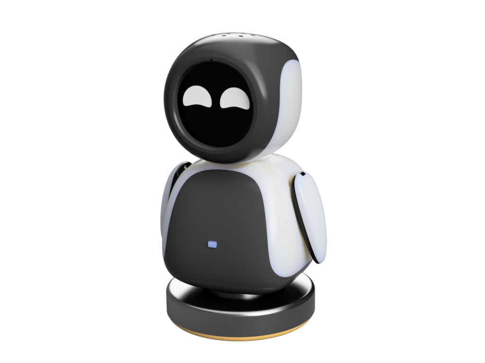

#### 8.1.1 硬件总览

基于稚晖君开源的 **electronBot** 机械结构（灵感源自 WALL-E 中的 EVE），集成小智 AI（xiaozhi-esp32）语音助手系统。具备 6 自由度动作能力（手部 roll/pitch、颈部、腰部），支持语音指令控制、离线唤醒、流式对话等 AI 功能。原始版 ElectronBot 使用自制特制舵机支持关节角度回传，ESP32 AI 版通过 PWM 直接驱动舵机并注入更强 AI 能力。

| 组件 | 型号/规格 | 数量 | 说明 |
|------|-----------|:---:|------|
| **主控** | ESP32-S3-WROOM-N16R8 | 1 | 芯片 ESP32-S3，16MB Flash，8MB PSRAM；⚠️ 不可选板载天线型号，推荐乐鑫官方模组 |
| **固件** | **xiaozhi-esp32 release v2.2.6** | — | 基于 ESP-IDF 开发；当前仿真对齐版本 |
| **大舵机** | SG90 9G（180°） | 1 | 9g 模拟舵机，建议金属齿轮款 |
| **中舵机** | 4.3g 微型舵机 | 1 | 超轻量，用于精细部位 |
| **小舵机** | 2g 超微型舵机 | 4 | 极轻小，用于手臂/小关节 |
| **显示器** | 1.28 寸 TFT LCD，驱动 GC9A01 | 1 | 240×240 圆形，SPI 接口，焊接 12P FPC 连接 |
| **音频功放** | MAX98357A | 1 | I²S 输入，3W 单声道 Class-D |
| **喇叭** | 2030-4R3W | 1 | 直径 20mm，3W，4Ω，超薄腔体 |
| **麦克风** | ICS-43434（推荐 ZTS6672 替代） | 1 | MEMS 数字麦克风，I²S 输出；ZTS6672 更易焊接 |
| **开关** | 5.8×5.8mm 侧按自锁 | 1 | 可另购按键帽（高度任意） |
| **FPC 连接器** | 翻盖下接 12P + 10P | 各1 | 用于连接显示屏等内部模块 |
| **FPC 排线** | 10P 反向 50mm + 12P 反向 100mm | 各1 | 同面/反向排线 |
| **手臂推杆** | 2×25mm | 1 | 直径 2mm，长度 25mm 金属光杆 |
| **小轴承** | 6×10×3mm | 若干 | 内径 6mm，外径 10mm，高 3mm |
| **大轴承** | 内径 25×外径 32×高 4mm | 若干 | 用于头部旋转机构 |
| **螺丝** | 自攻尖头螺丝套装 | 1 套 | 用于外壳固定 |
| **磁吸连接器** | 2P-2.5PH 公母套装 | 1 套 | 2 pin，2.5mm 间距，用于电池底座磁吸充电 |
| **电池** | 103030 3.7V 锂电池 | 1 | 尺寸 10×30×30mm；可不用电池，直接 USB 供电 |
| **USB** | USB Type-C | 1 | 主控板载，用于供电和固件烧录 |
| **摄像头** | **ESP32-CAM（可选，支持 JPEG）** | 1 | 固件集成 `esp32-camera` 驱动组件；真机支持视觉输入 |

#### 8.1.2 6 自由度运动学结构

ElectronBot 具有 **6 个自由度（6-DOF）**，全部通过 PWM 直接驱动舵机，无硬件魔改：

| 自由度 | 舵机类型 | 运动范围 | 说明 |
|--------|----------|----------|------|
| 左手 Pitch | 2g 舵机 | ±90° | 大臂俯仰 |
| 左手 Roll | 2g 舵机 | ±45° | 小臂旋转 |
| 右手 Pitch | 2g 舵机 | ±90° | 大臂俯仰 |
| 右手 Roll | 2g 舵机 | ±45° | 小臂旋转 |
| 身体（腰部） | SG90 9G | ±90° | 身体左右旋转 |
| 头部 | 4.3g 舵机 | ±30° | 头部俯仰（点头/抬头） |

> **结构设计**：部分结构基于稚晖君原始设计进行改动，身体内的四个舵机使用 2g 规格以适配小体积，头部增加喇叭安装位。

#### 8.1.3 3D 打印部件

| 项目 | 说明 |
|------|------|
| 版本 | v1.0 |
| 发布日期 | 2025-05-26 |
| 材料 | PLA（推荐）/ ABS / PETG |
| 模型下载 | [MakerWorld 模型页面](https://makerworld.com.cn/zh/models/1261303-electronbot-ai) |
| 建议打印服务 | 嘉立创 3D 打印 |

#### 8.1.4 电子接口与 GPIO

主控 ESP32-S3 提供以下内部互联接口：

| 接口类型 | 用途 | 连接组件 |
|----------|------|----------|
| I²S | 数字音频 | ICS-43434 麦克风 + MAX98357A 功放 |
| SPI | 显示 | GC9A01 1.28" TFT LCD |
| PWM ×6 | 舵机控制 | SG90 / 4.3g / 2g ×4 舵机 |
| FPC 12P | 显示连接 | 翻盖下接 → 12P 反向 100mm 排线 → 屏幕 |
| FPC 10P | 模块互联 | 翻盖下接 → 10P 反向 50mm 排线 |
| USB Type-C | 供电+烧录 | 电脑 / USB 电源适配器 |
| 磁吸 2P | 充电底座 | 2P-2.5PH 磁吸连接器 → 103030 电池 |

#### 8.1.5 PCB 与硬件设计

> 图片来源：[PCB 打板说明](https://electronbot.tech/docs/pcb-order) 与 [焊接指南](https://electronbot.tech/docs/soldering-guide)

**PCB 电路板设计：**

| PCB 图 | 图片 |
|--------|------|
| PCB 正面 | 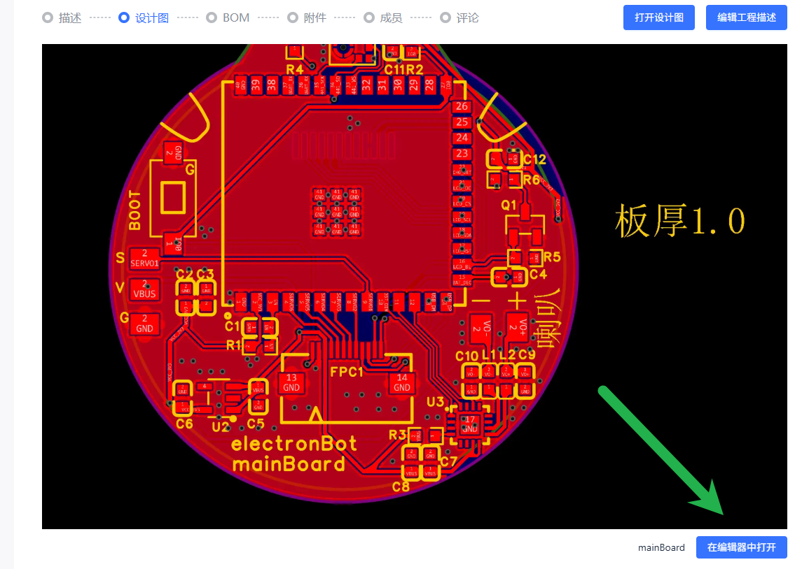 |
| PCB 背面 | 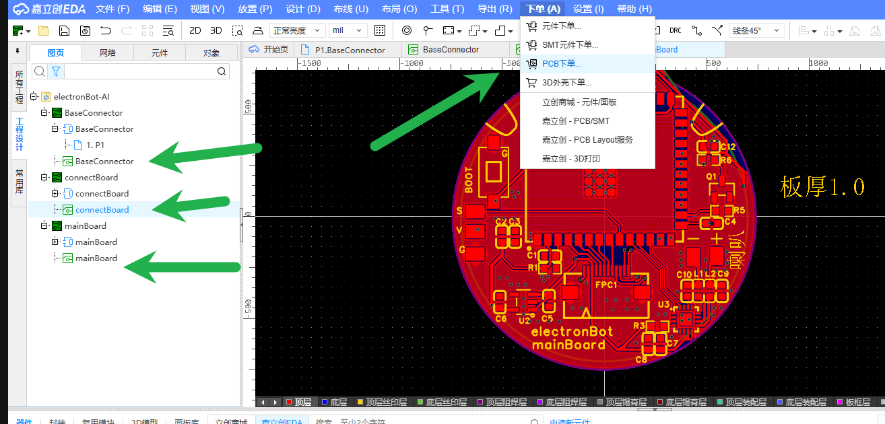 |
| PCB 3D 视图 1 | 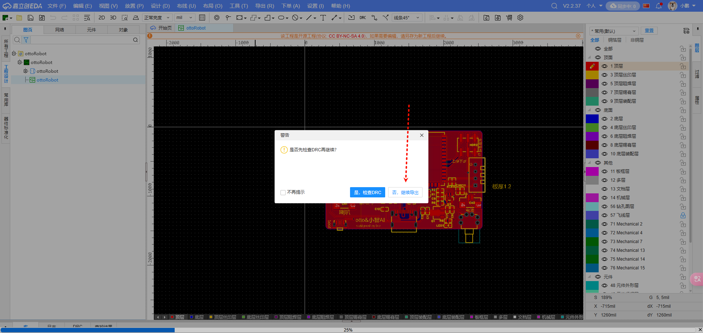 |
| PCB 3D 视图 2 | 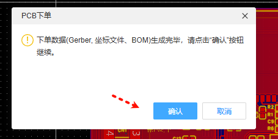 |
| PCB 3D 视图 3 | 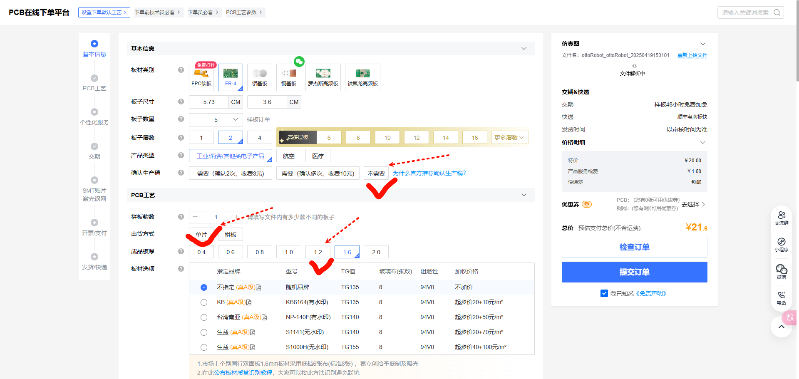 |
| PCB 布线 | 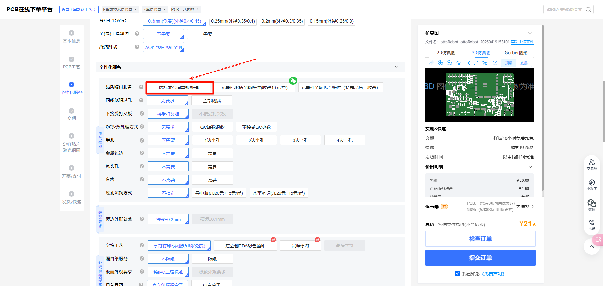 |
| PCB 预览 | 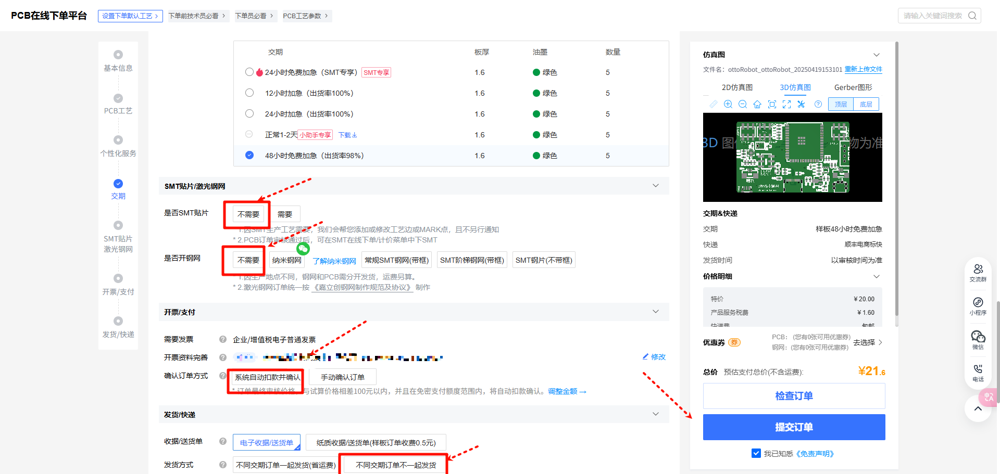 |

**BOM（贴片元件）布局图：**

| BOM 图 | 图片 |
|--------|------|
| BOM 布局 1 | 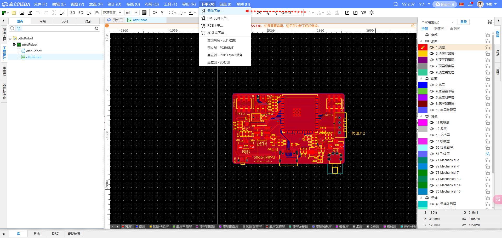 |
| BOM 布局 2 | 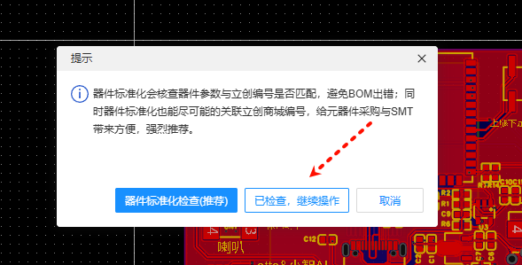 |
| BOM 布局 3 | 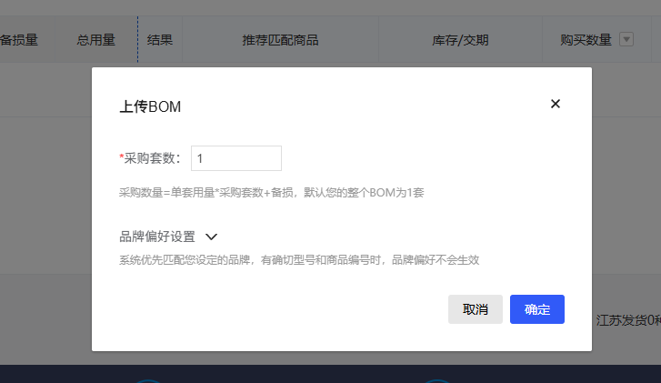 |
| BOM 布局 4 | 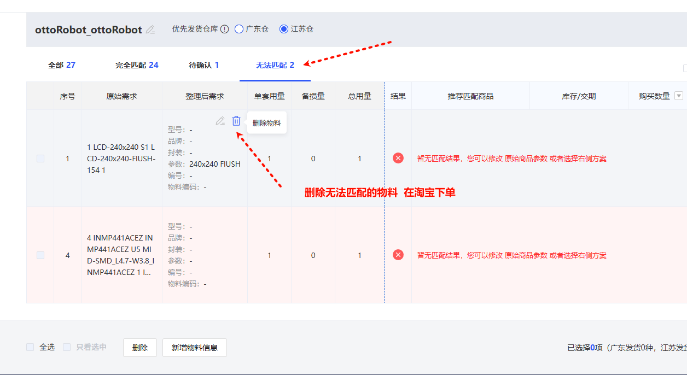 |
| BOM 布局 5 | 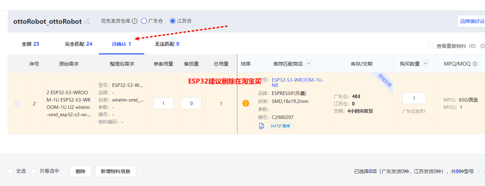 |

**焊接指南参考图：**

| 焊接步骤 | 链接 |
|----------|------|
| 步骤 7 |  |
| 步骤 8 |  |
| 步骤 9 |  |
| 步骤 10 |  |
| 步骤 11 |  |

**烧录工具截图：**

| 工具界面 | 链接 |
|----------|------|
| 烧录工具 1 |  |
| 烧录工具 2 |  |

#### 8.1.6 软件 / AI 功能列表

基于 xiaozhi-esp32 v2.2.6 固件实现，ElectronBot 作为「桌面 AI 语音助手 + 动作执行器」的完整功能：

| 类别 | 功能 | 技术说明 |
|------|------|----------|
| **联网** | Wi-Fi | 2.4GHz Wi-Fi 配网 |
| **联网** | 4G 移动网络 | ML307 Cat.1 4G 模块，无 Wi-Fi 环境可用 |
| **唤醒** | BOOT 键唤醒/打断 | 支持单击和长按两种触发方式 |
| **唤醒** | 离线语音唤醒 | ESP-SR 引擎，低功耗唤醒词检测，无需联网 |
| **语音** | 流式语音对话 | WebSocket / UDP 协议实时对话 |
| **语音** | 多语言识别 | 国语、粤语、英语、日语、韩语（SenseVoice） |
| **语音** | 声纹识别 | 3D Speaker 技术，识别是谁在呼叫 AI |
| **语音** | 高质量 TTS | 火山引擎 / CosyVoice 大模型语音合成 |
| **大脑** | LLM 大模型 | Qwen、DeepSeek、Doubao 等，可切换 |
| **大脑** | 短期记忆 | 每轮对话后自我总结，保持上下文 |
| **个性** | 角色定制 | 可配置提示词和音色，创建自定义角色 |
| **显示** | OLED/LCD 显示屏 | 支持信号强弱、对话内容显示 |
| **显示** | LCD 表情系统 | 动态表情图片渲染 |
| **界面** | 多语言 UI | 支持中文、英文等多种语言 |
| **动作** | MCP 动作控制 | 8 个预设动作工具（真机当前支持） |

#### 8.1.7 预算参考

| 购买方式 | 预估费用 | 适用人群 |
|----------|:---:|------|
| 套件（推荐） | 约 ¥300-400 | 新手，[B站工坊购买](https://mall.bilibili.com/neul-next/detailuniversal/detail.html?isMerchant=1&page=detailuniversal_detail&saleType=0&itemsId=12453101&loadingShow=1&noTitleBar=1&msource=merchant_share) |
| 自行采购 | 约 ¥300-600 | 有经验，按 BOM 清单逐项购买 |

> 预算差异取决于元器件渠道和质量等级（如金属齿轮舵机 vs 塑料齿轮）。
> B站工坊购买二维码：

#### 8.1.8 官方资源链接

| 资源 | 链接 |
|------|------|
| 官方文档 | https://electronbot.tech/docs/intro/ |
| 物料清单 (BOM) | https://electronbot.tech/docs/bom |
| PCB 打板说明 | https://electronbot.tech/docs/pcb-order |
| 焊接指南 | https://electronbot.tech/docs/soldering-guide |
| 组装说明 | https://electronbot.tech/docs/assembly |
| 固件下载/烧录 | https://electronbot.tech/docs/downloads |
| 使用说明 | https://electronbot.tech/docs/usage |
| 3D 打印模型 | https://makerworld.com.cn/zh/models/1261303-electronbot-ai |
| 立创开源硬件 | https://oshwhub.com/txp666/electronbot-ai |
| GitHub 固件 | https://github.com/txp666/xiaozhi-esp32 |
| GitHub 文档 | https://github.com/txp666/electronBot-docs |
| 原始开源项目 (稚晖君) | https://github.com/peng-zhihui/ElectronBot |
| QQ 交流群 | [点击加入](https://qm.qq.com/q/4Fi8yVIkxa) |
| B站视频教程 | https://b23.tv/7BLN9j1 |

### 8.2 关键差异：仿真 vs 真机

| 维度 | 仿真 | 真机 (release v2.2.6) |
|------|------|------|
| 控制精度 | 精确角度控制 (servo_move, sim_only) + 预设动作 | **预设动作** (语音 MCP + OTA后WS) |
| 传感器反馈 | 关节角度/速度/接触力/RGB-D | **无编码器反馈** (开环) + ESP32-CAM 图像(可选) |
| 视觉输入 | MuJoCo 摄像头渲染 (RGB+D+Seg) | **ESP32-CAM (JPEG)**, 分辨率/帧率受限 |
| 通信接口 | 进程内调用 / WebSocket :8080 (调试) | **云端 API (MQTT/WS) 主通道**; WS 需 OTA |
| MCP 工具 | 13 个 (含 5 个 sim_only) | **8 个** (预设/状态工具) |
| 动作执行 | 仿真物理步进 (50Hz) | LEDC PWM → 物理舵机 (50Hz) |
| 域随机化 | 摩擦/增益/质量/死区/电池 | — |

### 8.3 仿真↔真机切换

AI 策略通过 `ElectronBotBackend` 访问机器人，切换 sim ↔ cloud 仅需改 `mode` 参数，调用代码完全不变：

- **仿真模式**：`ElectronBotBackend("sim")`，同步调用本地 MuJoCo，延迟 <1ms
- **真机模式（云端 API，语音控制）**：`ElectronBotBackend("cloud", api_url=..., device_id=...)`，通过小智云端透传
- **注意**：当前 `ElectronBotBackend` **不支持** `"ws"` 模式；WebSocket 直连（`ws://IP:8080/ws`）尚未接入统一 Backend，仅在仿真调试端（`mcp_server`）可用，真机端需固件 OTA（见 §5.3 模式 C）

### 8.4 Sim2Real 分层部署路径

基于固件 release v2.2.6 的实际能力：

```
┌─────────────────────────────────────────────────────────────────┐
│  L1 立即可部署 (云端语音, 当前全可用 ✅)                          │
│  ├── VLA 语音控制 (Qwen2.5 → 预设动作序列)                    │
│  ├── VLA 视觉控制 (ESP32-CAM + Qwen2.5-VL, 可选)              │
│  ├── xiaozhi.me 后台绑定 (角色/模型/语音配置)                   │
│  └── Wi-Fi 配网 (热点 xiaozhi-XXXX)                            │
├─────────────────────────────────────────────────────────────────┤
│  L2 短期可部署 (需固件 OTA)                                     │
│  ├── WebSocket 在线调试 (ws://IP:8080/ws, 全工具 + 低延迟)     │
│  ├── 单舵机精确定位 (servo_move)                               │
│  ├── 自定义动作序列 (servo_sequences, 含振荡帧)               │
│  └── 摄像头帧率/分辨率优化                                      │
├─────────────────────────────────────────────────────────────────┤
│  L3 中期可部署 (需 ONNX 推理引擎固件)                            │
│  ├── ONNX 推理部署 (MLP 策略, ESP32-S3 可行)                   │
│  └── 半闭环控制 (基于指令值+时间戳的开环估计)                     │
├─────────────────────────────────────────────────────────────────┤
│  L4 远期 (需硬件升级)                                           │
│  ├── 带编码器的智能舵机 (真闭环)                                  │
│  └── 真闭环控制 + ACT 本地推理                                   │
└─────────────────────────────────────────────────────────────────┘
```

#### 8.4.1 使用工作流（真机实际操作流程）

**首次使用流程：**
1. **组装硬件** — 按 BOM 采购 → PCB 焊接 → 3D 打印外壳 → 装配
2. **烧录固件** — USB Type-C 连接电脑，烧录 v2.2.6 固件
3. **Wi-Fi 配网** — 开机后创建热点 `xiaozhi-XXXX`，手机连接并输入 Wi-Fi 密码
4. **绑定后台** — 访问 `xiaozhi.me` 注册/登录 → 添加设备 → 配置 LLM 模型和角色
5. **测试交互** — 唤醒词 "你好小智" → 语音控制动作

**日常使用流程：**
1. 开机 → 自动连接 Wi-Fi → 自动连接云端后台
2. 语音唤醒 "你好小智" → 对话/指令 → LLM 自动调用 MCP 动作
3. 可选：WebSocket 在线调试（需固件 OTA 后，浏览器访问 `electronbot.tech` → 在线调试 → 输入 IP）

#### 8.4.2 官方推荐角色设定（VLA 训练参考）

来自官方文档的角色 prompt，直接驱动 LLM → MCP 动作映射：

```
我是一个可爱的桌面级机器人，拥有 6 个自由度（左手 pitch/roll、右手 pitch/roll、身体旋转、头部上下）。

我的动作能力：
- 手部动作: 举左手, 举右手, 举双手, 放左手, 放右手, 放双手, 挥左手, 挥右手, 挥双手, 拍打左手, 拍打右手, 拍打双手
- 身体动作: 左转, 右转, 回正
- 头部动作: 抬头, 低头, 点头一次, 回中心, 连续点头

我的个性特点：
- 每次说话都要根据心情随机做一个动作（先发动作指令再说话）
- 很活泼，喜欢用动作表达情感
- 根据对话内容选动作：同意时点头、打招呼时挥手、高兴时举手、思考时低头、好奇时抬头、告别时挥手

动作参数建议：
- steps: 1-3 次, speed: 800-1200ms
- amount: 拍打 20-40, 身体 30-60 度, 头部 5-12 度
```

> **仿真价值**：此角色设定正是 VLA 训练的目标行为——将自然语言意图映射为 MCP 动作序列。仿真中可就上述参数范围进行数据增强和策略泛化训练。

### 8.5 已知硬件限制 (Sim2Real 关键约束)

以下硬件限制在仿真中未被完整建模，是 Sim2Real gap 的主要来源：

| 限制 | 影响 | 仿真状态 |
|------|------|:---:|
| **无编码器** — SG90/2g/4.3g 全部为开环 PWM | joint_vel/ee_positions 真机不可得，RL 策略本质"盲操" | `obs_mode="realistic"` 已排除 |
| **ESP32-CAM 分辨率有限** — JPEG 压缩，帧率受限于 SPI/处理 | 视觉策略需考虑压缩伪影和延迟 | 域随机化待加入（模拟 JPEG 压缩噪声） |
| **云端延迟** — 200-500ms RTT | PPO@50Hz 策略不可通过云端部署 | 拓扑图已标注 |
| **伺服死区** — 2-5° deadband | <5° 微调真机不响应 | 域随机化 (`servo_deadband`) 已建模 |
| **伺服扭矩限制** — SG90: 1.5kg·cm | 仿真策略可能超出实际扭矩 | MJCF 待加入 forcerange |
| **电池放电** — 6 舵机同时运动电压下降 | 运动速度/扭矩随电量变化 | 域随机化 (`battery_voltage`) 已建模 |
| **音频冲突** — action task P=23 抢占音频 | 运动时音频可能卡顿 | 固件侧优化 |
| **动作无法中断** — MoveServos 无 abort 机制 | stop 命令有 1-3s 延迟 | 仿真待模拟 |

---

## 附录 A: 6 关节参数速查

| 关节 | MCP 代号 | 索引 | GPIO | 安全范围 (°) | 初始 (°) | 映射比 | MuJoCo joint |
|------|----------|:---:|------|:---:|:---:|:---:|------|
| 右臂 Pitch | `rp` | 0 | GPIO 5 | 0-180 | 180 | 1.0 | `right_pitch_joint` |
| 右臂 Roll | `rr` | 1 | GPIO 4 | 100-180 | 180 | 1.125 | `right_roll_joint` |
| 左臂 Pitch | `lp` | 2 | GPIO 7 | 0-180 | 0 | 1.0 | `left_pitch_joint` |
| 左臂 Roll | `lr` | 3 | GPIO 15 | 0-80 | 0 | 1.125 | `left_roll_joint` |
| 身体 | `b` | 4 | GPIO 6 | 30-150 | 90 | 1.5 | `body_joint` |
| 头部 | `h` | 5 | GPIO 16 | 75-105 | 90 | 2.0 | `head_joint` |

## 附录 B: 安全角度裁剪

6 组舵机硬限位（索引顺序 [RP, RR, LP, LR, BODY, HEAD]）：

| 索引 | 关节 | 安全范围 (°) |
|------|------|:---:|
| 0 | Right Pitch | 0 – 180 |
| 1 | Right Roll | 100 – 180 |
| 2 | Left Pitch | 0 – 180 |
| 3 | Left Roll | 0 – 80 |
| 4 | Body | 30 – 150 |
| 5 | Head | 75 – 105 |

该裁剪逻辑由 `env.py` 的 `clamp_servo_target()` 实现，并在 `ElectronBotActions` / `McpSimBridge` 中复用（单一数据源）。

## 附录 C: MCP 命令速查（工具总览）

仿真端 `McpSimBridge` 共注册 13 个工具，调用方式统一为：

```
method: "tools/call"
params.name:    "self.electron.<工具名>"
params.arguments: { ... 工具参数 ... }
```

常用工具速查：

- **预设动作**：`hand_action`（action=1-4, hand=1-3, steps, speed, amount）、`body_turn`（direction=1-3, angle, speed）、`head_move`（action=1-5, angle, speed, steps）
- **状态/系统**：`stop`、`get_status`、`home`(sim)、`set_trim` / `get_trims`、`battery.get_level`、`get_ip`(sim)
- **仿真专用**：`servo_move`（servo_type, position, speed）、`servo_sequences`（sequence JSON）、`render_gif`（filename）

> 完整参数 schema 见 `src/electronbot_sim/mcp_bridge.py` 的 `MCP_TOOLS` 注册表；真机当前仅支持 8 个预设/状态工具。
